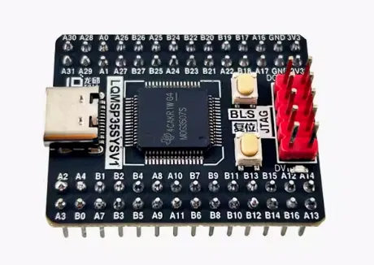
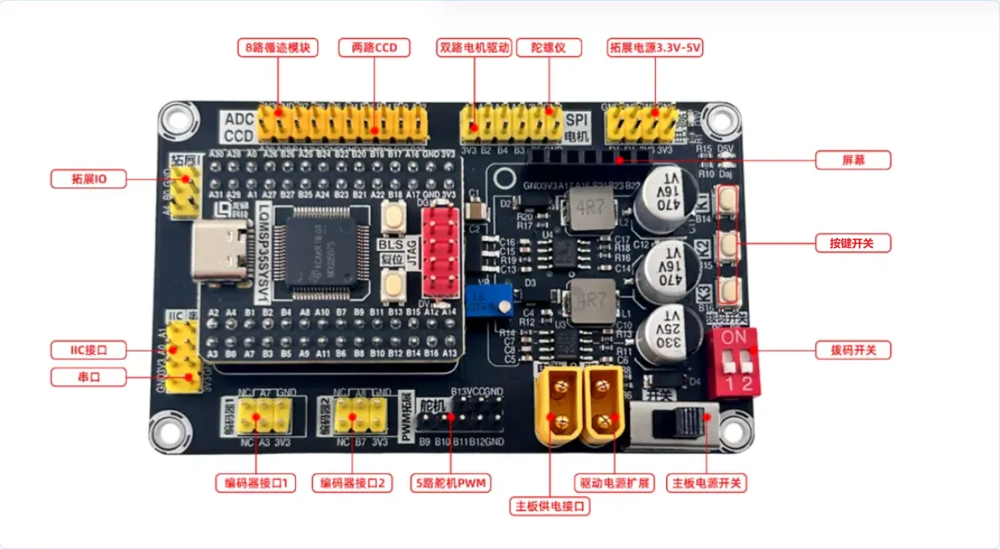

# 龙邱科技`TIMSPG3507`开源例程库

## 1-简介

龙邱科技`TIMSPG3507`软件示例程序开源例程库，含基础外设使用例程，`OLED`屏幕、电机、编码器、陀螺仪等驱动应用例程，为电赛适配的各种外设资源使用例程等，针对龙邱产品模块和常用外设资源移植驱动例程，以方便参加电赛和使用我们产品的各位入门学习使用。

## 2-开发环境

- 开发环境：`Keil uVision5 MDK`
- 工具：`LQ-ARMLINK-V9` 下载器。

## 3-资源分配

### 1. 母板引脚分配

| GPIO                    | **LED** `PA15`   | **蜂鸣器** **`PA28`** |                   |                   |                   |
| ----------------------- | ---------------- | --------------------- | ----------------- | ----------------- | ----------------- |
| 按键                    | **K1** `PB14`    | **K2** `PB15`         | **K3** `PB16`     |                   |                   |
| 拨码开关                | **SW1** `PB6`    | **SW2** `PB8`         |                   |                   |                   |
| OLED                    | **SCK** `PA17`   | **SDA** `PA16`        | **RST** `PB21`    | **DC** `PB23`     | **CS** `PB22`     |
| 编码器 1                | **A** `PA7`      | **B/Dir** `PA3`       |                   |                   |                   |
| 编码器 2                | **A** `PA8`      | **B/Dir** `PB7`       |                   |                   |                   |
| 双路电机驱动            | **PWM1** `PB2`   | **IO1** `PB4`         | **PWM2** `PB3`    | **IO2** `PB5`     |                   |
| 5 路舵机 PWM            | **Servo1** `PB9` | **Servo2** `PB10`     | **Servo3** `PB11` | **Servo4** `PB12` | **Servo5** `PB13` |
| 8 路灰度循迹 (轮询检测) | **OUT** `PA27`   | **S0** `PA26`         | **S1** `PA25`     | **S2** `PA24`     |                   |
| 8路灰度循迹 (并行检测)  | **ADC0** `PA27`  | **ADC1** `PA26`       | **ADC2** `PA25`   | **ADC3** `PA24`   | **ADC4** `PB25`   |
|                         | **ADC5** `PB24`  | **ADC6** `PB20`       | **ADC7** `PA22`   |                   |                   |
| LSM6DSR (SPI)           | **SCL** `PA12`   | **MISO** `PA14`       | **MOSI** `PA13`   | **CS** `PA2`      |                   |
| MPU6050 (IIC)           | **SCL** `PA12`   | **SDA** `PA14`        |                   |                   |                   |
| CCD 1                   | **SCL** `PB26`   | **SDA** `PB27`        | **ADC** `PB18`    |                   |                   |
| CCD 2                   | **SCL** `PA29`   | **SDA** `PA30`        | **ADC** `PB17`    |                   |                   |
| 超声波测距              | **TX** `PA0`     | **RX** `PA1`          |                   |                   |                   |
| 串口 0                  | **TX** `PA10`    | **RX** `PA11`         |                   |                   |                   |
| 拓展I/O                 | **拓展1** `PA4`  | **拓展2** `PB0`       | **拓展3** `PB1`   | **拓展4** `PA9`   | **拓展5** `PA31`  |

### 2. 部分模块所占用资源

| 编码器 1          | **A** `PA7`                         | `外部中断`                            |
| ----------------- | ----------------------------------- | ------------------------------------- |
| **编码器 2**      | **A** `PA8`                         | `外部中断`                            |
|                   | **清除计数值**                      | `TIMA0 定时器中断`                    |
|                   |                                     |                                       |
| **双路电机驱动**  | **PWM1** `PB2`                      | `TIMA1_C0`                            |
| **PWM2** `PB3`    | `TIMA1_C1`                          |                                       |
|                   |                                     |                                       |
| **5 路舵机 PWM**  | **Servo1** `PB9`                    | `TIMA0_C1`                            |
| **Servo2** `PB10` | `TIMG0_C0`                          |                                       |
| **Servo3** `PB11` | `TIMG0_C1`                          |                                       |
| **Servo4** `PB12` | `TIMA0_C2`                          |                                       |
| **Servo5** `PB13` | `TIMA0_C3`                          |                                       |
|                   |                                     |                                       |
| **8 路灰度循迹**  | **OUT** `PA27` **-** **OUT** `PA22` | `ADC0_CH0 - ADC0_CH7`                 |
|                   |                                     |                                       |
| **CCD 1**         | **ADC** `PB18`                      | `ADC1_CH5`                            |
| **CCD 2**         | **ADC** `PB17`                      | `ADC1_CH4`                            |
|                   |                                     |                                       |
| **串口 0**        | **TX** `PA10`、**RX** `PA11`        | `串口0（115200）`                     |
|                   |                                     |                                       |
| **定时器中断**    | **执行用户自定义任务**              | `除上述所用和PWM占用意外的其余定时器` |

## 4-使用说明

使用方式与`STM32 HAL`库 / 标准库类似，具体可参考库中的示例程序。

## 5-其他核心板类开源库

龙邱-核心板类开源库百度网盘链接：[https://pan.baidu.com/s/1exDJTBU4HdRVE5ne6-5LCA](https://gitee.com/link?target=https%3A%2F%2Fpan.baidu.com%2Fs%2F1exDJTBU4HdRVE5ne6-5LCA) 提取码：7sa3

其他开源库，陆续整理中。。。后续也会同步 gitee

## 6-关于咨询

其他关于龙邱科技、智能车、电赛相关咨询，敬请关注龙邱官方微信公众号：

 

更多智能车和公司动态信息、文章会在此发布。

## 7-更新日志

1.更新内容 详见 **更新记录.txt** 文件内容。

### 8-关于gitee使用

1. 使用 `Readme_XXX.md` 来支持不同的语言，例如 `Readme_en.md`, `Readme_zh.md`
2. `Gitee` 官方博客 [blog.gitee.com](https://blog.gitee.com)
3. `Gitee` 官方提供的使用手册 [https://gitee.com/help