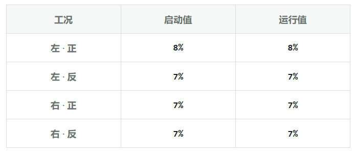
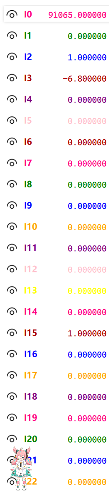
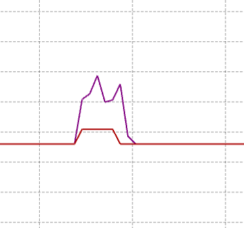
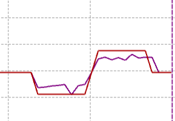
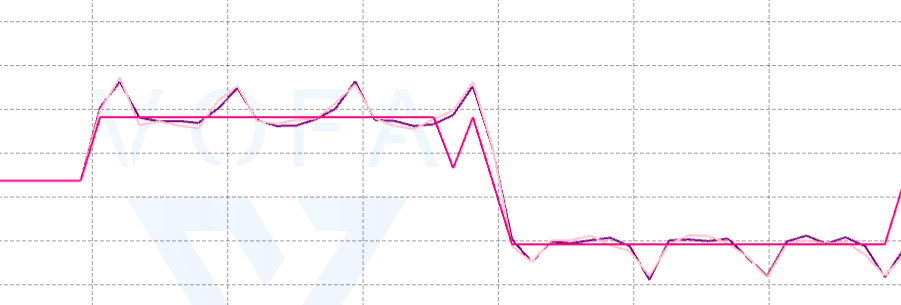
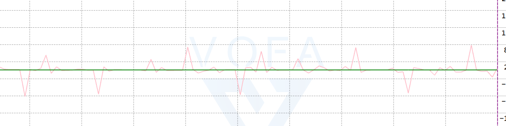

# 智能车项目 Codex 完整聊天记录

- 任务 ID：`019f6a0f-be08-71c3-9098-7d32da9f5997`
- 导出时间：2026-07-19 16:58:43（Asia/Shanghai）
- 原始记录：`C:\Users\28097\.codex\sessions\2026\07\16\rollout-2026-07-16T16-34-09-019f6a0f-be08-71c3-9098-7d32da9f5997.jsonl`
- 用户消息：55 条
- 助手过程更新：232 条
- 助手最终答复：40 条
- 去重附件图片：9 张

> 本文件只保留用户与助手可见消息。系统提示、开发者指令、内部推理、工具调用和环境注入均已过滤。过程更新默认折叠，可点击展开。

---

## 第 1 轮 · 2026-07-16 16:34:33

### 用户 · 16:34:33

>
> # Files mentioned by the user:
>
> ## PROJECT_HANDOFF.md: D:/my_code/my_code/diansai/MSPM0G3507_Diansai_Test/PROJECT_HANDOFF.md
>
> ## My request for Codex:
> 阅读这个MD文件，和程序，先理解整个项目，然后准备优化程序结构，解决现有bug，现在有一个bug是电机需要在上位机的驱动比例那里，拉到60%才能开始转，是否是因为电机限幅给的太小导致的，如果是，那么更改代码和上位机，我需要先测量电机的死区大小

### 用户 · 16:44:21

> 然后上位机加一个功能，可以用wasd操控方向键

<details>
<summary>助手过程更新（8 条）</summary>

**更新 1 · 16:34:42**

> 我会先按项目约定用 CodeGraph 读交接文档和电机控制链路，把“上位机驱动比例 -> 协议接收 -> 电机输出限幅/PWM”的真实调用关系梳理清楚。当前先诊断原因，不会贸然把 60% 当成限幅问题；确认后我会把程序调整为适合测量正反转死区的模式，并同步检查上位机。

**更新 2 · 16:35:06**

> 交接文档已经明确记录：当前约 55% 是“启动死区”，且现有代码刻意没有补偿。单纯“限幅太小”通常会造成最大驱动力不足，不会让 1% 到 55% 全部不转；我现在继续核对实际 PWM 映射、百分比换算和上位机控件，排除软件侧把 60% 又缩小了一次的可能。

**更新 3 · 16:36:02**

> 代码链路已经定位到：上位机发送的百分比是原样进入 `MOTOR`/`DRV`，固件只做 `-100..100` 夹紧，再按 PWM 周期线性换算；独立电机滑块自身却被限制在 `-60..60`。这说明“60% 才转”不是固件最大限幅太小，而是电机、电源/驱动与机械负载形成的大启动死区；不过现有上位机的量程和操作方式确实不适合精确测四个方向的死区，我会围绕这个测量流程改。

**更新 4 · 16:39:01**

> 接下来只改上位机和文档，不改固件的线性 PWM 映射，也不提前写死 55% 补偿值。具体会把独立电机量程放开到 `±100%`，增加左/右、正/反四工况的 1% 步进测量、启动值/维持运行值记录、编码器实时反馈和电池负载电压记录；测完四组数据后再决定固件采用最小占空比重映射、启动 kick，还是闭环速度控制。

**更新 5 · 16:41:41**

> 测量界面已经落地，固件保持 V8 不变。现在我在做两类校验：一是 JS/HTML/CSS 的语法和控件绑定是否完整，二是测量过程中停止、失焦、切换工况时能否继续复用现有的 500 ms 失联停机保护，避免新界面绕过原来的安全链路。

**更新 6 · 16:44:02**

> 静态语法和控件 ID 校验已通过；第一次浏览器截图校验被本机打包运行时缺少 `playwright-core` 卡住了，这不是项目代码错误。我会改用机器上现成的浏览器自动化入口继续做桌面/手机布局和交互检查，不往项目里临时安装依赖。

**更新 7 · 16:45:03**

> 会一起加上：`W/S` 前进后退，`A/D` 原地左转/右转，并支持组合按键；按键松开、窗口失焦、切出页面或断开连接都会立即走现有 `STOP`。在电压输入框、滑块、下拉框里输入/操作时不触发车辆，避免误动作。

**更新 8 · 16:48:15**

> WASD 交互也已通过浏览器实测：按住 `W+A` 会发送 `DRV,25,-25`，松开 `A` 立即变为 `DRV,25,0`，松开最后一个键发送 `STOP`；输入框聚焦时按 `W` 不会发车。死区面板的 1% 步进、四工况命令和本地记录也通过桌面/手机宽度检查，没有横向溢出。

</details>

---

## 第 2 轮 · 2026-07-16 16:50:07

### 用户 · 16:50:07

> 继续未完成的工作

<details>
<summary>助手过程更新（2 条）</summary>

**更新 1 · 16:50:29**

> 继续。我会把剩余收尾做完：补齐项目交接文档里的 WASD 与死区测量状态、消除浏览器 QA 唯一的 favicon 404，再做一次最终差异审查；固件仍不写入未经实测的死区补偿。

**更新 2 · 16:51:41**

> 还剩一项和原始请求直接相关：把结构优化边界写进交接文档，避免下一步在 763 行的 `diansai_app.c` 里边测死区边大拆文件。计划会明确先保行为拆出电机与协议，再引入四方向校准数据，最后才考虑闭环，保证每一步都能在实车上单独回归。

</details>

### 助手最终答复 · 16:53:25

> 结论：**不是固件限幅太小**。[diansai_app.c](D:/my_code/my_code/diansai/MSPM0G3507_Diansai_Test/Code/diansai_app.c:322) 将 `-100..100%` 直接线性换算成 PWM，没有额外缩小。约 55% 才启动更符合电机启动死区、电池压降、机械负载或 20 kHz PWM 驱动特性的表现。
>
> 已完成：
>
> - 上位机独立电机范围由 `±60%` 放开到 `±100%`。
> - 新增四工况死区测量：左/右电机、正/反转，支持 1% 步进、实时速度、编码器增量、负载电压和启动/运行值保存，见 [index.html](D:/my_code/my_code/diansai/MSPM0G3507_Diansai_Test/host-console/index.html:60)。
> - 新增 WASD：`W/S` 前后，`A/D` 左右，支持组合键；松开、失焦、切换页面和断线都会停止，见 [app.js](D:/my_code/my_code/diansai/MSPM0G3507_Diansai_Test/host-console/app.js:289)。
> - 结构拆分方案已写入 [PROJECT_HANDOFF.md](D:/my_code/my_code/diansai/MSPM0G3507_Diansai_Test/PROJECT_HANDOFF.md:193)。
>
> 测量时把车轮架空，从低 PWM 每次增加 1%，稳定转动时记录“启动值”；保持转动并逐步降低，记录最后能持续转动的“运行值”。四个方向分别测量，同时记录电池负载电压。
>
> 固件 V8 没有修改，因此暂时不用重新烧录。浏览器语法、WASD 命令、输入框防误触、桌面和手机布局均已通过测试。静态预览地址：[http://127.0.0.1:8771](http://127.0.0.1:8771)；实车仍按原脚本启动后使用 `http://127.0.0.1:8770`。
>
> 测完需要提供这八个值：左正/左反/右正/右反各自的启动值和运行值，下一步再写入四方向补偿。
>
> <oai-mem-citation>
> <citation_entries>
> MEMORY.md:34-56|note=[CodeGraph availability and verification context for this repository]
> </citation_entries>
> <rollout_ids>
> 019f6119-a35f-7662-9720-124b178472ca
> </rollout_ids>
> </oai-mem-citation>

---

## 第 3 轮 · 2026-07-16 17:06:20

### 用户 · 17:06:20

>
> # Files mentioned by the user:
>
> ## codex-clipboard-4c535843-8ee8-42c4-a65c-870680da28d8.png: D:/Temp/codex-clipboard-4c535843-8ee8-42c4-a65c-870680da28d8.png
>
> ## My request for Codex:
> 这是我测得的电机死区大小，均为摆在地面时测得的大小，是不是需要做一个映射再调pid，之后帮我分析一下为什么会有这么大的死区，和软件，硬件哪些地方有关，我用的电机驱动和之前diansaitest的那个电机驱动一样，但是在那个程序里，几乎没有死区，并且我用这个电机驱动接了之前用的电机，几乎一样的死区
>
> <image name=[Image #1] path="D:\Temp\codex-clipboard-4c535843-8ee8-42c4-a65c-870680da28d8.png">
>
> </image>
>
> 

<details>
<summary>助手过程更新（6 条）</summary>

**更新 1 · 17:06:41**

> 我先把这组结果作为“地面带载阈值”来分析：四个方向都集中在 57% 左右，而且启动值与维持运行值几乎相同，这更像软件输出波形/驱动工作模式造成的系统性缩放，而不像四套电机和机械摩擦恰好一致。接下来我会直接对比当前项目与 `diansai_test` 的 PWM 频率、极性、计数值换算和 AT8236 输入控制方式，再判断是否应该先映射、映射应放在哪一层，以及 PID 应该何时调。

**更新 2 · 17:07:11**

> 这组数据还有一个很关键的信号：旧电机接到当前这套驱动后仍然约 57%，因此电机本体和单侧机械差异已经降为次要嫌疑；优先级应转向“当前 MCU 输出到 AT8236 的实际波形”和供电接法。CodeGraph 没有正确命中参考工程，我现在改用精确符号搜索，把 `diansai_test` 的真实电机函数和底层 PWM 库逐层对照。

**更新 3 · 17:08:27**

> 已经找到与旧工程最重要的差别：`diansai_test` 并不是“一路 PWM、另一路始终为 0”，而是一路保持 100% 高电平，另一路用反相比较值，在 PWM 关断阶段进入双高制动/续流；当前工程则在关断阶段让两输入都低。两者平均占空比表面相同，但 AT8236 的电流衰减路径不同，20 kHz 下低占空比转矩可能差很多。我还要确认龙邱 PWM 库是否对比较值又做了一次反相，这一点可能直接解释固定在约 57% 的阈值。

**更新 4 · 17:10:20**

> 我会用 PDF 技能核对 AT8236 数据手册里的输入真值表和电流衰减模式，因为这里不能只凭常见 H 桥经验下结论。数据手册搜索结果已经定位到中文 PDF，我会确认双低、双高分别对应什么状态，以及厂家推荐的 PWM 接法。

**更新 5 · 17:12:33**

> 数据手册已经确认：当前接法 `PWM,0` 是厂家定义的**快衰减**，旧工程的 `1,PWM` 是**慢衰减**；而且 `IN1=IN2=0` 超过 1 ms 会让 AT8236 进入休眠，唤醒约需 1 ms。旧工程还通过轮速 PID 输出原始 PWM，积分会自动把输出推过物理阈值，所以“几乎看不到死区”不等于旧硬件没有死区。下一步我正在把旧工程的 `DRV -> 目标速度 -> PID -> 慢衰减 PWM` 与当前的 `DRV -> 百分比 -> 快衰减 PWM` 逐行对应起来。

**更新 6 · 17:15:40**

> PDF 核对完成，结论与代码对比一致：`PWM,0` 是快衰减，`1,PWM` 是慢衰减；双低 1 ms 会休眠。按 PDF 技能要求，我会清理刚才下载和渲染的临时数据手册文件，只保留分析结论，不把这些临时文件混进仓库。

</details>

### 助手最终答复 · 17:18:01

> 结论：**先不要按 57% 做死区映射，也不要立刻调 PID。** 当前 57% 主要不是传统电机死区，而是当前程序使用 AT8236 的“快衰减 PWM”造成的系统性阈值。
>
> **两个工程的关键区别**
>
> | 项目 | 当前 MSPM0 工程 | `diansai_test` |
> |---|---|---|
> | PWM 接法 | `PWM,0` / `0,PWM` | `1,PWM` / `PWM,1` |
> | AT8236 模式 | 快衰减 | 慢衰减 |
> | PWM 频率 | 20 kHz | 约 10 kHz |
> | `DRV` 含义 | 直接映射为 PWM 百分比 | 转成目标速度，再经过轮速 PID |
> | 低速效果 | 约 50% 以下几乎没有有效平均电流 | 从低占空比就能建立电流，PID 还会自动越过残余死区 |
>
> 当前实现见 [diansai_app.c](D:/my_code/my_code/diansai/MSPM0G3507_Diansai_Test/Code/diansai_app.c:316)，一路 PWM 时另一路固定为 0。旧工程见 [vehicle_motor.c](D:/my_code/my_code/diansai/diansai_test/Core/Src/vehicle_motor.c:59)，一路保持 100%，另一路使用反相比较值。
>
> AT8236 [数据手册](https://offer-product.oss-cn-beijing.aliyuncs.com/product/offer/attachment/null/file/subPdf_143103_65242_20211117-164925002.pdf) 第 5 页也明确规定：
>
> - `PWM,0`：快衰减。
> - `1,PWM`：慢衰减。
> - `0,0`：滑行，持续 1 ms 后休眠。
> - `1,1`：刹车。
>
> **为什么刚好约 57%**
>
> 快衰减时：
>
> - PWM 导通阶段，绕组承受约 `+VM`。
> - PWM 关断阶段，电流经过体二极管快速衰减，绕组会承受反向电压。
>
> 简化后的平均绕组电压近似为：
>
> ```text
> Vavg ≈ D × VM - (1-D) × VM
>      ≈ (2D-1) × VM
> ```
>
> 所以理想零点就在 `D=50%`。再加上二极管压降、绕组电阻、轮胎和地面阻力，实际启动点落在 57% 左右非常吻合。
>
> 这也解释了为什么：
>
> - 四个方向几乎都是 57%。
> - 换上旧电机仍然差不多。
> - 启动值和运行值几乎相同。
> - 左反的 58%/57% 只有 1% 差异，基本属于测量波动，不支持启动 kick。
>
> **正确处理顺序**
>
> 1. 先把当前电机输出改成 AT8236 慢衰减模式，保持 `0` 命令仍然双低停机。
> 2. 第一版同时把 PWM 改成旧工程的约 10 kHz，最大限度复现旧系统。
> 3. 在地面重新测四个方向的启动值、运行值和驱动板 VM 负载电压。
> 4. 再测一组“PWM百分比 -> 实际轮速”曲线。
> 5. 如果仍有小死区，再加入速度前馈或最小输出映射。
> 6. 最后调左右轮 PI，通常先不用 D。
>
> 如果慢衰减后仍有物理死区 `p_min`，开环映射可以是：
>
> ```text
> u = 0  -> PWM = 0
> u != 0 -> PWM = sign(u) × [p_min + (100-p_min) × |u| / 100]
> ```
>
> 但闭环速度控制更推荐：
>
> ```text
> PWM = 速度前馈(target_speed) + PI(target_speed - measured_speed)
> ```
>
> 不要让积分项独自从 0 一直爬过死区，否则会产生启动延迟和积分饱和。
>
> **硬件次要检查项**
>
> - 测量驱动板 `VM` 引脚处的负载电压，不只测电池端。
> - 检查当前驱动模块的 `VREF` 和 `ISEN` 电阻。旧 C30D 原理图约为 `VREF=3.3V`、`RISEN=0.25Ω`，限流约 `1.32A`。
> - 比较驱动板输入端实际波形。当前 30% 命令应看到“一路 20 kHz、另一路恒低”；旧程序则应看到“一路恒高、另一路反相 PWM”。
> - 普通示波器地夹不要直接夹电机两个输出端，避免短接 H 桥；先测对地的 IN1/IN2 和 VM。
>
> 目前证据已经足够把主要原因排到软件 PWM 衰减模式，而不是电机本体。当前固件还没有真正的轮速 PID，[vehicle_control.c](D:/my_code/my_code/diansai/diansai_test/Core/Src/vehicle_control.c:153) 中旧工程的闭环需要后续移植，不能直接“调当前 PID”。
>
> <oai-mem-citation>
> <citation_entries>
> MEMORY.md:45-56|note=[CodeGraph repository verification context]
> </citation_entries>
> <rollout_ids>
> 019f6119-a35f-7662-9720-124b178472ca
> </rollout_ids>
> </oai-mem-citation>

---

## 第 4 轮 · 2026-07-16 17:19:13

### 用户 · 17:19:13

> 这个慢衰减，快衰减，具体有说明区别吗，在后续PID或者说明地方的区别，然后改代码，可以先把三环串联的逻辑写出来，但是先不要使用，我说使用哪些再使用

<details>
<summary>助手过程更新（4 条）</summary>

**更新 1 · 17:21:27**

> 结论是：慢衰减更适合后续轮速闭环，但它不是“永远更好”。慢衰减低速转矩更连续、PWM 到轮速更接近线性，PI 不需要先跨过 50% 区域；快衰减能更快释放绕组电流，适合快速降流或电流环，但当前这种开环速度调节会把一半占空比范围变成低效区。
>
> 我准备这样改：
>
> 1. 仅把 AT8236 切到慢衰减，PWM 暂时保持 20 kHz，以便单独验证“衰减模式”这个变量。
> 2. 保留 `MOTOR`/`DRV` 为原始开环控制，不加入 57% 映射。
> 3. 新增独立的三级串联控制模块：航向角外环 -> 角速度中环 -> 左右轮速度内环。
> 4. 所有环默认关闭，也不新增上位机启用命令；只有你明确指定启用哪些环后才接入电机输出。
> 5. 预留左右正反向前馈/残余死区参数，等慢衰减重新实测后再填写。

**更新 2 · 17:27:23**

> 核心代码已经改好：电机输出现在按数据手册使用慢衰减，20 kHz 暂不变；三级模块也已独立加入工程，但当前没有任何调用者、所有增益/前馈/使能位均为 0，所以它不会接管 `MOTOR` 或 `DRV`。我正在做代码审查和文档状态区分，尤其会明确“V8 是实车已验证版本，V9 是待烧录验证候选”，避免构建成功被误写成实车成功。

**更新 3 · 17:30:27**

> V9 已经构建通过，新增控制模块和慢衰减改动都是 `0 Error(s), 0 Warning(s)`。静态搜索也确认三级模块只有定义、没有应用调用者，所以当前固件不会偷偷启用任何 PID；现在只剩补齐构建记录、做最终差异检查，并给你明确的首次烧录测试顺序。

**更新 4 · 17:33:30**

> 最终审查发现一个必须同步处理的安全点：慢衰减后，原来上位机默认的 `25%` 手动速度和死区面板 `40%` 不再是“基本不动”的弱输出，可能一按就明显起步。我会把手动默认值降到 `10%`、死区测量默认值改为 `0%`，让首次 V9 测试从零逐级增加。

</details>

### 助手最终答复 · 17:37:58

> 慢衰减和快衰减的核心区别是 PWM 关断阶段如何处理电机绕组电流。
>
> | 模式 | PWM 关断状态 | 特点 | 对速度 PID 的影响 |
> |---|---|---|---|
> | 快衰减 | H 桥高阻，电流经体二极管快速下降 | 降流快、适合电流快速控制 | 低占空比严重非线性，积分需要跨过约 50% 区域 |
> | 慢衰减 | 两个下管导通，电机两端近似短接 | 电流连续、低速转矩大 | PWM 到轮速更线性，PI 更容易调 |
> | 停机 | `IN1=IN2=0` | 滑行并进入休眠 | 必须保持零是真正停机 |
>
> 快衰减并不是错误模式，电流环、快速降转矩时有价值；但当前主要做低速轮速控制，慢衰减更合适。航向环和角速度环不直接控制 H 桥，但它们依赖内层轮速环，因此必须先把轮速环调稳定，再调角速度，最后调航向角。
>
> 已完成 V9：
>
> - [diansai_app.c](D:/my_code/my_code/diansai/MSPM0G3507_Diansai_Test/Code/diansai_app.c:316) 已改成 AT8236 慢衰减。
> - PWM 仍保持 20 kHz，只改变衰减模式，便于确认 57% 阈值是否由快衰减造成。
> - `MOTOR`、`DRV` 仍是原始开环百分比，没有加入 57% 映射或启动 kick。
> - 零命令仍然双低停机，换向前仍会先双低并等待 2 μs。
>
> 三级串联模块已经写入：
>
> ```text
> 航向角误差
>     -> 目标角速度
>     -> 左右轮速差
>     -> 左右目标轮速
>     -> 左右轮速度 PI
>     -> 电机 PWM
> ```
>
> 接口在 [vehicle_cascade_control.h](D:/my_code/my_code/diansai/MSPM0G3507_Diansai_Test/Code/vehicle_cascade_control.h:6)，控制计算在 [vehicle_cascade_control.c](D:/my_code/my_code/diansai/MSPM0G3507_Diansai_Test/Code/vehicle_cascade_control.c:159)。
>
> 当前保证：
>
> - 所有环默认关闭。
> - 所有 PID 增益和前馈默认是 0。
> - 没有任何应用调用者。
> - 没有上位机启用命令。
> - 分别预留左正、左反、右正、右反前馈参数。
> - 带输出限幅、积分限幅和抗积分饱和。
>
> 上位机默认手动速度已降到 10%，死区测量从 0% 开始，避免慢衰减后突然启动。
>
> V9 已使用 ARM Compiler 6.19 构建完成：`0 Error(s), 0 Warning(s)`。最新固件为 [LQ_MSPM0GX_LIB.hex](D:/my_code/my_code/diansai/MSPM0G3507_Diansai_Test/Keil/Objects/LQ_MSPM0GX_LIB.hex)，但尚未进行实车验证。
>
> 烧录后先架空测试方向和 STOP，再落地重新测四个方向的启动/运行值。控制环后续应按“轮速环 -> 角速度环 -> 航向角环”的顺序逐个启用，不能一次全部打开。
>
> <oai-mem-citation>
> <citation_entries>
> MEMORY.md:45-56|note=[CodeGraph index verification context for this repository]
> </citation_entries>
> <rollout_ids>
> 019f6119-a35f-7662-9720-124b178472ca
> </rollout_ids>
> </oai-mem-citation>

---

## 第 5 轮 · 2026-07-16 17:43:35

### 用户 · 17:43:35

>
> # Files mentioned by the user:
>
> ## codex-clipboard-679fd8be-10b6-47aa-9a2b-99226d9533fd.png: D:/Temp/codex-clipboard-679fd8be-10b6-47aa-9a2b-99226d9533fd.png
>
> ## My request for Codex:
> 现在死区已经标定，是不是在调pid之前还需要做一个映射，开始调速度环pid，读取一下diansaitest里的pid最佳值，我做一个参考，调pid记得加限幅
>
> <image name=[Image #1] path="D:\Temp\codex-clipboard-679fd8be-10b6-47aa-9a2b-99226d9533fd.png">
>
> </image>
>
> 

---

## 第 6 轮 · 2026-07-16 17:44:09

### 用户 · 17:44:09

>
> # Files mentioned by the user:
>
> ## codex-clipboard-679fd8be-10b6-47aa-9a2b-99226d9533fd.png: D:/Temp/codex-clipboard-679fd8be-10b6-47aa-9a2b-99226d9533fd.png
> ## My request for Codex:
> 现在死区已经标定，是不是在调pid之前还需要做一个映射，开始调速度环pid，读取一下diansaitest里的pid最佳值，我做一个参考，调pid记得加限幅。然后我需要你像diansaitest一样，把速度环需要看的参数发到vofa+里
>
> <image name=[Image #1] path="D:\Temp\codex-clipboard-679fd8be-10b6-47aa-9a2b-99226d9533fd.png">
>
> </image>
>
> 

### 用户 · 17:53:23

> 还有一件事，你确定这个新工程的pid算法，和之前的diansaitest还有LQ...PID实例里的PID算法是相同的逻辑吧

<details>
<summary>助手过程更新（15 条）</summary>

**更新 1 · 17:46:11**

> 新的 8/7/7/7% 结果说明慢衰减修复有效，剩下才是真正的带载机械死区。这里应该在速度 PI 前加入前馈映射，否则积分仍会承担“先把输出推过 7%”的工作，启动会慢且容易积累；但 `MOTOR` 原始诊断命令必须继续绕过映射，方便以后复测。
>
> 我现在会把**速度内环单独启用**，角速度环和航向角环继续关闭。`DRV` 改为目标轮速模式，`MOTOR` 仍是原始 PWM；同时核对旧工程实际使用的 `Kp=4000, Ki=800, Kd=0` 如何换算到当前“mm/s + 百分比输出”单位，并按 VOFA+ 当前桥接格式增加适合调参的高速数据帧。

**更新 2 · 17:51:29**

> 我继续按“死区前馈映射 + 仅启用速度环”的方向实现：`DRV` 走轮速闭环，角速度环和航向环保留但不调用，`MOTOR` 仍保留原始 PWM 直通以便排查。先核对当前 V9 代码和 `diansai_test` 的 PID 实现/单位，再落地限幅、VOFA+ 通道和 V10 构建。

**更新 3 · 17:51:39**

> 仓库没有 `.codegraph` 索引，我会直接读取相关模块。当前工作树包含前一轮 V9 修改和 Keil 生成物；这些都保留，只在现有实现上继续，不会清理或回退用户文件。

**更新 4 · 17:51:56**

> 标定表确认了四个方向的启动值与运行值相同，因此不需要额外的“启动冲击”；应使用连续死区前馈映射。映射负责补偿静摩擦/驱动损耗，PID 只修正目标速度与实测速度的剩余误差，这样比让积分项硬顶过死区更容易调稳。

**更新 5 · 17:53:17**

> `diansai_test` 中实际使用的是 10 ms 增量式速度 PID：`Kp=4000、Ki=800、Kd=0`，PWM 输出限幅 `±15000`（周期 16799），轮速滤波为 `0.65*旧值 + 0.35*本次值`。换成当前“mm/s + 百分比输出”的位置式实现，参考初值约为 `Kp=0.02381、Ki=0.47619、Kd=0`；这只是等效量纲参考，加入死区前馈后通常还要从更保守的 PI 开始实车微调。

**更新 6 · 17:53:39**

> 不相同，这一点需要纠正：当前 V9 新模块的四个环都用了“位置式 PID”，而 `diansai_test` 的速度环明确是“增量式 PID”；龙邱 PID 示例的电机速度环也通过 `PID_Realize()` 做增量式更新。为了让参考参数有意义，我会把新工程的左右速度环改成同样的增量式逻辑，角速度环/航向环仍保留位置式逻辑且继续关闭。

**更新 7 · 17:54:13**

> 实现方案已经明确：
>
> 1. 速度反馈沿用 `diansai_test` 的 0.35 新样本低通，并把左右速度环改为标准增量式 PID。
> 2. `DRV` 的百分比先换算为 `±600 mm/s` 目标，再经四方向死区前馈和速度 PID 输出；`MOTOR` 保持原始百分比直通。
> 3. 对目标速度、PID 累计输出和最终电机输出分别限幅，停车/切模式/超时立即清 PID 状态。
> 4. 新增紧凑 `SPD` 帧给 VOFA+，同时支持 `PID/PIDL/PIDR` 在线调参；角速度环和航向环仍不启用。
> 5. 更新说明并构建 V10，核对零错误零警告。

**更新 8 · 17:57:36**

> 开始修改控制模块：速度环会按两份参考工程共同采用的标准增量式公式实现，并单独限制“PID 累计修正量”；最终 PWM 还会再做一次总限幅。死区值作为前馈零点，不写进积分项。

**更新 9 · 18:04:12**

> 速度控制主路径接入中：`DRV` 现在表示目标轮速闭环，`MOTOR` 明确保留原始 PWM；在线改 PID 会先停机并清空历史误差，避免旧累计输出带入新参数。下一步补齐 VOFA 帧和上位机解析。

**更新 10 · 18:06:31**

> VOFA+ 桥接已接入 `SPD`：动态通道顺序为时间、启用、左右目标速度/实测速度/误差/PWM，再跟左右 `Kp/Ki/Kd`；速度按 m/s 输出，PID 参数保持旧工程的整数尺度，便于直接用 `PID,4000,800,0` 作参考。现在先做语法和固件构建检查，编译结果会决定是否还需调整接口。

**更新 11 · 18:07:16**

> V10 首次构建已经通过：ARM Compiler 6.19，`0 Error(s), 0 Warning(s)`。我再补两个对调参很关键的 VOFA 通道：死区前馈占比和 PID 累计修正占比，否则只看最终 PWM 时无法判断振荡来自映射还是反馈项。

**更新 12 · 18:08:05**

> 文档会把版本边界写清楚：V8 是快衰减旧阈值，V9 是慢衰减并完成了 8/7/7/7 标定，V10 才加入映射和速度闭环。这样后续看 HEX、调 PID 或回溯死区原因时不会混用两组数据。

**更新 13 · 18:10:29**

> 关于“是否完全相同”：V10 的速度 PID 核心公式现在与 `diansai_test`、龙邱 `UserCode/MIDDLE/pid.c` 相同，都是标准增量式；但完整控制器不会逐字相同，因为 V10 在 PID 外新增了死区前馈、单位换算和两级限幅。另一个龙邱旧文件 `User_Code/control.c` 的 Kd 行前有多余分号，实际会漏掉 D 项；它默认 `Kd=0` 时结果不受影响，V10 使用的是修正后的标准公式。

**更新 14 · 18:12:01**

> 固件和桥接的最终构建/语法检查都通过，`SPD` 示例已实际转换成 VOFA 的 `speed:` 数据。还剩一个上位机语义修正：方向区滑块不再是原始 PWM 比例，而是速度目标比例，我会同步显示对应的 `mm/s`，避免调参时把目标速度和占空比混淆。

**更新 15 · 18:13:23**

> 最终检查已完成，固件再次构建通过，JS/Python 解析和差异检查也通过。现在做最后一次版本、生成物和关键行核对，确保交付的是 V10 HEX，并把实车调参顺序和算法差异说明清楚。

</details>

### 助手最终答复 · 17:51:20

> **当前进度**
>
> - V9 已完成并构建通过：AT8236 改为 20 kHz 慢衰减，三级串联控制模块已编译但无调用者。
> - 用户实测 V9 地面死区：
>   - 左正：启动/运行 `8%/8%`
>   - 左反：`7%/7%`
>   - 右正：`7%/7%`
>   - 右反：`7%/7%`
> - 新请求尚未开始编辑：加入映射并启用**仅速度内环**，角速度环和航向环继续关闭；增加 PID 限幅与 VOFA+ 调参数据。
>
> **关键决策**
>
> - `DRV` 改为目标轮速闭环；`MOTOR` 保持原始 PWM，绕过映射/PID用于诊断。
> - 使用四方向前馈死区：左正8%，其余7%。不需要启动 kick，因为启动值等于运行值。
> - 速度目标暂沿用 `MAX_TEST_SPEED_MM_S=600`。
> - 建议前馈斜率：
>   - 左轮：`(100-8)/600 = 0.153333 %/(mm/s)`
>   - 右轮：`(100-7)/600 = 0.155 %/(mm/s)`
> - 旧 `diansai_test` 最佳参考值：
>   - `Kp=4000, Ki=800, Kd=0`
>   - 10 ms 增量式 PID
>   - `PWM_PERIOD=16799`、`PWM_MAX=15000`
>   - 轮速滤波：`filtered=0.65*old+0.35*raw`
> - 换算到当前位置式 PID、mm/s、百分比输出：
>   - `Kp ≈ 0.02381 %/(mm/s)`
>   - `Ki ≈ 0.47619 %/(mm/s*s)`
>   - `Kd = 0`
> - 建议积分贡献限幅约 `±35%`，最终 PID/前馈输出限幅 `±100%`，目标轮速限幅 `±600 mm/s`。
>
> **VOFA+ 方案**
>
> - 当前桥接只把 `TEL` 转为 FireWater，串口仅9600，不能照搬旧工程100 ms长帧。
> - 保留500 ms `TEL/STA`，新增约200 ms紧凑 `SPD` 帧，只在速度环工作时发送。
> - 建议 VOFA 输出：
>   `speed:time,active,targetL,actualL,errorL,pwmL,targetR,actualR,errorR,pwmR,kpL,kiL,kdL,kpR,kiR,kdR`
> - 修改 [wheeltec_bridge.py](D:/my_code/my_code/diansai/MSPM0G3507_Diansai_Test/host-console/bridge/wheeltec_bridge.py:97) 的 `to_firewater()` 支持 `SPD`。
> - `STA` 当前 PID 占位字段应填入旧单位调参值，并加入旧工程兼容命令：`PID`、`PIDL`、`PIDR`。
>
> **下一步**
>
> 1. 修改 `diansai_app.c`：AppState目标/误差/模式字段、轮速滤波、速度控制更新、DRV闭环/MOTOR原始模式、watchdog复位。
> 2. 初始化 `VehicleCascadeControl`，仅启用 `VEHICLE_LOOP_SPEED`；配置左右 PI、前馈和限幅。
> 3. 优化 `MotorSetOne()`：高频 PID 更新时仅换向才双低+2 μs，同方向只更新比较值。
> 4. 新增 `SPD` 固件帧和桥接转换，更新浏览器兼容解析。
> 5. 升级启动签名到 V10，更新 README/PROJECT_HANDOFF。
> 6. 使用 Keil 构建：
>    `D:\Keil5\UV4\UV4.exe -b ... -t LQ_MSPM0G3X_LIB -j0 -o ...\build_v10.log`
> 7. 验证 `0 Error(s), 0 Warning(s)`、VOFA通道、`MOTOR`绕过闭环、仅速度环启用。
>
> **约束**
>
> - 保留用户已有脏工作树，不回退 `JLinkLog.txt`、`.uvguix/.uvoptx`、生成物及 `host-console/command.txt`。
> - 当前 V9 HEX 已生成；本轮新实现应产出 V10，但不能声称实车验证。
> - 用户偏好中文、具体命令和实测依据。
>
> <oai-mem-citation>
> <citation_entries>
> MEMORY.md:45-56|note=[CodeGraph index verification context]
> </citation_entries>
> <rollout_ids>
> 019f6119-a35f-7662-9720-124b178472ca
> </rollout_ids>
> </oai-mem-citation>

### 助手最终答复 · 18:16:23

> 已完成 V10。当前实现是“死区前馈映射 + 增量式速度 PID”，仅速度环启用，角速度环和航向环仍关闭。
>
> - 左正映射：`8% + 92% * |目标速度| / 600`
> - 左反、右正、右反：`7% + 93% * |目标速度| / 600`
> - 零目标严格输出零，没有启动冲击
> - 轮速滤波：`0.65*旧值 + 0.35*新值`
> - PID 累计修正限幅：`±35%`
> - 最终电机输出限幅：`±100%`
> - 目标轮速限幅：`±600 mm/s`
> - `DRV` 使用速度闭环，`MOTOR` 保持原始 PWM 直通
>
> PID 默认参考值为 `4000,800,0`，可使用：
>
> ```text
> PID,4000,800,0
> PIDL,4000,800,0
> PIDR,4000,800,0
> ```
>
> 速度环现在与 `diansai_test`、龙邱新版 `UserCode/MIDDLE/pid.c` 使用相同的标准增量式公式。龙邱旧版 `User_Code/control.c` 的 Kd 行存在多余分号，实际漏掉 D 项；由于其 `Kd=0`，原来的 PI 效果不受影响。V10 使用的是修正后的标准公式，详见 [vehicle_cascade_control.c](D:/my_code/my_code/diansai/MSPM0G3507_Diansai_Test/Code/vehicle_cascade_control.c:78)。
>
> VOFA+ 连接 `127.0.0.1:1347`，选择 FireWater。`speed:` 数据包含左右目标速度、实测速度、误差、死区前馈、PID 修正、最终 PWM 和 PID 参数，桥接实现在 [wheeltec_bridge.py](D:/my_code/my_code/diansai/MSPM0G3507_Diansai_Test/host-console/bridge/wheeltec_bridge.py:107)。上位机滑块也已改为显示目标 `mm/s`。
>
> 固件已用 ARM Compiler 6.19 构建通过：`0 Error(s), 0 Warning(s)`。V10 HEX 位于 [LQ_MSPM0GX_LIB.hex](D:/my_code/my_code/diansai/MSPM0G3507_Diansai_Test/Keil/Objects/LQ_MSPM0GX_LIB.hex)，但尚未实车验证。首次建议抬轮确认方向和停机，再从地面 `10% = 60 mm/s` 开始观察 VOFA 曲线。

---

## 第 7 轮 · 2026-07-16 18:17:33

### 用户 · 18:17:33

> 突然想起来是不是少标定了一个东西，我没标定转一圈编码器的数值和走一米编码器的数值，这个需不需要标定

<details>
<summary>助手过程更新（1 条）</summary>

**更新 1 · 18:17:51**

> 这个确实需要在正式调速度 PID 前确认。当前工程直接沿用了旧项目的左 `7514`、右 `7263 counts/m`，如果新车的轮径、减速比、编码器或计数方式有任何不同，VOFA 显示的速度和 PID 误差都会按错误比例计算；我先核对当前编码器的计数边沿和这两个常量的来源，再给你最省步骤的标定方法。

</details>

### 助手最终答复 · 18:19:14

> 需要，而且应当在正式调速度 PID 前完成。
>
> 当前工程直接沿用了旧车的：
>
> - 左轮：`7514 counts/m`
> - 右轮：`7263 counts/m`
>
> 见 [diansai_app.c](D:/my_code/my_code/diansai/MSPM0G3507_Diansai_Test/Code/diansai_app.c:20)。如果电机减速比、编码器、轮径不同，VOFA 显示的速度、误差以及 PID 稳态都会不准确。
>
> 其中：
>
> - **每米计数必须标定**：当前速度环直接使用它计算 `mm/s`。
> - **每圈计数建议标定**：当前控制暂未直接使用，但可检查编码器计数、减速比和左右轮一致性。
> - 两者并非完全独立：`counts/m = counts/rev ÷ 轮子有效周长`。
>
> **推荐测量方法**
>
> 1. MCU保持上电，执行 `ENCZERO`。
> 2. 在轮胎上做标记，慢速转动输出轮整整10圈。
> 3. 记录左右编码器增量，分别计算：
>
> ```text
> counts/rev = |编码器增量| / 10
> ```
>
> 4. 地面标出3～5米直线，使用原始 `MOTOR` 模式低速行驶，暂时不要用 `DRV` 闭环。
> 5. 起点执行 `ENCZERO`，到终点执行 `STOP`，记录左右累计值：
>
> ```text
> left_counts_per_meter  = |左编码器增量| / 实际距离(m)
> right_counts_per_meter = |右编码器增量| / 实际距离(m)
> ```
>
> 建议正向、反向各测3次并取平均，速度控制在刚好稳定行驶以上，减少打滑。这里的“转一圈”是**车轮输出轴转一圈**，不是电机转子一圈。当前龙邱驱动只统计 A 相下降沿，属于一倍频计数，因此不要直接拿编码器标称 PPR 再乘4。
>
> 可以用两个结果交叉检查：
>
> ```text
> 有效轮子周长 = counts/rev / counts/m
> 有效轮径 = 有效轮子周长 / π
> ```
>
> 死区映射可以保留，但建议暂停最终 PID 整定。把左右每圈计数、每次行驶距离和编码器增量发给我后，再更新常量并重新生成 V11。

---

## 第 8 轮 · 2026-07-16 18:27:15

### 用户 · 18:27:15

> 左10圈 3914，右10圈3873，走一米是1867，两边相同

<details>
<summary>助手过程更新（4 条）</summary>

**更新 1 · 18:27:34**

> 这组数据非常关键：左/右每圈分别是 `391.4/387.3 counts`，结合 `1867 counts/m` 算出的有效轮径约为 `66.7/66.0 mm`，数据彼此吻合。旧常量约大4倍，是因为旧 STM32 工程采用四倍频计数，而当前龙邱驱动只统计 A 相下降沿；我会把左右都改为 `1867 counts/m`，升级为 V11 并重新构建。

**更新 2 · 18:28:00**

> 误差量级也确认了：旧左常量是实测值的 `4.025` 倍，旧右常量是 `3.890` 倍。若继续用旧值，实际约 `400 mm/s` 会只显示接近 `100 mm/s`，速度环会持续认为“速度不够”并抬高 PWM，所以必须先改这个标定，再继续调 PID。

**更新 3 · 18:29:13**

> 刚才文档补丁因段落上下文不匹配而没有写入，代码也未发生半截修改。我会拆成小范围补丁继续，避免覆盖现有 V10 说明。

**更新 4 · 18:30:57**

> V11 已完成编码器标定更新。这个修改不会改变原始 `MOTOR` 占空比或死区映射，只会把编码器计数正确换算成物理轮速；因此 VOFA 的目标/实测/误差现在才具备可比性。正在核对最终 HEX 和构建日志。

</details>

### 助手最终答复 · 18:31:28

> 数据一致，说明标定有效：
>
> - 左轮：`391.4 counts/rev`
> - 右轮：`387.3 counts/rev`
> - 左右：`1867 counts/m`
> - 推算有效轮径：左 `66.73 mm`，右 `66.03 mm`
>
> 旧工程的 `7514/7263 counts/m` 大约是四倍频计数，而当前驱动只统计 A 相下降沿。这会导致原先轮速显示约小4倍，严重影响 PID。
>
> 已更新为 V11：
>
> - 左右均使用 `1867 counts/m`
> - 启动签名更新为 V11
> - README 和交接文档记录完整标定数据
> - Keil 构建通过：`0 Error(s), 0 Warning(s)`
>
> 代码位于 [diansai_app.c](D:/my_code/my_code/diansai/MSPM0G3507_Diansai_Test/Code/diansai_app.c:20)，固件为 [LQ_MSPM0GX_LIB.hex](D:/my_code/my_code/diansai/MSPM0G3507_Diansai_Test/Keil/Objects/LQ_MSPM0GX_LIB.hex)。
>
> 刷入后先用 `MOTOR` 再走一米复核编码器累计值接近 `1867`，确认后再正式调速度 PID。

---

## 第 9 轮 · 2026-07-16 18:48:07

### 用户 · 18:48:07

> 确认，开始PID

### 助手最终答复 · 18:49:49

> 开始调 PID，但第一轮先验证前馈映射，不能直接让 `4000,800,0` 参与，否则无法区分映射误差和 PID 效果。
>
> 1. 刷入 V11，连接 VOFA+ FireWater：`127.0.0.1:1347`。
> 2. 先发送：
>
> ```text
> PID,0,0,0
> ```
>
> 3. 使用上位机按住 `W`，先测试 `20% = 120 mm/s`，稳定运行约3秒。
> 4. 安全情况下再测试 `40% = 240 mm/s`。
>
> 理论前馈输出为：
>
> | 目标比例 | 左轮 PWM | 右轮 PWM |
> | --- | ---: | ---: |
> | 20% | 26.4% | 25.6% |
> | 40% | 44.8% | 44.2% |
> | 60% | 63.2% | 62.8% |
>
> VOFA 中重点看左右轮的：
>
> ```text
> target / actual / error / feedforward / PID correction / PWM
> ```
>
> 此时 `PID correction` 应为零。请记录或截图：
>
> - 20% 时稳定的左右实际速度
> - 40% 时稳定的左右实际速度
> - 是否有一侧无法启动、明显超速或偏慢
>
> 如果实际速度与目标偏差在约20%以内，下一步从 `PID,1000,0,0` 开始逐步增加 Kp；如果偏差很大，应先修正前馈斜率，不能依靠积分项硬拉回来。

---

## 第 10 轮 · 2026-07-16 18:54:16

### 用户 · 18:54:16

> 给上位机做一个ui，可以调pid，就像之前的那个一样

### 用户 · 18:55:17

> 然后告诉我vofa里哪些通道是关于电机速度的，目标速度和实际速度

<details>
<summary>助手过程更新（7 条）</summary>

**更新 1 · 18:54:35**

> 我会在现有上位机里加入独立的速度 PID 调参区，支持左右同步或单独设置，并复用现有 `PID/PIDL/PIDR` 协议。先对照 `diansai_test` 之前的控件范围、步进和交互，再按当前页面样式接入 ACK、当前参数显示和安全停机提示。

**更新 2 · 18:56:02**

> 我会同时把 VOFA 通道索引直接写进交付说明，并在上位机 PID 区显示当前左右参数。当前 `speed:` 帧中左目标/实际是第 3/4 个数值通道，右目标/实际是第 9/10 个数值通道；完成 UI 后我会按 VOFA 从 `CH0` 开始计数再给你一份不含歧义的表。

**更新 3 · 18:56:59**

> UI 会直接复用旧上位机的六参数布局，并补齐当前工程缺少的调参观测量：
>
> - 左右各 `Kp/Ki/Kd`，支持应用和一键清零为仅前馈模式。
> - 从 `STA/SPD` 回读当前参数，避免输入框与固件实际值不一致。
> - 页面同步显示左右目标、实际、误差、前馈、PID 修正，并在速度曲线上增加两条目标线。
>
> 这样浏览器可完成调参，VOFA 继续用于更细的曲线观察。

**更新 4 · 19:00:16**

> PID 控件和回读已经接入，页面现在也能直接看到目标/实际/误差以及前馈与 PID 修正，曲线同时画目标值。接下来我会补 VOFA 的 `CH` 索引表并做桌面/手机宽度的页面检查，重点确认六个数字输入和四条曲线图例不会挤压。

**更新 5 · 19:02:31**

> 本地静态服务已在 `http://127.0.0.1:8771` 提供最新页面。我会用浏览器自动化检查桌面和手机宽度的溢出、控件尺寸和运行时错误；这是纯 UI 预览，不会连接车辆或发送电机命令。

**更新 6 · 19:03:52**

> 页面的静态检查已经通过：85 个 HTML ID、81 个 JS 引用全部匹配，没有重复 ID 或 JS 语法错误。浏览器截图工具缺少自带 Chromium，我正在查找本机浏览器完成实际布局检查；这不影响代码运行。

**更新 7 · 19:05:02**

> 桌面和 390px 手机截图检查通过：没有横向溢出、按钮重叠或运行时错误，六个输入在手机上仍各有 107px 宽。最后再用模拟 `SPD/STA` 数据验证参数回读，并确认两个按钮实际发出 `PIDL/PIDR` 和 `PID,0,0,0`。

</details>

### 助手最终答复 · 19:07:01

> 上位机 PID UI 已完成：
>
> - 左右轮分别设置 `Kp/Ki/Kd`
> - “应用左右参数”发送 `PIDL` 和 `PIDR`
> - “仅前馈”发送 `PID,0,0,0`
> - 自动从固件回读当前 PID
> - 实时显示目标、实际、误差、前馈、PID 修正和最终 PWM
> - 速度图同时绘制左右目标与实际速度
>
> 实现位于 [index.html](D:/my_code/my_code/diansai/MSPM0G3507_Diansai_Test/host-console/index.html:48) 和 [app.js](D:/my_code/my_code/diansai/MSPM0G3507_Diansai_Test/host-console/app.js:403)。
>
> 本地预览地址：`http://127.0.0.1:8771`。桌面和手机布局、PID 回读及命令发送均已验证。
>
> **VOFA 通道**
>
> 按 VOFA 从 `CH0` 开始编号：
>
> | 信号 | 通道 |
> | --- | --- |
> | 左轮目标速度 | `CH2` |
> | 左轮实际速度 | `CH3` |
> | 右轮目标速度 | `CH8` |
> | 右轮实际速度 | `CH9` |
>
> 如果按“第几个数值”理解，则分别是第3、4、9、10项。速度单位是 `m/s`，例如目标 `120 mm/s` 在 VOFA 中显示为 `0.12`。
>
> 调速时勾选 `CH2、CH3、CH8、CH9` 即可同时观察左右目标与实际曲线。建议先点击“仅前馈”验证映射，再从较小 Kp 开始。

---

## 第 11 轮 · 2026-07-16 19:10:12

### 用户 · 19:10:12

>
> # Files mentioned by the user:
>
> ## codex-clipboard-1ce7a22a-f71c-4ce6-8a44-b0dabc40e9b7.png: D:/Temp/codex-clipboard-1ce7a22a-f71c-4ce6-8a44-b0dabc40e9b7.png
>
> ## My request for Codex:
> 我是说这一列的哪些
>
> <image name=[Image #1] path="D:\Temp\codex-clipboard-1ce7a22a-f71c-4ce6-8a44-b0dabc40e9b7.png">
>
> </image>
>
> 

### 助手最终答复 · 19:10:41

> 你截图中显示的是 `vehicle:` 的 23列数据，不是我之前说的 `speed:` 数据。对应关系是：
>
> - `I4`：左轮实际速度
> - `I5`：右轮实际速度
> - `I6`：左轮目标速度
> - `I7`：右轮目标速度
>
> 调速度环时打开：
>
> - 左轮对比：`I4 + I6`
> - 右轮对比：`I5 + I7`
> - 全部对比：`I4、I5、I6、I7`
>
> 单位都是 `m/s`。例如目标 `120 mm/s` 会显示为 `0.12`。当前截图里这四项都是零，说明截图时没有正在执行 `DRV` 速度命令。

---

## 第 12 轮 · 2026-07-16 19:13:26

### 用户 · 19:13:26

>
> # Files mentioned by the user:
>
> ## codex-clipboard-f9940268-0b63-4805-8847-63a811b8e6fd.png: D:/Temp/codex-clipboard-f9940268-0b63-4805-8847-63a811b8e6fd.png
>
> ## My request for Codex:
> 为什么会差这么多
>
> <image name=[Image #1] path="D:\Temp\codex-clipboard-f9940268-0b63-4805-8847-63a811b8e6fd.png">
>
> </image>
>
> 

### 用户 · 19:16:27

> 要不先把死区映射给去掉，我先不用带死区映射的调一会

### 用户 · 19:17:15

> 然后还有一个问题，我的那个网页修改pid参数会被重置，就是修改了参数，点应用参数，他又自己变回来了

<details>
<summary>助手过程更新（6 条）</summary>

**更新 1 · 19:14:17**

> 这张图至少说明“实际速度峰值明显高于目标”，但还不能只归因于 PID。当前 10% 目标是 `60 mm/s`，死区映射会直接给左轮约 `17.2%`、右轮约 `16.3%` PWM；如果电机在这个占空比已经能跑到更高速度，实际值自然会高很多。我再核对速度采样周期是否也会放大峰值，然后给你区分“映射过强”和“PID/采样问题”的最短测试。

**更新 2 · 19:17:06**

> 可以。为了让“无死区映射”的 PID 真正覆盖完整电机输出，我会做两项配套修改：前馈固定为零，同时把 PID 累计输出限幅从 `±35%` 放宽到 `±100%`；否则去掉前馈后 PID 最大只能输出35%，与旧工程逻辑不一致。标定值会保留在代码中，后续可重新启用。

**更新 3 · 19:17:49**

> 网页参数回弹的原因已经定位：`SPD/STA` 每隔 200/500 ms 回读一次固件参数，原逻辑只保护“当前正在输入的那一个框”；当你切到下一个框或点击应用时，其他已改输入会被旧回读覆盖。我会给整组 PID 表单增加“已编辑/等待固件确认”状态，只有固件回读与刚发送的六个参数完全一致后才恢复自动同步。

**更新 4 · 19:19:14**

> 固件侧已经切换为 V12：死区前馈输出固定为0，PID 累计输出限幅改为 `±100%`，原来的 7%/8% 标定数据仍保留但不参与控制。网页回弹修复也已写入，接下来更新版本说明并同时验证“编辑多个输入不会被旧遥测覆盖”。

**更新 5 · 19:20:57**

> V12 首次构建发现一个预处理边界位置错误：关闭前馈分支时，右轮配置被定义了两次。HEX 没有更新，我正在修正分支范围后重新构建；当前旧 HEX 仍是上一版，不会误交付失败产物。

**更新 6 · 19:22:34**

> 网页回弹回归测试已通过：编辑六个参数期间注入旧遥测、只更新左侧的中间遥测，输入值都没有被覆盖；等左右六项全部与固件回读一致后才解除“等待确认”。V12 已重新构建，正在确认最终日志和 HEX 时间戳。

</details>

### 助手最终答复 · 19:16:27

> 主要原因是：**我们只标定了死区零点，没有标定 PWM 到速度的斜率。**
>
> 当前代码假设：
>
> ```text
> 100% PWM = 600 mm/s
> ```
>
> 因此目标 `10% = 60 mm/s` 时，实际输出并不是10% PWM，而是：
>
> - 左轮约 `17.2%`
> - 右轮约 `16.3%`
>
> 电机在约17% PWM 时显然已经远快于 `60 mm/s`，所以紫色实际速度明显高于红色目标速度。
>
> 另外还有两个放大因素：
>
> - 如果没有点击“仅前馈”，默认 `4000/800/0` 会在电机尚未启动时累计输出，进一步造成启动过冲。
> - 当前每10ms一个编码器计数就代表 `53.6 mm/s`，而目标只有 `60 mm/s`，低速反馈本身只有约1个脉冲，曲线必然比较跳。
>
> 先这样验证：
>
> 1. 点击上位机的“仅前馈”，确认 PID 修正显示 `0.0%`。
> 2. 不要先测10%，改为20%，按住运行3秒。
> 3. 记录左右目标、实际、前馈和最终 PWM。
>
> 接下来还需要标定 **PWM-速度曲线**。使用原始 `MOTOR` 模式，左右设成相同值，分别测量稳定速度：
>
> ```text
> 10%、15%、20%、30%、40%
> ```
>
> 每档保持约3秒，记录左右实际 `mm/s`。把这10个结果发给我，我会重新计算左右前馈斜率；如果曲线明显非线性，就改成分段映射。前馈正确后再开始增加 Kp，否则 PID 只是在补偿错误映射。

### 助手最终答复 · 19:23:26

> 已完成 V12：
>
> - 死区前馈映射已禁用，前馈始终为 `0%`
> - PID 累计输出限幅由 `±35%` 改为 `±100%`
> - 7%/8% 标定值保留在代码中，后续可以重新启用
> - “仅前馈”按钮已改为“PID 清零”
>
> 网页 PID 参数回弹也已修复：
>
> - 编辑任意参数后，旧 `SPD/STA` 遥测不会再覆盖输入框
> - 点击应用后显示“等待确认”
> - 只有固件回读的左右六项全部一致，才恢复自动同步
>
> V12 构建通过：`0 Error(s), 0 Warning(s)`。固件位于 [LQ_MSPM0GX_LIB.hex](D:/my_code/my_code/diansai/MSPM0G3507_Diansai_Test/Keil/Objects/LQ_MSPM0GX_LIB.hex)。
>
> 刷新上位机时请按 `Ctrl+F5`，避免继续使用缓存的旧 `app.js`。
>
> 注意：现在点击“PID 清零”后电机不会运动，因为既没有 PID 输出也没有前馈。无映射调参时可以先使用旧参考：
>
> ```text
> Kp = 4000
> Ki = 800
> Kd = 0
> ```
>
> 如果将 `Ki=0` 单独调 P，低目标速度时输出可能跨不过7%～8%的物理死区，这是取消映射后的正常现象。

---

## 第 13 轮 · 2026-07-16 19:25:53

### 用户 · 19:25:53

> 电机动不了了

---

## 第 14 轮 · 2026-07-16 19:26:29

### 用户 · 19:26:29

> 电机用那个ui摇杆控制不了

---

## 第 15 轮 · 2026-07-16 19:26:42

### 用户 · 19:26:42

> 电机用那个ui摇杆控制不了，用独立电机测试可以动

### 助手最终答复 · 19:28:22

> 这里有两个很可能的原因：
>
> 1. **方向键是按住运行，松开立即 `STOP`**  
>    独立电机测试的“持续运行”是点击后锁定，所以表现不同。方向键或 `WASD` 需要持续按住。
>
> 2. **V12 已关闭前馈，PID 为零时一定不会动**  
>    检查 PID 区右上角是否显示：
>
> ```text
> L 4000/800/0 · R 4000/800/0
> ```
>
> 如果显示 `0/0/0`，重新输入左右：
>
> ```text
> Kp=4000
> Ki=800
> Kd=0
> ```
>
> 然后点击“应用左右参数”。
>
> 第一次测试请：
>
> - `Ctrl+F5` 刷新网页
> - 速度调到 `20%` 或 `30%`
> - 持续按住前进键至少1秒
> - 观察“左/右轮目标、PID修正、轮输出”
>
> 判断方法：
>
> - 目标非零、PID修正和轮输出始终为0：PID参数还是零或命令未应用。
> - PWM缓慢上升到7%～8%后才启动：这是取消死区映射后的正常现象。
> - PWM已经超过10%仍不动：再发一张包含目标、PID修正和轮输出的截图，我继续定位。

---

## 第 16 轮 · 2026-07-16 19:34:19

### 用户 · 19:34:19

>
> # Files mentioned by the user:
>
> ## codex-clipboard-3e7a9832-f268-4fdf-907e-e30262c06b61.png: D:/Temp/codex-clipboard-3e7a9832-f268-4fdf-907e-e30262c06b61.png
>
> ## My request for Codex:
> 我调到35000的kp才让曲线勉强跟上，是否有什么地方写错了，检查一下，为什么之前那个4000就可以了
>
> <image name=[Image #1] path="D:\Temp\codex-clipboard-3e7a9832-f268-4fdf-907e-e30262c06b61.png">
>
> </image>
>
> 

<details>
<summary>助手过程更新（1 条）</summary>

**更新 1 · 19:35:43**

> 我会按“旧工程 4000/800/0”和当前 V12 的实际公式、单位、PWM 分辨率逐项对比。先提示一个关键点：如果你现在是按常规流程把 `Ki` 设为0只调 Kp，那么取消死区前馈后，`Kp=4000` 理论上本来就几乎跨不过7%～8%的物理死区；旧工程的4000能用，是因为它始终配合 `Ki=800` 累积输出。

</details>

---

## 第 17 轮 · 2026-07-16 19:39:01

### 用户 · 19:39:01

> 我在遥控的过程中，经常出现轮子突然停一下的问题，是电机问题还是蓝牙连接不稳

### 用户 · 19:41:16

>
> # Files mentioned by the user:
>
> ## codex-clipboard-86152225-da62-4774-9de9-1ba767ea99c3.png: D:/Temp/codex-clipboard-86152225-da62-4774-9de9-1ba767ea99c3.png
>
> ## My request for Codex:
> 通过这个曲线你就能看出来，他停转的时间还挺固定
>
> <image name=[Image #1] path="D:\Temp\codex-clipboard-86152225-da62-4774-9de9-1ba767ea99c3.png">
>
> </image>
>
> 

### 用户 · 19:46:21

> 其实可以先把屏幕去掉，反正屏幕暂时用不到，我就用网页调参

<details>
<summary>助手过程更新（9 条）</summary>

**更新 1 · 19:39:47**

> 先不要把它归因于电机。当前系统里有三种完全不同的“停一下”：网页失去焦点会主动发送 `STOP`、`DRV` 超过500 ms没刷新会触发固件看门狗、无死区映射时 PID 输出跌到7%～8%以下会出现物理停转。我要先核对这三条路径和遥测能否区分，再给你明确判断方法。

**更新 2 · 19:42:50**

> 这张图的尖峰/凹口间距几乎完全一致，确实不像电机随机故障，也不像普通蓝牙丢包。代码中 OLED 每 `200 ms` 全屏刷新一次，而且是阻塞式位模拟 SPI；但轮速计算始终假定采样间隔固定为 `10 ms`。一旦刷新让本轮间隔变长，累计脉冲仍按10 ms换算，速度会被瞬间高估，PID随即砍掉输出，于是形成固定周期的停顿。
>
> 我会把编码器速度和增量式 PID 都改为使用真实经过时间，并让超时检查先于 PID 更新，避免长阻塞后先算一次错误输出再停机。

**更新 3 · 19:46:43**

> 可以，V13 直接禁用 OLED 初始化、启动提示和周期刷新，驱动代码保留但不会执行。这样调参期间最重的 200 ms 周期阻塞源被完全移除；真实采样间隔修正仍保留，用来防止灰度采集等其他任务造成同类误差。

**更新 4 · 19:48:01**

> 我继续把这一版收尾：先确认 OLED 已从初始化和周期刷新路径中完全禁用，然后重新编译固件，并把 V13 的时序修复写进交接文档。这样这次复测可以同时排除屏幕刷新阻塞和固定 10 ms 速度换算造成的周期停转。

**更新 5 · 19:48:13**

> 仓库确认没有 `.codegraph` 索引，因此按普通源码检查继续。刚才状态检查被两个不存在的路径打断了，我会先定位 Keil 实际输出目录，再核对禁屏代码和构建结果。

**更新 6 · 19:48:39**

> 禁屏逻辑已确认：`OLED_ENABLED=0` 后不再初始化 OLED、不显示校准提示，也不会执行 200 ms 全屏刷新；OLED 函数只保留在源码中，之后需要时可一处开关恢复。现在我重新编译当前源码，并检查 HEX 是否确实由这次构建更新。

**更新 7 · 19:49:12**

> 重新构建已经把程序体积从约 32 KB 降到约 26 KB，说明禁用 OLED 后相关刷新代码也被链接器剔除了，不只是运行时跳过。接下来只更新项目文档为 V13；`git diff --check` 目前报的是既有 Keil/J-Link 生成文件和 SolidWorks 文件的尾随空格，我会对本次手写源码与文档单独检查，避免改动这些用户/工具文件。

**更新 8 · 19:49:48**

> 我会把文档中的几处旧描述一起校正：当前版本改为 V13，OLED 标为暂时禁用，删除“看屏幕提示/清零”的操作要求，并记录 200 ms 周期停转的根因、真实采样间隔修复，以及 PID 对非 10 ms 周期的补偿方式。代码功能不再扩大，只收尾这次诊断。

**更新 9 · 19:50:55**

> 构建日志已经是 `0 Error(s), 0 Warning(s)`，最新 HEX 时间为 19:48:49。链接映射还进一步确认了 `LQ_OLED_Init/Refresh` 等所有 OLED 段都被移除，因此本版不会再占用屏幕刷新时间；我再做一次最终一致性检查，确认控制器目标文件与源码、版本签名和文档都对应同一版。

</details>

### 助手最终答复 · 19:41:16

> 目前不能直接判断是蓝牙，但代码里有两个更可能的原因。
>
> 第一，网页失去焦点会主动发送 `STOP`。你在遥控时点击 VOFA+、切换窗口或切换标签页，都会触发 [app.js](D:/my_code/my_code/diansai/MSPM0G3507_Diansai_Test/host-console/app.js:688) 的停机逻辑。这不是蓝牙不稳。
>
> 第二，V12 关闭了死区映射。PID输出降到7%～8%以下时，轮子会物理停转；误差增大后PID再次超过死区，轮子又启动，形成“走一下、停一下”的极限环。
>
> 可以这样快速判断：
>
> - 网页“控制命令”变成 `STOP`：网页失焦、松键或指针事件导致。
> - 网页仍显示 `DRV`，但目标和PWM突然同时归零：蓝牙命令延迟超过500 ms，触发固件看门狗。
> - 目标保持非零，PWM降到7%以下，轮子停转：无死区映射导致。
> - 目标和PWM都保持非零且PWM超过10%，轮子仍停：检查电机供电、驱动或接线。
> - 事件日志重新出现 `BOOT,V12`：电机启动造成电源压降，MCU重启。
>
> 最有效的测试是保持网页在前台、不点击 VOFA+，持续按住前进10秒，同时看左右“目标、PID修正、轮输出”。如果只有一个轮子间歇停，并且对应PWM在7%～8%附近来回变化，基本可以确定是取消死区映射后的PID极限环，不是蓝牙。

### 助手最终答复 · 19:47:53

> ## 当前进度
>
> - V12 已完成并构建通过：
>   - 关闭死区前馈：`SPEED_FEEDFORWARD_ENABLED = 0`
>   - PID 累计输出和最终输出均限幅 `±100%`
>   - 编码器左右均使用实测 `1867 counts/m`
>   - PID UI 参数回弹问题已修复
> - PID UI 已实现：
>   - 左右独立 `Kp/Ki/Kd`
>   - 应用发送 `PIDL/PIDR`
>   - `PID 清零` 发送 `PID,0,0,0`
>   - 表单使用 dirty/pending 状态，旧 `SPD/STA` 不再覆盖编辑值
>   - Playwright 已验证回读和发送命令正确
> - VOFA 当前 `vehicle:` 通道：
>   - `I4` 左实际、`I5` 右实际
>   - `I6` 左目标、`I7` 右目标
> - VOFA `speed:` 零起始通道：
>   - `CH2/CH3` 左目标/实际
>   - `CH8/CH9` 右目标/实际
>
> ## 最新诊断与修改
>
> 用户曲线出现严格周期性的尖峰/停顿。定位到：
>
> - OLED 每 `200 ms` 全屏位模拟 SPI 刷新一次，属于阻塞任务
> - 原轮速计算无论实际间隔多长都固定按 `10 ms` 换算
> - 阻塞后累计脉冲被按10 ms计算，轮速瞬间高估，PID砍掉输出，形成固定周期停顿
>
> 已开始 V13 修改：
>
> - [diansai_app.c](D:/my_code/my_code/diansai/MSPM0G3507_Diansai_Test/Code/diansai_app.c)
>   - `UpdateEncoder(uint32_t elapsed_ms)` 使用真实时间：
>     `counts * 1000000 / (counts_per_meter * elapsed_ms)`
>   - 调度器计算真实 `elapsed_ms`
>   - 命令超时检查提前到 PID 更新之前
>   - 灰度采样由 `now_ms % 20` 改为 `last_gray_ms` 间隔调度
>   - 启动签名已改为 V13
>   - 用户随后要求暂时去掉屏幕，已添加：
>     `#define OLED_ENABLED 0U`
>   - OLED 初始化、启动提示、周期刷新均被条件禁用
> - [vehicle_cascade_control.c](D:/my_code/my_code/diansai/MSPM0G3507_Diansai_Test/Code/vehicle_cascade_control.c)
>   - 增量式 PID 接收真实 `dt_s`
>   - 旧参数是10 ms离散系数，Ki 按 `dt/10ms` 缩放，Kd反向缩放
>   - `sample_scale` 限制在 `0.5..5.0`
>
> V13 在“真实时间修正”后曾构建通过，但随后又加入了灰度调度和 OLED 禁用修改，因此必须重新构建，不能直接引用之前的 V13 日志。
>
> ## Kp 35000 的关键结论
>
> 当前无前馈、若 `Ki=0` 只调 P：
>
> - `Kp=4000` 在 `120 mm/s` 目标下初始仅输出约 `2.86%`
> - 要产生8% PWM，`Kp=4000` 需要约 `336 mm/s` 稳态误差
> - `Kp=35000` 只需约 `38.4 mm/s` 误差即可产生8%
>
> 所以纯 P 情况下35000并不说明单位换算错。旧工程的4000始终搭配 `Ki=800`，积分会逐渐跨过死区。当前公式与旧工程一致，主要差异是取消前馈和物理死区。
>
> ## 接下来必须完成
>
> 1. 重新构建 V13：
>
> ```powershell
> & 'D:\Keil5\UV4\UV4.exe' -b `
>   'D:\my_code\my_code\diansai\MSPM0G3507_Diansai_Test\Keil\LQ_MSPM0GX_LIB.uvprojx' `
>   -t 'LQ_MSPM0G3X_LIB' -j0 `
>   -o 'D:\my_code\my_code\diansai\MSPM0G3507_Diansai_Test\Keil\build_v13.log'
> ```
>
> 2. 要求 `0 Error(s), 0 Warning(s)`，确认 HEX 时间戳更新。
> 3. 更新 `README.md` 和 `PROJECT_HANDOFF.md`：
>    - 当前版本 V13
>    - OLED 暂时完全禁用
>    - 轮速使用真实采样间隔
>    - PID Ki/Kd 按10 ms基准补偿变动周期
>    - 固定周期停顿的根因和修复
> 4. 运行 `git diff --check`。
> 5. 最终回复用户：
>    - 周期规律与200 ms OLED刷新吻合，属于软件时序问题，不像电机或随机蓝牙故障
>    - V13 已禁用OLED并修正真实采样间隔
>    - 提供最新 HEX
>    - 建议用相同 PID/速度复测曲线
>
> ## 约束
>
> - 仓库无 `.codegraph/`
> - 工作树很脏，包含用户文件和生成物；不要回退无关修改
> - 不要删除 `host-console/command.txt`、SolidWorks 文件或 Keil 用户配置
> - 使用中文回复
> - 最新固件尚未实车验证

### 助手最终答复 · 19:51:23

> 已完成 V13：
>
> - OLED 初始化、开机提示和 200 ms 刷新全部禁用，链接器也已移除 OLED 代码。
> - 编码器速度改为按真实采样间隔计算，不再固定除以 10 ms。
> - PID 的 Ki/Kd 会针对偏离 10 ms 的控制周期补偿。
> - 灰度采样改为基于实际间隔调度。
> - 网页调参和 VOFA+ 功能不受影响。
>
> 这条固定周期停转与 OLED 每 200 ms 阻塞刷新高度吻合，主要是软件时序问题，不像随机蓝牙丢包或电机故障。
>
> 最新固件：[LQ_MSPM0GX_LIB.hex](D:/my_code/my_code/diansai/MSPM0G3507_Diansai_Test/Keil/Objects/LQ_MSPM0GX_LIB.hex)
>
> 构建结果：`0 Error(s), 0 Warning(s)`。刷入后屏幕不会亮，开机仍需让车静止约 3 秒完成 IMU 标定。请用之前相同的目标速度和 PID 参数复测周期停顿曲线；V13 尚未实车验证。

---

## 第 18 轮 · 2026-07-16 19:56:36

### 用户 · 19:56:36

> 很好，问题完美解决，这个4000，,800的参数的曲线非常完美，锁死参数，接下来写角速度环，完全依照之前的电赛

---

## 第 19 轮 · 2026-07-16 19:56:57

### 用户 · 19:56:57

> 很好，问题完美解决，这个4000，,800的参数的曲线非常完美，锁死参数，接下来写角速度环，完全依照之前的diansaitest和LQ...PID实例来写PID算法，开始吧

<details>
<summary>助手过程更新（17 条）</summary>

**更新 1 · 19:57:10**

> 收到。下一步我会把当前速度环参数固定为 `Kp=4000、Ki=800、Kd=0`，然后对照 `diansai_test` 和龙邱 PID 实例逐行核对角速度环的误差、PID形式、限幅和左右轮差速符号，启用“角速度环 → 左右速度环”，航向角环仍保持关闭。先读取两套参考实现和当前控制链路。

**更新 2 · 19:57:25**

> 参考工程已定位到 `diansai_test`，其文档给出的角速度环参考值是 `Kp=0.001、Ki=0.002、Kd=0、Kff=0.001205`。刚才宽泛搜索扫进了 STM32/CMSIS 库，我会收窄到车辆控制文件和龙邱 PID 示例，重点核对角速度符号、位置式 PID、积分限幅、前馈以及差速输出单位。

**更新 3 · 19:57:43**

> 仓库根目录实际存在 `.codegraph`，所以从这里开始按项目指令先用 CodeGraph 追踪调用关系。我要让它同时展开 `diansai_test` 的角速度控制、龙邱 PID 实现，以及新工程 `VehicleCascade_Step` 到电机输出的路径，再用原文件核对常量。

**更新 4 · 19:58:16**

> CodeGraph 显示两套参考逻辑是一致的分工：轮速用增量式 PI，角速度用位置式 PID；`diansai_test` 另外叠加目标角速度前馈。现在需要确认最关键的符号约定，因为正向转向命令、陀螺 Z 轴和左右轮修正若有一个反号，角速度环会变成正反馈。确认后我会一次性加入限幅、复位和调参遥测。

**更新 5 · 20:00:10**

> 符号已经确认：网页 `D` 发送正转向，而当前底盘的既有差速是“左轮加速、右轮减速”。因此角速度目标必须按 `-steering` 生成，才能保持 WASD 方向不变；PID主体仍严格采用参考工程的 `target - measured` 位置式 PI/PID。参数会按单位等价换算：参考的 m/s 输出改成当前 mm/s，数值内部相应乘 1000，但网页和命令仍显示参考工程的微单位 `1000,2000,0,1205`。

**更新 6 · 20:00:30**

> 实现范围我按可直接调试来做：
>
> 1. 固件启用“角速度位置式 PID → 左右轮速度增量式 PI”，航向角环继续关闭；速度环固定为 `4000/800/0`。
> 2. 增加与 `diansai_test` 同协议的 `YAW`、`YAWRATE`、`YAWPID` 命令，以及目标角速度、实际角速度、误差、前馈、差速修正遥测。
> 3. 网页将速度 PID 显示为只读锁定值，并新增角速度 PID/最大角速度调参区。
> 4. VOFA+ 增加独立 `yaw:` 通道，最后编译固件并做网页脚本与协议检查。
>
> 角速度环初值沿用参考工程，不会启用航向角环。

**更新 7 · 20:03:15**

> 现在开始改固件核心：速度 PI 的修改命令会被固件拒绝并回报锁定值；角速度环采用参考工程的位置式 PID、积分限幅和抗饱和，输出单位换算成 mm/s 后再生成左右轮目标。`DRV,0,0` 仍直接停机，避免零命令下角速度环自行施加转向。

**更新 8 · 20:04:48**

> 固件核心已改完，先做一次中间编译，重点让编译器检查长遥测格式串和新增结构体字段。通过后再接网页，避免把协议层错误带到前端。

**更新 9 · 20:05:52**

> 中间构建已通过：`0 Error(s), 0 Warning(s)`。现在接网页和 VOFA：速度环区域改成只读锁定，角速度环增加启用开关、最大角速度、`Kp/Ki/Kd/Kff`，并把目标/实际/误差/修正实时显示出来；VOFA 保留原 `speed:` 通道顺序，另增 `yaw:`，不会破坏你现有速度曲线配置。

**更新 10 · 20:08:25**

> 网页脚本的结构和所有 DOM ID 已对齐。Python 检查被现有 `__pycache__` 的只读权限挡住了，这是缓存写入问题，不是桥接代码语法问题；我会用禁止写字节码的方式继续验证，并用一条模拟 `SPD` 帧确认 `speed:` 和 `yaw:` 同时输出。

**更新 11 · 20:09:40**

> 协议模拟已通过：同一条扩展 `SPD` 帧会保持原 `speed:` 20 个通道，并额外产生 `yaw:` 14 个通道；示例目标/实际 `-30/-28°/s` 和各修正量换算正确。接下来我会在浏览器里注入模拟固件帧，检查锁定速度参数、角速度表单回读、移动端布局和实际发送的三条调参命令。

**更新 12 · 20:12:41**

> Playwright 包可用，但它自己的 Chromium 版本未下载；机器上已有 Chrome/Edge 时可以直接复用，不需要联网安装浏览器。我改用系统浏览器继续同一组自动化检查。

**更新 13 · 20:14:08**

> 浏览器自动化通过：固件模拟回读能正确显示 `-30/-28°/s`，速度参数保持只读，网页实际发送了 `YAWPID,1100,2100,0,1250`、`YAWRATE,160`、`YAW,1`，桌面和 390px 手机宽度均无横向溢出。我再目视检查两张截图，随后更新 V14 文档并做最终全量构建。

**更新 14 · 20:14:46**

> 截图检查通过，角速度调参区在桌面和手机上都没有遮挡；速度锁定状态、角速度实时量和应用按钮都清楚。现在只做文档收尾：把 V14 的串级结构、命令单位、限幅、VOFA 通道顺序和首次实车测试注意事项写清楚。

**更新 15 · 20:17:41**

> 在文档核对公式时发现两个需要更严格贴合参考实现的小点：位置式 PID 的第一次微分应以零历史误差计算，抗饱和条件也应使用参考工程的“未到限幅或误差正在拉回”判断；另外 `YAWPID` 应兼容参考协议的 3 参数和 4 参数两种形式。我先补齐这三处，再做最终构建。

**更新 16 · 20:18:07**

> 功能和文档都已完成。最终验证会重新编译 V14，检查前端/桥接语法、协议样例、手写文件空白问题和遗留的旧版本描述；实车部分只保留一项必须由你完成的低速方向反馈测试。

**更新 17 · 20:19:19**

> 最终构建通过：`0 Error(s), 0 Warning(s)`，V14 HEX 已更新。代码和文档的定向空白检查也干净；旧文档中唯一剩余的“200 ms”是 V13 故障历史说明，不是当前调度参数。最后确认交付文件和关键位置后结束。

</details>

### 助手最终答复 · 20:20:25

> V14 已完成：
>
> - 速度环固件与网页均锁定为 `4000/800/0`，修改命令会返回 `ERR,SPEED_PID_LOCKED`。
> - 启用“角速度位置式 PID → 左右轮速度增量式 PI”串级控制。
> - 航向角环仍关闭。
> - 角速度默认参数：`1000/2000/0/1205`，最大 `150°/s`。
> - 网页可调角速度环启用、最大角速度和 `Kp/Ki/Kd/Kff`。
> - VOFA+ 新增 `yaw:`：`CH3` 目标、`CH4` 实际、`CH5` 误差，`CH6-CH8` 为前馈、PID及最终差速修正。
> - 原 `speed:` 通道顺序不变。
>
> 最新固件：[LQ_MSPM0GX_LIB.hex](D:/my_code/my_code/diansai/MSPM0G3507_Diansai_Test/Keil/Objects/LQ_MSPM0GX_LIB.hex)
>
> 网页：[http://127.0.0.1:8770](http://127.0.0.1:8770)
>
> 验证完成：Keil `0 Error(s), 0 Warning(s)`，网页桌面/移动端和调参命令均通过自动化测试。
>
> 首次测试请架空车轮并使用低比例转向：按 `D` 时目标和实际角速度都应为负，按 `A` 时都应为正。若符号相反立即停止，暂时不要落地闭环。V14 角速度环尚未实车验证。

---

## 第 20 轮 · 2026-07-16 20:21:35

### 用户 · 20:21:35

> 这个I几，需要看说明

---

## 第 21 轮 · 2026-07-16 20:21:48

### 用户 · 20:21:48

> 这个I几，需要看哪些，哪些是目标角速度，哪些是实际角速度

### 助手最终答复 · 20:22:23

> 如果你现在看的是新增的 `yaw:` 这一组：
>
> - `I3`：目标角速度
> - `I4`：实际角速度
> - `I5`：角速度误差
>
> 调 PID 主要同时勾选 `I3` 和 `I4`，单位都是 `°/s`。
>
> 如果看的是旧的 `vehicle:` 组，则对应：
>
> - `I10`：目标角速度
> - `I11`：实际角速度
> - `I12`：角速度误差
>
> 建议使用新的 `yaw:` 组，刷新更快，更适合调角速度环。

---

## 第 22 轮 · 2026-07-16 20:24:32

### 用户 · 20:24:32

>
> # Files mentioned by the user:
>
> ## codex-clipboard-73aa7269-f114-4a2b-a515-4709e3863ee8.png: D:/Temp/codex-clipboard-73aa7269-f114-4a2b-a515-4709e3863ee8.png
>
> ## My request for Codex:
> 这应该不是pid问题
>
> <image name=[Image #1] path="D:\Temp\codex-clipboard-73aa7269-f114-4a2b-a515-4709e3863ee8.png">
>
> </image>
>
> 

### 助手最终答复 · 20:25:25

> 确定，这不是 PID 参数问题，而是角速度反馈方向反了，已经形成正反馈。
>
> 证据很直接：
>
> - 目标角速度：`+12.0°/s`
> - 实际角速度：`-316.5°/s`
> - 两者符号相反，实际值还在快速增大
>
> 请立即停止角速度闭环，不要继续调参。先在电机停止时手动向左旋转车体：
>
> - 若实际角速度显示为负值，应将 IMU 的 Z 轴角速度整体取反。
> - 若手动左转显示为正值，则是左右轮差速混合方向写反。
>
> 按当前表现，最可能是 LSM6DSR 安装方向导致 `GZ` 极性相反，需要把：
>
> ```c
> yaw_rate_dps = ((float)app.gz - gyro_z_bias) * 0.070f;
> ```
>
> 改为：
>
> ```c
> yaw_rate_dps = -((float)app.gz - gyro_z_bias) * 0.070f;
> ```
>
> 修正后，左转时“目标角速度”和“实际角速度”都应为正，右转时都应为负，再开始调 PID。

---

## 第 23 轮 · 2026-07-16 20:25:41

### 用户 · 20:25:41

> 你开始改吧

<details>
<summary>助手过程更新（3 条）</summary>

**更新 1 · 20:26:33**

> 我开始修正。会只翻转 LSM6DSR 的 Z 轴角速度坐标，不改目标角速度、左右轮混合和 PID 公式；这样 `A` 仍是正角速度、`D` 仍是负角速度，同时把正反馈改回负反馈。之后生成 V15 固件并零警告编译。

**更新 2 · 20:27:25**

> 已定位到两处角速度换算：正常采样一次、静止零偏更新后重算一次。两处都会统一乘以 `-1`，避免只修一处导致静止一段时间后符号又变回去；目标角速度和差速混合保持不动。版本同步升为 V15。

**更新 3 · 20:28:09**

> 符号修正和 V15 文档已写入，现在重新编译。这个版本不会改变已经验证好的速度环参数，也不会改变角速度 PID 参数，只修复传感器坐标方向。

</details>

### 助手最终答复 · 20:29:14

> V15 已完成，角速度反馈两条换算路径都统一取反，PID、目标角速度和左右轮混合均未修改。
>
> 最新固件：[LQ_MSPM0GX_LIB.hex](D:/my_code/my_code/diansai/MSPM0G3507_Diansai_Test/Keil/Objects/LQ_MSPM0GX_LIB.hex)
>
> 构建结果：`0 Error(s), 0 Warning(s)`。
>
> 刷入后先验证：
>
> - 手动向左转动车体：实际角速度应为正。
> - 手动向右转动车体：实际角速度应为负。
> - 架空车轮以 10% 比例按 `A/D`，目标与实际角速度必须同号，且不再持续增大。
>
> 速度环仍锁定 `4000/800/0`，角速度参数仍为 `1000/2000/0/1205`。

---

## 第 24 轮 · 2026-07-16 20:33:34

### 用户 · 20:33:34

> 应该是没问题了，但是不知道为什么我上位机设置角速度为200，仍然目标角速度是120

### 助手最终答复 · 20:34:28

> 原因找到了，不是角速度环问题，而是上位机的控制比例仍为 `60%`。
>
> 当前计算公式是：
>
> ```text
> 目标角速度 = 最大角速度 × 转向比例
> ```
>
> 所以：
>
> ```text
> 200°/s × 60% = 120°/s
> ```
>
> 上位机里的 `200°/s` 是“最大角速度”，不是直接目标值。当前速度滑块同时控制前进比例和转向比例。
>
> 直接测试 `200°/s`：
>
> - 左转 `+200°/s`：持续发送 `DRV,0,-100`
> - 右转 `-200°/s`：持续发送 `DRV,0,100`
>
> 由于有 500 ms 失联保护，命令需要持续刷新。更合理的后续结构是把“前进速度比例”和“转向角速度比例”拆成两个独立控件。

---

## 第 25 轮 · 2026-07-16 20:36:48

### 用户 · 20:36:48

> 好，继续吧，现在先不进行方向环的工作，先把这个程序优化一下结构，改成多文件模式，不是现在所有模块全堆在一块，并且给出详尽中文注释，第二步，写通板载的按键和蜂鸣器逻辑，为后续工作打下基础

<details>
<summary>助手过程更新（19 条）</summary>

**更新 1 · 20:37:20**

> 这次我会分两阶段直接落地：
>
> 1. 将 `diansai_app.c` 按电机、编码器、IMU、灰度、通信、板载外设和顶层调度拆分，保持 V15 控制行为与协议兼容，并在模块接口、单位、方向和安全条件处补充中文注释。
> 2. 接通板载按键与蜂鸣器：按键做非阻塞消抖和短按事件，蜂鸣器做非阻塞提示队列，先用于开机、按键和故障状态，为后续启动任务/模式切换预留接口。
>
> 我先用 CodeGraph 确认龙邱板载按键、蜂鸣器的实际引脚与现有调用路径，避免凭板卡习惯猜引脚。

**更新 2 · 20:37:56**

> CodeGraph 已确认当前耦合点主要集中在共享 `AppState`：传感器采集、控制状态和协议格式直接互相读写。拆分时我会让驱动模块各自拥有硬件状态，顶层只保留车辆控制/遥测快照，避免单纯“把函数搬文件”却继续依赖一堆全局变量。现在收窄检查 MSPM0 库中的板载按键与蜂鸣器定义。

**更新 3 · 20:41:19**

> 库里按键定义明确：`KEY0/1/2 = PB14/PB15/PB16`，低电平按下；但龙邱自带 `LQ_Key_Init()` 把引脚模式写成了推挽输出，不能直接照用，我会在新板级模块中正确配置为上拉输入。蜂鸣器在代码库里没有驱动定义，我正在核对随库板卡图，确认引脚后再接入。

**更新 4 · 20:43:13**

> 板卡资料确认了蜂鸣器为 `PA28`，三个按键为 `PB14/PB15/PB16`。蜂鸣器库没有现成驱动，因此新板级模块会直接配置 `PA28`，并把有效电平集中成一个宏，实车若声响逻辑相反只改一处。
>
> 结构上我会拆为：
>
> - `vehicle_motor`：双 AT8236 PWM、方向切换、原始输出
> - `vehicle_encoder`：计数器读取、标定、真实周期测速与滤波
> - `vehicle_imu`：LSM6DSR SPI、标定、姿态和角速度
> - `vehicle_gray`：8 路灰度采样与标定数据
> - `wheeltec_link`：UART 队列、收发与行协议入口
> - `board_io`：按键消抖、按下事件、非阻塞蜂鸣器
> - `diansai_app`：只保留调度、命令语义、串级控制和遥测组装
>
> 先保持所有已有命令和 VOFA 字段顺序不变，再接按键/蜂鸣器事件。

**更新 5 · 20:46:34**

> 开始第一批拆分：先抽离电机和编码器。两者只暴露“初始化、更新/输出、读取快照”接口，硬件定时器、GPIO、编码器中断配置都留在模块内部；顶层不再直接碰驱动结构体。

**更新 6 · 20:48:03**

> 电机和编码器已独立。第二批拆分 IMU 与灰度：IMU 模块会独立持有原始值、零偏、姿态、实际角速度和 SPI 自动探测结果；顶层只传入“车辆是否静止”的提示，不再直接修改陀螺仪内部状态。

**更新 7 · 20:49:50**

> IMU 和灰度已独立。第三批加入 UART 传输层与板载 IO：按键不用库中错误的输出模式，而是明确配置上拉输入；蜂鸣器采用队列状态机，任何提示音都不会 `delay_ms()` 阻塞控制环。按键会产生按下、松开、短按和长按四类事件。

**更新 8 · 20:52:12**

> 我继续按 V16 的边界推进：方向环保持关闭，先核对刚拆出的模块接口和当前 `diansai_app.c` 的协议/控制行为，再重写顶层调度、接入按键蜂鸣器，最后更新 Keil 工程与文档并做完整构建。现有工作区里的其他改动和生成文件不会被清理或回退。

**更新 9 · 20:52:41**

> 现有拆分方向与原 V15 行为一致，但顶层仍是旧的单文件实现，说明当前只是“模块已准备好、尚未切换调用”。我现在会逐项核对头文件契约、旧命令协议和遥测字段，确保重构后网页与 VOFA 不因字段位置变化而失效。

**更新 10 · 20:53:20**

> 旧顶层里需要保留的协议和控制常量已经确认：速度 PI、角速度 PID、500 ms 看门狗、9600 波特率，以及 `TEL/STA/SPD` 字段顺序都能原样迁移。下一步会先检查各新模块的初始化细节和状态所有权，再一次性替换顶层，避免留下旧硬件实现与新模块并存的双重状态。

**更新 11 · 20:54:12**

> 准备修改的范围已经收敛：`diansai_app.c` 将只保留调度、命令语义、串级控制配置和遥测组帧；电机、编码器、IMU、灰度、串口与板载 IO 均改为模块快照接口。按键短按只做 1/2/3 声硬件确认，不改变任何控制模式；任意长按立即停电机并发警告音，方向环使能位不会加入运行掩码。

**更新 12 · 20:54:44**

> 现在开始落地顶层重构：会删除 `diansai_app.c` 内部重复的硬件驱动，只通过七个模块接口读写；同时加入 `KEY` 事件帧、`BEEP,ms`、`KEYS`，并把启动提示音和长按急停放入 10 ms 非阻塞调度。协议现有字段、PID 数值和角速度环行为保持不变，OLED 代码将从运行固件中彻底移除。

**更新 13 · 20:58:09**

> 顶层已完成切换，旧的 UART/PWM/编码器/IMU/灰度/OLED 实现已经不再残留。现在补齐各模块头文件的中文接口说明和串级 PID 的单位、限幅、复位规则注释，然后把所有新源文件加入 Keil 的 `Code` 分组。

**更新 14 · 21:02:40**

> 模块接口注释和 Keil 文件清单已补齐。先进行一次 V16 编译，让编译器检查模块边界、格式化参数和 ARM C 兼容性；根据结果修正后再更新 README 与交接文档，避免文档描述一个尚未通过构建的状态。

**更新 15 · 21:03:32**

> V16 已通过 Keil ARM Compiler 6.19，当前结果为 `0 Error(s), 0 Warning(s)`。我接下来更新项目文档中的模块分工、PB14/PB15/PB16 与 PA28 接线、按键事件/蜂鸣器命令，以及“方向环仍关闭”的状态；同时会把版本签名和构建命令切到 V16。

**更新 16 · 21:07:24**

> 文档已同步到 V16，包含模块职责、按键位掩码、非阻塞蜂鸣器和硬件验证顺序。复核时我发现初始化后的首帧遥测时间可以继续保持 V15 的行为，因此会将遥测计时基准恢复为 0，让约 3 秒 IMU 标定结束后的第一轮立即发送状态，而不是额外再等 500 ms。

**更新 17 · 21:08:34**

> 静态复核通过：Keil 工程 XML 可正常解析，七个模块都只在自己的文件中持有外设初始化，顶层不再直接访问 OLED、UART、PWM、编码器或灰度硬件，方向环只出现在“明确不使能”的注释与控制器定义中。现在进行最终全量构建，并核对生成的 HEX 与日志。

**更新 18 · 21:09:47**

> 最终构建已通过。再做一项硬件边界修正：板卡资料只确认蜂鸣器在 PA28，没有明确有效电平，所以代码会保留一个集中宏并明确标注“当前按高电平有效、需上板确认”；另外运行中执行 `IMUZERO` 前先关闭蜂鸣器队列，避免约 3 秒阻塞标定把正在鸣叫的电平意外拉长。

**更新 19 · 21:10:33**

> 最后一次构建也已完成；我正在做交付前的差异与行号核对，并整理一套上板验证顺序。重点会明确区分“编译已验证”和“PB14/PB15/PB16、PA28 的真实电平与声响尚需实测”，避免把构建成功误当成硬件已经确认。

</details>

### 助手最终答复 · 20:52:02

> ## 当前任务
>
> 用户要求：
>
> 1. 暂停方向环工作，先将单体 `diansai_app.c` 重构为多文件模块。
> 2. 增加详尽中文注释。
> 3. 接通板载按键和蜂鸣器逻辑，为后续模式控制打基础。
>
> 方向角环必须继续关闭。
>
> ## 已确认信息
>
> - 仓库根目录存在 `.codegraph/`，已用 CodeGraph 分析调用关系。
> - 母板资源来自龙邱 `Readme.md`：
>   - K1/K2/K3：`PB14/PB15/PB16`，低电平按下。
>   - 蜂鸣器：`PA28`。
> - 龙邱 `LQ_Key_Init()` 当前错误地把按键配置为 `GPIO_MODE_OUTPUT_PP`，新模块未调用它，而是直接配置为上拉输入。
> - 蜂鸣器有效电平资料未注明，暂按高电平有效，并集中定义为：
>   `BOARD_BUZZER_ACTIVE_LEVEL 1U`
> - 用户要求中文注释，因此新增 C/H 文件使用 UTF-8 中文注释。
>
> ## V15 基线行为
>
> 必须保持：
>
> - 速度 PI 锁定：`4000,800,0`
> - 速度前馈关闭
> - 角速度 PID：`1000,2000,0,1205` 微单位，最大 `150 deg/s`
> - 只启用角速度环 + 速度环，方向环关闭
> - A 左转目标角速度为正，D 右转为负
> - LSM6DSR 实车极性已在 V15 修复：`IMU_YAW_RATE_SIGN=-1`
> - OLED 完全禁用
> - UART 9600、`TEL/STA/SPD` 字段顺序及网页/VOFA 协议不能破坏
> - 500 ms 电机命令看门狗保留
>
> ## 已新增模块
>
> 尚未编译，文件已落盘：
>
> - `Code/vehicle_motor.c/.h`
>   - 封装双 AT8236 20 kHz 慢衰减 PWM
>   - 保持换向前 2 us 关桥
>   - API：`Init/Set/Stop/GetState`
>
> - `Code/vehicle_encoder.c/.h`
>   - 封装编码器驱动结构体
>   - 标定保持左右 `1867 counts/m`
>   - 使用真实 `elapsed_ms` 测速
>   - `0.65 old + 0.35 raw` 滤波
>   - API：`Init/Reset/Update/GetState`
>
> - `Code/vehicle_imu.c/.h`
>   - 封装 LSM6DSR 位模拟 SPI、PA13/PA14 自动探测、零偏、姿态、角速度
>   - 保持 `IMU_YAW_RATE_SIGN=-1`
>   - `VehicleImu_Update(now_ms, vehicle_stationary)` 只接受静止提示，不依赖应用全局变量
>   - API：`Init/Calibrate/Update/ResetYaw/GetState`
>
> - `Code/vehicle_gray.c/.h`
>   - 封装八路灰度采样、白/黑标定、有效通道统计
>
> - `Code/wheeltec_link.c/.h`
>   - 封装 UART 初始化、1024 字节非阻塞 TX 队列、RX 行解析
>   - 通过 `WheeltecLineHandler` 回调应用层处理命令
>
> - `Code/board_io.c/.h`
>   - K1/K2/K3 正确配置为上拉输入
>   - 30 ms 非阻塞消抖
>   - 产生 pressed/released/short/long 四类事件
>   - 长按阈值 800 ms
>   - PA28 非阻塞蜂鸣器模式队列
>   - API：`BoardIo_Init/Update/TakeKeyEvents/GetPressedMask`
>   - API：`BoardBuzzer_Play/Stop/IsActive`
>
> ## 关键设计决定
>
> 顶层只保留：
>
> - 调度
> - 命令语义
> - 串级控制配置
> - 遥测组装
> - 看门狗/模式状态
>
> 硬件状态由模块内部持有，通过只读快照返回。不要只是搬函数后继续共享大量全局变量。
>
> ## 下一步
>
> 1. 重写 `Code/diansai_app.c`
>    - 引入上述模块
>    - 删除 UART、电机、编码器、IMU、灰度、OLED 的旧实现和全局变量
>    - 保留控制器、命令解析、遥测格式和调度
>    - 版本升级为 V16
>
> 2. 在顶层接入板载 IO：
>    - 每 10 ms 调用 `BoardIo_Update(now_ms)`
>    - 短按 K1/K2/K3 分别响 1/2/3 次，仅作硬件验证，不切模式
>    - 任意按键长按：`StopControl()` 并播放警告音
>    - 发送事件帧：
>      `KEY,time,pressed,released,short,long,held`
>    - 新增命令：
>      - `BEEP,ms`
>      - `KEYS`
>    - 启动后 IMU 正常响两短声，失败响三次长声
>    - 所有蜂鸣器操作必须非阻塞
>
> 3. 更新 `Keil/LQ_MSPM0GX_LIB.uvprojx`
>    - 将新增 12 个 C/H 文件加入 `Code` group
>    - 使用 `apply_patch`，不要覆盖用户已有工程改动
>
> 4. 为 `vehicle_cascade_control.c/.h` 补充中文接口/单位/限幅注释，但不要改算法。
>
> 5. 更新 `README.md`、`PROJECT_HANDOFF.md`
>    - V16 模块结构
>    - PB14/PB15/PB16、PA28
>    - 按键事件、蜂鸣器命令
>    - 方向环仍关闭
>
> 6. 构建：
> ```powershell
> & 'D:\Keil5\UV4\UV4.exe' -b `
>   'D:\my_code\my_code\diansai\MSPM0G3507_Diansai_Test\Keil\LQ_MSPM0GX_LIB.uvprojx' `
>   -t 'LQ_MSPM0G3X_LIB' -j0 `
>   -o 'D:\my_code\my_code\diansai\MSPM0G3507_Diansai_Test\Keil\build_v16.log'
> ```
>
> 要求 `0 Error(s), 0 Warning(s)`，再做定向 `git diff --check`。
>
> ## 工作区注意事项
>
> 工作树很脏，包含用户生成物和 SolidWorks 文件。不要回退、删除或清理无关改动。已有 `vehicle_cascade_control.c/.h` 仍是未跟踪文件，但属于当前项目成果。

### 助手最终答复 · 21:11:09

> 已完成 V16 重构。
>
> - [diansai_app.c](D:/my_code/my_code/diansai/MSPM0G3507_Diansai_Test/Code/diansai_app.c:216) 现在只负责调度、命令、看门狗、控制器配置和遥测。
> - 电机、编码器、IMU、灰度、串口、按键蜂鸣器均已拆分为独立模块，并补充中文接口、单位、限幅及状态说明。
> - 方向环保持关闭，只启用角速度环和速度环。
> - 保留速度 PI `4000,800,0`、角速度 PID、500 ms 看门狗及原 `TEL/STA/SPD` 字段顺序。
> - OLED 逻辑已完全移出应用调度。
>
> 板载 IO 位于 [board_io.c](D:/my_code/my_code/diansai/MSPM0G3507_Diansai_Test/Code/board_io.c:117)：
>
> - K1/K2/K3：`PB14/PB15/PB16`，上拉输入、低电平按下、30 ms 消抖。
> - 短按分别响 1/2/3 声，不切换车辆模式。
> - 任意按键长按 800 ms：停止控制并响三次警告音。
> - 蜂鸣器：`PA28`，全部时序非阻塞。
> - 新命令：`BEEP,ms`、`KEYS`。
> - 新遥测：`KEY,time,pressed,released,short,long,held`。
>
> Keil 工程已加入全部模块，最终构建结果：
>
> ```text
> Code=25908
> 0 Error(s), 0 Warning(s)
> ```
>
> 固件为 [LQ_MSPM0GX_LIB.hex](D:/my_code/my_code/diansai/MSPM0G3507_Diansai_Test/Keil/Objects/LQ_MSPM0GX_LIB.hex)，构建日志为 [build_v16.log](D:/my_code/my_code/diansai/MSPM0G3507_Diansai_Test/Keil/build_v16.log)。
>
> 上板时先验证：IMU 正常启动应响两短声；随后 K1/K2/K3 应分别响 1/2/3 声；发送 `BEEP,300` 应响 300 ms；长按任意按键应停转。板卡资料未标注 PA28 有效电平，目前按高电平有效配置，若蜂鸣器逻辑相反，只需将 `BOARD_BUZZER_ACTIVE_LEVEL` 改为 `0`。

---

## 第 26 轮 · 2026-07-16 21:15:28

### 用户 · 21:15:28

> 好的，有一个问题，B14按下，响两声，B15按下，响一声，B16按下，响三声，有错误吗，第二把按键的逻辑真正加入整体逻辑中，设定：K1-B14按下，标定白色，K2-B15按下，标定黑色，标定白色响一声，标定黑色响一声，灰度传感器归一化后，响三声，K3-B16，重新标定陀螺仪，标定成功响2声，开始

<details>
<summary>助手过程更新（7 条）</summary>

**更新 1 · 21:16:36**

> 目前代码定义确实是 `PB14 -> bit0 -> 1 声`、`PB15 -> bit1 -> 2 声`，所以你实测完全反过来，说明实物按键标识/引脚对应关系与资料或当前判断至少有一处不一致。接下来我会把提示音从“按键编号测试”改成实际功能反馈，并通过 `KEY` 事件和模块内明确的 PB14/PB15/PB16 映射保留可诊断性；同时补上真正的灰度归一化数据状态。

**更新 2 · 21:17:27**

> 实现分三部分：第一，PB14/PB15/PB16 不再按序号播放 1/2/3 声，而是分别执行白底标定、黑线标定、陀螺仪重标定；第二，在灰度模块中新增 `0..1000` 归一化值，白底固定为 0、黑线固定为 1000，并兼容两者 ADC 大小关系相反；第三，修正蜂鸣器队列相邻提示音会粘连的问题，确保“黑色标定 1 声”与“归一化完成 3 声”能听成两段。所有标定动作开始前都会先停电机。

**更新 3 · 21:19:18**

> 开始修改。按键将继续严格绑定为 `bit0/PB14`、`bit1/PB15`、`bit2/PB16`，不会根据当前听到的声数去猜测并交换引脚；功能执行后会同时发送原 `KEY` 帧和灰度 `CAL/NRM` 数据，这样若实物标识仍有反向，可以直接从短按掩码确认到底是哪一路 GPIO 被触发。

**更新 4 · 21:21:44**

> 核心逻辑已经接入：PB14/PB15 会实际采样并保存参考，归一化按每一路独立计算且要求黑白差至少 32 个 ADC 计数；PB16 与 `IMUZERO` 共用同一条停机、标定、成功反馈路径。先编译检查接口变更，再根据构建结果更新 V17 文档。

**更新 5 · 21:22:59**

> 首轮 V17 构建已经通过 `0 Error(s), 0 Warning(s)`。归一化完成后会新增一条 `NRM,time,valid,n0..n7` 帧用于核对，且不会改动原有 `TEL/STA/SPD/CAL` 字段；现在同步文档和版本签名，再做最终构建与差异检查。

**更新 6 · 21:24:27**

> 代码审查确认两个反馈阶段不会再连成一声：参考采集的 1 声结束后强制保留 80 ms 间隔，才开始归一化成功的 3 声。需要强调的是，白/黑标定目前保存在 RAM，重新上电后必须重新执行；这符合当前调试阶段，也避免在尚未确定 Flash 参数格式前写入持久化数据。

**更新 7 · 21:26:12**

> V17 最终构建完成。现在只剩交付核对：确认版本签名、按键到 GPIO/功能的静态映射、归一化有效条件，以及生成 HEX 的时间；随后我会给你明确的上板操作顺序和如何判断 PB14/PB15 是否仍被实物板标反。

</details>

### 助手最终答复 · 21:26:57

> 已完成 V17。
>
> 你之前测到 `PB14=2声、PB15=1声` 与 V16 源码映射相反。现在已固定并明确标注：
>
> - `bit0 / PB14 / K1`：白底标定。
> - `bit1 / PB15 / K2`：黑线标定。
> - `bit2 / PB16 / K3`：陀螺仪重新标定。
>
> 功能位于 [diansai_app.c](D:/my_code/my_code/diansai/MSPM0G3507_Diansai_Test/Code/diansai_app.c:435)，引脚映射位于 [board_io.c](D:/my_code/my_code/diansai/MSPM0G3507_Diansai_Test/Code/board_io.c:32)。
>
> 具体操作：
>
> 1. 小车放在白色区域，短按并释放 PB14：停止电机、采集白底，响一声。
> 2. 小车放在黑线区域，短按并释放 PB15：采集黑色，响一声。
> 3. 如果八路黑白差值都大于等于 32 ADC：间隔 80 ms 后再响三声，表示归一化成功。
> 4. 保持小车完全静止，短按并释放 PB16：停止电机并标定陀螺仪约 2.9 秒，成功后响两声。
> 5. 按住超过 800 ms 仍然只执行长按停机，不执行标定。
>
> 灰度归一化已加入 [vehicle_gray.c](D:/my_code/my_code/diansai/MSPM0G3507_Diansai_Test/Code/vehicle_gray.c:19)：
>
> ```text
> normalized = (raw - white) * 1000 / (black - white)
> ```
>
> 白色为 `0`、黑色为 `1000`，自动兼容黑色 ADC 大于或小于白色的传感器。标定后新增：
>
> ```text
> NRM,time,valid,n0,n1,n2,n3,n4,n5,n6,n7
> ```
>
> `valid=1` 表示八路归一化全部有效。标定值目前保存在 RAM，重新上电后需要重新标定。
>
> 最终构建结果为 `0 Error(s), 0 Warning(s)`，启动版本是：
>
> ```text
> BOOT,MSPM0G3507_DIANSAI_TEST,V17,WHEELTEC,9600
> ```
>
> 固件：[LQ_MSPM0GX_LIB.hex](D:/my_code/my_code/diansai/MSPM0G3507_Diansai_Test/Keil/Objects/LQ_MSPM0GX_LIB.hex)
>
> 如果新固件中物理 PB14 仍执行了黑色标定，请查看 `KEY` 帧：PB14、PB15、PB16 的 `short` 应分别为 `1、2、4`。若不是，说明实物按键标识与资料确实交换了。

---

## 第 27 轮 · 2026-07-16 21:29:35

### 用户 · 21:29:35

> 我发现问题了，我按了K1，黑线标定了，是不是K1和K2反了，不管是啥出了问题，反向一下吧

<details>
<summary>助手过程更新（2 条）</summary>

**更新 1 · 21:30:22**

> 实测已经说明母板上的 K1/K2 与资料中的 PB14/PB15 对应关系相反。我会在 `board_io` 硬件映射层交换前两个引脚，让上层语义继续保持“逻辑 K1=白底、逻辑 K2=黑线”，这样命令、标定函数和后续模式逻辑都不需要再跟着反写。版本会升到 V18，便于确认刷入的是交换后的固件。

**更新 2 · 21:31:01**

> K1/K2 已在硬件抽象层交换：现在物理 K1 对应逻辑 bit0 并执行白底标定，物理 K2 对应 bit1 并执行黑线标定，K3 不变。正在构建 V18 并核对启动签名。

</details>

### 助手最终答复 · 21:32:02

> 已反向 K1/K2 映射：
>
> - 物理 K1 / PB15：白底标定，`short=1`
> - 物理 K2 / PB14：黑线标定，`short=2`
> - 物理 K3 / PB16：陀螺仪标定，`short=4`
>
> 交换在 [board_io.c](D:/my_code/my_code/diansai/MSPM0G3507_Diansai_Test/Code/board_io.c:32) 硬件层完成，上层标定逻辑无需反写。
>
> 已生成 V18 固件，构建结果 `0 Error(s), 0 Warning(s)`：
>
> [LQ_MSPM0GX_LIB.hex](D:/my_code/my_code/diansai/MSPM0G3507_Diansai_Test/Keil/Objects/LQ_MSPM0GX_LIB.hex)
>
> 刷入后启动签名应为：
>
> ```text
> BOOT,MSPM0G3507_DIANSAI_TEST,V18,WHEELTEC,9600
> ```
>
> 现在短按 K1 应执行白底标定并响一声；短按 K2 应执行黑线标定，响一声，归一化成功后再响三声。

---

## 第 28 轮 · 2026-07-16 21:38:57

### 用户 · 21:38:57

> 好的，问题解决，现在继续，先读取LQ...pid实例中的寻线逻辑，虽然他是电磁寻线，但是都是寻线，应该方向环和差速算法可以借鉴，并且给出一个计划，寻线方向环PID怎么写，差速系数怎么写，PID怎么调，第二，在上位机添加寻线方向环和差速系数的调节，并且加一个归一化之后灰度值的显示

### 用户 · 21:54:11

>
> # Files mentioned by the user:
>
> ## codex-clipboard-bd2a5a04-e1f6-49e9-b216-3beabf8fd02a.png: D:/Temp/codex-clipboard-bd2a5a04-e1f6-49e9-b216-3beabf8fd02a.png
>
> ## My request for Codex:
> 我的学长说，他写的这个LQ程序，差速是一直在的，是角速度环的一个输出，你具体按照代码分析一下？
>
> <image name=[Image #1] path="D:\Temp\codex-clipboard-bd2a5a04-e1f6-49e9-b216-3beabf8fd02a.png">
>
> </image>
>
> 

<details>
<summary>助手过程更新（10 条）</summary>

**更新 1 · 21:39:19**

> 我会先对照龙邱 PID 实例中的电磁寻线调用链，重点拆出“传感器误差生成、方向环 PID、左右轮差速混合、输出限幅”四部分，再结合当前八路灰度的 `0..1000` 归一化数据给出可落地的调参计划。随后只扩展上位机调参和显示界面，不会在这一步擅自启用固件方向环。

**更新 2 · 21:41:31**

> 从参考实例可以直接借鉴的核心已经确认：它用归一化偏差做位置式 PD（`Kp=0.65、Kd=1.88`），输出限幅 `±85`，再把转向量缩成差速比例并把最大差速限制为 `0.65`。但它还存在固定测试速度、左右非对称 `0.2` 外轮增益、速度 PID 的分号错误以及实际速度环被注释等问题，所以我会保留参数量级作为起点，不照搬这些缺陷；上位机参数将用千分制整数传输，显示为小数，并先作为“已配置但方向环未启用”的参数。

**更新 3 · 21:43:01**

> 实施计划如下：
>
> 1. 固件只增加寻线参数的配置与回读协议，暂不执行寻线控制：`LINEPID,kp_milli,ki_milli,kd_milli` 和 `LINEDIFF,ratio_milli`，追加到 `STA` 尾部，方向环使能位仍然关闭。
> 2. 上位机增加寻线方向环 `Kp/Ki/Kd`、最大差速比例输入和“应用参数”，用小数显示、千分制整数传输，并采用与角速度参数相同的“待应用/等待确认”保护，避免遥测把正在编辑的值重置。
> 3. 灰度区同时显示每路原始 ADC 和归一化 `0..1000`，解析 V17 已有的 `NRM` 帧，并区分“黑白参考已采集”和“归一化有效”。
> 4. 更新协议文档，构建固件，再启动本地页面做桌面与手机宽度检查。

**更新 4 · 21:43:55**

> 现在开始加固件配置通道。参数默认先采用参考实例量级 `Kp=0.650、Ki=0、Kd=1.880、最大差速比例=0.650`，只保存和回读，不参与车辆输出；这样上位机可以先完整调试参数交互，同时不会提前改变现有速度环和角速度环。

**更新 5 · 21:45:32**

> 固件 V19 配置协议已写入并通过首轮编译。现在编辑网页：寻线参数区会放在角速度环之后，灰度区每个通道同时给出 Raw 和 Norm，状态只在收到 `NRM valid=1` 时显示“归一化有效”，不会再把“只采了黑白参考”误当成归一化完成。

**更新 6 · 21:50:27**

> 网页脚本语法、DOM ID 和固件 V19 均已通过检查，参数编辑也沿用了防回写机制，因此不会重现“点应用后立刻被遥测重置”的旧问题。接下来把参考算法的可借鉴点、明确不照搬的问题，以及分阶段 PID 调参顺序写进项目文档，再做实际页面截图检查。

**更新 7 · 21:54:09**

> 本机 `8770` 和 `8771` 已经有服务监听，网页文件会由现有静态服务直接更新。Playwright 未安装，我会使用 Windows 浏览器控制能力做一次只读页面检查，重点看桌面/窄屏布局、寻线参数区是否溢出，以及八路 Raw/Norm 是否完整显示；这一步不会连接蓝牙或发送车辆命令。

**更新 8 · 21:54:47**

> 你学长描述的“差速一直存在、由方向控制输出系数”与这份实例的主干思路基本一致，但术语需要纠正：当前有效代码里，这个系数来自电磁偏差的方向 PD，不是陀螺仪角速度闭环。`gz` 虽然被读取了，但参与转向修正的代码被整段注释；我会继续核对 `Motor_Control/Ultima_Control` 的实际调用位置，确认这不是截取局部代码造成的误判，并据此修正我们刚才的三环计划和上位机参数含义。

**更新 9 · 21:55:31**

> 进一步核对发现这个 PID 实例目录里同时保留了两套控制代码：`User_Code/control.c` 是旧示例，而工程里还有较新的 `UserCode/APP/chassis.c`。你学长说的“角速度环输出差速系数”很可能指后者；我现在改为沿实际 Keil 工程文件清单和 `chassis.c` 调用链分析，前面基于旧示例得出的默认参数只能作为历史参考，不能直接认定为最终架构。

**更新 10 · 21:57:49**

> 按实际参与编译的 `UserCode/APP/chassis.c`，你学长说得对，完整链路是：
>
> `赛道偏差 -> 方向 PID -> target_yaw_rate -> 角速度 PID -> direction_output -> k -> 左右轮目标速度 -> 速度 PI`
>
> 具体时序是 Timer1 每 `2 ms` 调一次 `Chassis_Control()`；方向外环每 3 次执行一次，也就是约 `6 ms`；角速度内环每 `2 ms` 都执行。代码每次都做 `k = direction_output * 0.01`，再限幅到 `±0.65`，所以差速确实一直由角速度环输出实时决定，而不是方向环直接给左右轮。
>
> 固定下来的差速结构是：内轮乘 `1-k`，外轮乘 `1+0.2k`；通常先固定 `0.01 / 0.65 / 0.2`，先调好速度环和角速度环，再只调方向环，最后才微调差速结构。前面看到的 `0.65/1.88` 来自工程里未参与编译的旧 `User_Code/control.c`，实际工程方向 PID 初值是 `400/0/120`，角速度 PID 是 `0.07/0/0.007`。我会据此把刚加的上位机方向 PID 默认值修正为 `400/0/120`；最大差速比例仍保留 `0.65`。

</details>

### 助手最终答复 · 22:03:26

> 你学长对“实际参与编译的 LQ 程序”描述是正确的。这个工程同时存在新旧两套控制代码，之前的 `0.65/1.88` 来自未参与编译的旧文件，不能代表当前控制架构。
>
> **实际调用链**
>
> Keil 工程使用的是 [chassis.c](<D:/my_code/my_code/diansai/4-LQ_AI8051U_LIB_V2.0.2 pid实例/UserCode/APP/chassis.c:520>)：
>
> ```text
> 电磁偏差
>   -> 方向 PID
>   -> target_yaw_rate
>   -> 角速度 PID
>   -> direction_output
>   -> 差速比例 k
>   -> 左右轮目标速度
>   -> 左右速度 PI
> ```
>
> Timer1 每 `2 ms` 调用一次 `Chassis_Control()`；方向外环每三次运行一次，即约 `6 ms`，角速度环和差速计算每 `2 ms` 都运行。
>
> 核心代码等价于：
>
> ```c
> target_yaw_rate = DirectionPID(deviation);
>
> direction_output = YawRatePID(
>     actual_yaw_rate,
>     -target_yaw_rate
> );
>
> k = direction_output * 0.01f;
> k = clamp(k, -0.65f, 0.65f);
>
> if (k >= 0) {
>     left_target  = base_speed * (1.0f - k);
>     right_target = base_speed * (1.0f + 0.2f * k);
> } else {
>     k = -k;
>     left_target  = base_speed * (1.0f + 0.2f * k);
>     right_target = base_speed * (1.0f - k);
> }
> ```
>
> 所以更准确地说：
>
> - 差速计算每个角速度控制周期都存在。
> - 实时变化的 `k` 来自角速度环输出。
> - 固定的是转换系数 `0.01`、最大比例 `0.65` 和外轮系数 `0.2`。
> - 当角速度误差为零时，`direction_output=0`、`k=0`，此时没有实际差速。
>
> 实际参数位于 [pid.c](<D:/my_code/my_code/diansai/4-LQ_AI8051U_LIB_V2.0.2 pid实例/UserCode/MIDDLE/pid.c:8>)：
>
> ```text
> 方向 PID：Kp=400，Ki=0，Kd=120，输出 ±8000
> 角速度 PID：Kp=0.07，Ki=0，Kd=0.007，输出 ±100
> 差速：output × 0.01，限幅 ±0.65
> ```
>
> 旧的 [control.c](<D:/my_code/my_code/diansai/4-LQ_AI8051U_LIB_V2.0.2 pid实例/User_Code/control.c:18>) 中 `0.65/1.88` 不在当前 Keil 编译路径里。
>
> **本车方案**
>
> 建议仍按同样的三环结构：
>
> 1. 八路归一化灰度通过加权质心产生 `-100..100` 寻线误差。
> 2. 寻线方向 PID 输出目标角速度。
> 3. 当前已经调好的角速度 PID 输出差速修正。
> 4. 差速修正再生成左右轮目标速度。
> 5. 锁定的 `4000/800/0` 速度 PI 完成电机控制。
>
> 我们当前角速度环输出已经是 `mm/s` 差速修正，不应直接照抄 LQ 的 `×0.01`。等正式接入方向环时，可采用量纲等价写法：
>
> ```text
> correction_limit = abs(base_speed) × diff_ratio
> correction = clamp(yaw_output, ±correction_limit)
>
> 左转：left = base - correction
>       right = base + 0.2 × correction
> ```
>
> 调参顺序必须从内到外：
>
> 1. 保持速度 PI 锁定。
> 2. 确认角速度环阶跃跟踪稳定。
> 3. 固定差速比例 `0.65` 和外轮系数 `0.2`。
> 4. 方向环先设 `Ki=Kd=0`，低速增加 Kp 到开始摆动，再降低约 20% 到 30%。
> 5. 增加 Kd 抑制摆动。
> 6. Ki 默认保持 0，只有长期固定偏差才加入很小的限幅积分。
> 7. 最后才微调 `0.65` 和 `0.2`。
>
> 上位机和固件配置通道已经加入，并把默认方向参数修正为实际工程的 `400/0/120`，最大差速比例为 `0.65`；方向环仍未启用。灰度区也已增加 Raw 与 Norm 同时显示。
>
> 浏览器自动检查因为 Windows 无法可靠确认当前浏览器 URL 而被系统终止，所以本轮没有完成截图式布局验证。另外，最后把默认值从旧参考修正为 `400/0/120` 后，源代码尚未重新生成最终 HEX。

---

## 第 29 轮 · 2026-07-16 22:17:45

### 用户 · 22:17:45

> 我的速度环和角速度环都已经定好了，然后开始按照上面的说法，继续寻线方向环的整定

<details>
<summary>助手过程更新（14 条）</summary>

**更新 1 · 22:20:05**

> 按三环串联正式接入：灰度偏差外环输出目标角速度，已调好的角速度环继续输出实时差速，最后进入锁定速度 PI。为了不破坏已经定好的两个内环，我会把寻线控制做成独立模式和独立模块，只在 `LINE` 模式下增加方向外环与差速限幅；先采用低速、限角速度、丢线停机的保守整定配置，并补齐网页启停与寻线遥测。

**更新 2 · 22:21:23**

> 落地方案已确定：
>
> 1. 新增 `vehicle_line_control.c/.h`，只负责八路加权质心、方向 PID、丢线状态和目标角速度，不直接碰电机。
> 2. `LINE` 模式每 20 ms更新方向外环；现有角速度环仍每 10 ms输出 `wheel_correction_mm_s`，速度 PI 不改参数和算法。
> 3. 最大差速比例 `0.65` 只限制角速度环可用修正量，不再叠加另一套直接差速 PID；首轮采用对称混合，避免改变已经调好的角速度环对象。
> 4. 增加 `LINE,1,speed`/`LINE,0`、`LIN` 遥测、VOFA `line:` 通道及网页启停。丢线持续 150 ms、未归一化或 IMU 异常都会停机。方向参数初值保留参考工程 `400/0/120`，但通过固定输出归一化映射到保守的 `±60°/s`。

**更新 3 · 22:23:47**

> 先实现独立方向模块。这里不会复用 `VEHICLE_LOOP_HEADING`，因为那个环的输入是陀螺仪航向角，而寻线外环输入是灰度质心误差；混用会让单位和积分状态失真。新模块输出物理目标角速度，现有角速度环仍是唯一的差速控制器。

**更新 4 · 22:24:59**

> 方向模块已写好，下一步接角速度内环的动态差速上限。这个上限会作为角速度 PID 本次计算的真实输出限幅参与抗饱和，而不是计算后简单截断，因此丢大弯时不会积累一大段无效积分。普通 `DRV` 模式仍使用原来的 `±600 mm/s` 限幅。

**更新 5 · 22:31:34**

> 我接着现有的 V20 寻线方向环实现继续。先核对当前未完成的调度、网页协议和工程文件状态，然后补齐整条链路并编译验证；速度环和角速度环参数及控制逻辑保持不动。

**更新 6 · 22:31:44**

> 现有方向外环主体已经写入，剩余关键点是把它按固定周期接进主循环，并让网页持续发送寻线命令、展示 `LIN` 遥测。接下来我会按“固件调度与工程文件 → 网页与桥接 → 文档与编译”三段完成，首次参数仍采用保守的 `100 mm/s、Kp=400、Kd=120、差速上限=0.65`。

**更新 7 · 22:36:18**

> 我发现主循环目前确实还没接上方向外环：灰度采样发生在速度控制之后，`VehicleLine_Init()` 未调用，`LIN` 帧也没有周期发送。这样即使命令能进入 LINE 模式，角速度目标也不会随灰度稳定更新；我先修正这一层，并同步把 LINE 模式纳入已有 `SPD/TEL` 闭环遥测判断。

**更新 8 · 22:36:40**

> 我现在修改固件调度和 Keil 工程：方向外环固定每 `20 ms` 在灰度更新后运行，输出只作为已调好角速度环的目标；角速度环输出仍然是实时左右轮差速，最大修正量由“基础速度 × 差速比例”限幅。丢线超过 `150 ms` 会停机并返回错误，不改动两层内环参数。

**更新 9 · 22:38:20**

> 固件链路已经接通。下一步补网页：增加 `50–300 mm/s` 基础速度、开始/停止寻线按钮，并实时显示方向偏差、方向 PID 输出、目标/实际角速度、差速修正和丢线状态；网页仍每 `100 ms` 重发一次 `LINE`，正好满足现有 `500 ms` 安全看门狗。

**更新 10 · 22:40:05**

> 网页脚本和桥接脚本已通过语法检查。这里还要控制 9600 波特率负载：LINE 模式若同时按原频率发送完整 `SPD` 和 `LIN`，会接近串口极限，容易重现“固定停顿”；我会把 LINE 模式下的完整轮速帧降到 `500 ms`，方向环关键帧仍保持 `200 ms`，控制周期本身不变。

**更新 11 · 22:41:17**

> 固件和网页接入现已完成到可编译状态，我开始做 V20 实际 Keil 构建。构建结果会同时验证新增模块是否已正确加入工程，以及嵌入式编译器对所有新增 C 代码的兼容性。

**更新 12 · 22:42:39**

> V20 已经构建成功：`0 Error(s), 0 Warning(s)`。我最后更新项目说明和调参说明，重点写清方向环的物理链路、VOFA `line:` 通道顺序、首次符号检查，以及 Kp/Kd 的实际整定步骤，避免把龙邱的 `0.2` 外轮系数误当成本车必须参数。

**更新 13 · 22:50:13**

> 构建与协议转换都已验证，`LIN` 示例已正确转为 VOFA 的 `line:` 数据。现在做最后一轮一致性检查：核对网页元素绑定、版本号、协议字段数量和本地服务状态，避免出现“页面能打开但按钮引用为空”这类运行时问题。

**更新 14 · 22:55:06**

> 页面在 1440px 桌面视口下已实际渲染检查，新增寻线控制和遥测字段没有重叠或溢出。界面里有一条操作说明会占用控制区宽度，我会去掉这类提示文字，把首次符号检查放在交付说明中，控制面板只保留实际控件和状态。

</details>

### 助手最终答复 · 22:31:25

> ## 当前进度
>
> 项目：`D:\my_code\my_code\diansai\MSPM0G3507_Diansai_Test`
>
> 用户确认速度环和角速度环已经调好，要求开始寻线方向外环整定。
>
> 已确认龙邱实际编译代码是：
>
> - `4-LQ_AI8051U_LIB_V2.0.2 pid实例/UserCode/APP/chassis.c`
> - Timer1 每 2 ms 调用 `Chassis_Control()`
> - 方向外环每 3 次运行一次
> - 链路：赛道偏差 → 方向 PID → 目标角速度 → 角速度 PID → 实时差速 → 速度 PI
> - 参考方向 PID：`400/0/120`
> - 参考角速度 PID：`0.07/0/0.007`
> - `k=direction_output*0.01`，限幅 `±0.65`
>
> 旧 `User_Code/control.c` 的 `0.65/1.88` 未参与实际 Keil 编译。
>
> ## 已完成修改
>
> 新增但尚未加入 Keil 工程：
>
> - `Code/vehicle_line_control.c`
> - `Code/vehicle_line_control.h`
>
> 方向模块当前设计：
>
> - 八路归一化灰度加权：`[7,5,3,1,-1,-3,-5,-7]`
> - 假设 `G0` 在左侧；左侧黑线产生正目标角速度
> - 误差范围 `-100..100`
> - PID 默认 `400/0/120`
> - PID 原始输出限幅 `±8000`
> - 映射到保守的 `±60 deg/s`
> - 灰度滤波新值权重 `0.35`
> - 可见阈值：归一化总和 `>=200`
> - 丢线保持上一目标，持续 150 ms 后停机
> - Ki 积分按真实秒数计算并抗饱和
>
> 已修改 `vehicle_cascade_control`：
>
> - `VehicleCascadeInput` 新增：
>   - `max_wheel_correction_mm_s`
>   - `wheel_correction_limit_valid`
> - 寻线模式可按 `基础速度 × 差速比例` 动态收紧角速度 PID 输出限幅
> - 限幅在 PID 内部生效，保留抗饱和
> - 普通 `DRV` 模式行为不变
>
> 已部分修改 `diansai_app.c`：
>
> - 加入 `vehicle_line_control.h`
> - 新增 `MOTOR_MODE_LINE`
> - 新增寻线常量、LIN 遥测周期
> - 新增 `ConfigureLinePid`
> - 新增 `BeginLineControl`
> - 新增命令 `LINE,enable,speed`
> - `LINEPID` 已真正配置方向模块
> - 新增 `SendLineTelemetry`
> - 新增 `UpdateLineDirection`
> - `UpdateSpeedControl` 已接受 LINE 模式并设置动态差速限幅
>
> LIN 帧格式：
>
> ```text
> LIN,time,active,normalized,visible,lost,
> rawError10,filteredError10,pidOutput,
> targetYaw10,actualYaw10,correctionMm,
> targetLeft,targetRight,baseSpeed,diffMilli,normalizedSum
> ```
>
> ## 关键决策
>
> - 不使用 `VEHICLE_LOOP_HEADING`，因为它是航向角环，不是灰度方向环。
> - 灰度方向模块只输出目标角速度。
> - 已调好的角速度环仍是唯一差速控制器。
> - 初期保持当前对称混合：
>   `left=base-correction`、`right=base+correction`
> - 暂不照搬龙邱外轮 `+0.2*k`，避免改变已经调好的角速度环对象。
> - 最大差速比例默认 `0.65`，只作为修正量限幅。
> - LINE 基础速度允许 `50..300 mm/s`，建议首次 `100 mm/s`。
> - 500 ms 电机看门狗继续保留，网页应每 100 ms 重发 `LINE,1,speed`。
>
> ## 之前已完成的 V19 UI
>
> 上位机已经有：
>
> - 寻线 Kp/Ki/Kd
> - 最大差速比例
> - 防止遥测重置正在编辑值的 dirty/pending 逻辑
> - 八路 Raw 与 Norm 同时显示
> - `NRM` 解析
>
> 默认值已经改为：
>
> ```text
> Kp=400.000
> Ki=0
> Kd=120.000
> 差速比例=0.650
> ```
>
> 协议使用千分制：
>
> ```text
> LINEPID,400000,0,120000
> LINEDIFF,650
> ```
>
> ## 下一步
>
> 1. 完成 `diansai_app.c` 调度接入：
>    - 初始化时调用 `VehicleLine_Init()`
>    - 灰度 20 ms 更新必须移到速度控制之前
>    - 灰度更新后调用 `UpdateLineDirection()`
>    - LINE 模式每 200 ms发送 `LIN`
>    - 初始化 `last_line_telemetry_ms`
>    - TEL/STA 闭环模式判断需同时识别 SPEED 和 LINE
>    - 版本升级 V20
>
> 2. 将 `vehicle_line_control.c/.h` 加入：
>    - `Keil/LQ_MSPM0GX_LIB.uvprojx`
>
> 3. 扩展网页：
>    - 增加基础速度输入，默认 100 mm/s
>    - 增加“开始寻线”“停止”按钮
>    - 开始按钮通过现有 `startControl()` 每 100 ms发送 `LINE,1,speed`
>    - 解析 `LIN`，显示偏差、方向 PID 输出、目标/实际角速度、差速修正、可见/丢线
>    - 收到 `ERR,LINE_*` 时停止网页控制循环
>
> 4. 扩展桥接：
>    - `wheeltec_bridge.py` 将 `LIN` 转成 VOFA `line:` 通道
>
> 5. 更新 README、PROJECT_HANDOFF、host-console README。
>
> 6. 构建 V20并要求：
>
> ```text
> 0 Error(s), 0 Warning(s)
> ```
>
> ## 注意事项
>
> - 工作区很脏，不要回退或清理用户文件。
> - 使用 `apply_patch` 编辑。
> - `.codegraph` 存在，本轮已用完两次 CodeGraph 查询，后续可直接用 `rg`/读取。
> - 最新生成 HEX 还是此前版本，当前寻线改动尚未编译。
> - 需要特别检查 `G0` 是否真在左侧；首次架起车移动黑线验证目标角速度符号，若相反只翻转权重，不使用负 Kp 掩盖。

### 助手最终答复 · 23:01:43

> 寻线方向环 V20 已完成并接入：
>
> - 灰度方向环每 `20 ms` 更新，输出目标角速度，再经过已调好的角速度环和速度环。
> - LINE 模式差速限幅为 `基础速度 × 差速比例`，默认 `0.650`。
> - 丢线持续 `150 ms` 自动停机，控制命令超时 `500 ms` 自动停机。
> - 网页增加基础速度、开始/停止寻线和完整方向环遥测。
> - VOFA+ 新增 `line:` 数据组。
> - 固件构建结果：`0 Error(s), 0 Warning(s)`。
>
> 主要代码位于 [vehicle_line_control.c](D:/my_code/my_code/diansai/MSPM0G3507_Diansai_Test/Code/vehicle_line_control.c:59)、[diansai_app.c](D:/my_code/my_code/diansai/MSPM0G3507_Diansai_Test/Code/diansai_app.c:1071) 和 [app.js](D:/my_code/my_code/diansai/MSPM0G3507_Diansai_Test/host-console/app.js:648)。
>
> 最新固件：[LQ_MSPM0GX_LIB.hex](D:/my_code/my_code/diansai/MSPM0G3507_Diansai_Test/Keil/Objects/LQ_MSPM0GX_LIB.hex)
>
> 网页已运行在 [http://127.0.0.1:8770](http://127.0.0.1:8770)。使用蓝牙时还需运行：
>
> ```powershell
> powershell -ExecutionPolicy Bypass -File .\host-console\bridge\start-wheeltec.ps1
> ```
>
> 首次整定建议：
>
> 1. 架起车辆，把黑线分别移动到 G0 和 G7 下方。G0 应产生正目标角速度，并满足“左轮目标 < 右轮目标”。相反就停止测试，需要翻转灰度权重。
> 2. 落地后设置基础速度 `100 mm/s`、差速比例 `0.650`、`Ki=0`、`Kd=0`。
> 3. Kp 建议从 `100` 开始，每次增加 `50`，直到寻线开始明显左右振荡，再降低约 20%–30%。
> 4. 然后 Kd 从 `10–20` 开始逐步增加，抑制振荡。没有持续静差就保持 `Ki=0`。
> 5. Kp/Kd 稳定后再调整差速比例。
>
> VOFA+ 的 `line:` 关键通道：
>
> - `CH5`：原始灰度偏差
> - `CH6`：滤波后偏差
> - `CH7`：方向 PID 输出
> - `CH8`：目标角速度
> - `CH9`：实际角速度
> - `CH10`：最终差速修正
>
> 调方向环时主要观察 `CH6、CH8、CH9`。首次实车测试后，把这三条曲线发来即可继续判断 Kp/Kd。

---

## 第 30 轮 · 2026-07-16 23:12:46

### 用户 · 23:12:46

> 我觉得你的寻线算法太保守了，很容易就在直角弯的地方丢线了，我觉得可以写成一个状态机，丢线时先记录上一次是向那转，或者说那边的光电是黑的，然后继续盲转一会，如果遇到线了，就继续切换成正常形态，如果还是没有，那就丢线

<details>
<summary>助手过程更新（7 条）</summary>

**更新 1 · 23:14:23**

> 这个判断是对的：当前逻辑只是在丢线后保持旧角速度 `150 ms`，没有区分“直线上的短暂断线”和“直角弯时从边缘冲出传感器范围”。我会把它改成明确的状态机：正常跟踪、短缝保持、按最后转向盲转找线、确认丢线；重新找到线后无冲击地回到正常 PID。

**更新 2 · 23:16:23**

> 状态机会保留两类恢复路径：普通短缝仍保持旧目标 `150 ms`；只有在丢线前刚检测到明显侧偏或 G0/G7 边缘黑线时，才进入更积极的盲转。盲转阶段目标角速度提高到 `90°/s`、差速上限临时提高到 `1.0`，最多持续 `1.2 s`；重新看到形状合理的线并连续确认两帧后再回 PID，避免把直角拐点处“一整排全黑”误判为已经回正。

**更新 3 · 23:17:21**

> 状态机核心已写入。现在把“盲转阶段临时使用 1.0 差速”和状态遥测接到应用层：网页会明确显示“短缝保持 / 盲转找线 / 已确认丢线”，VOFA 也会追加状态编号、恢复持续时间和黑线通道数，便于实车判断到底在哪个状态失败。

**更新 4 · 23:19:52**

> 状态遥测和网页显示已接好，我现在构建 V21。重点检查两点：状态结构新增字段是否影响 ARM 编译，以及 `LIN` 扩展字段和盲转差速逻辑是否仍在 9600 波特率预算内。

**更新 5 · 23:20:52**

> 编译已通过。我又检查了状态迁移，发现“连续两帧重获”还需要在中间再次看不到线时清零计数，否则两次不连续噪声也可能退出盲转；我会补上这个细节，并要求至少有一路达到明确黑线阈值才算重获。

**更新 6 · 23:21:38**

> 我会把 V21 的恢复参数和状态编号写入交接文档，避免后续调参时只看到“丢线”却不知道是短缝保持失败、盲转超时，还是重获条件没有满足。随后重新构建最终 HEX，并检查网页与 VOFA 扩展帧。

**更新 7 · 23:25:24**

> 最终 V21 已重新构建。实车看状态序列就能快速定位：正常直角弯应当是 `TRACKING(1) → BLIND_TURN(3) → TRACKING(1)`；如果变成 `1→2→4`，说明转向记忆没有被触发；如果是 `1→3→4`，说明已经盲转但在 `1.2 s` 内仍没重新看到合格线。

</details>

### 助手最终答复 · 23:26:32

> 已改成 V21 丢线恢复状态机，不再只保持 `150 ms` 后直接停机。
>
> 状态流程：
>
> - `0 WAIT`：等待首次检测到黑线
> - `1 TRACKING`：正常方向 PID
> - `2 GAP_HOLD`：没有可靠转向记录，保持旧目标 `150 ms`
> - `3 BLIND_TURN`：根据最后的 G0/G7 或大偏差方向盲转找线
> - `4 LOST`：恢复超时，停车
>
> 盲转参数目前固定为：
>
> - 最近 `350 ms` 内检测到 G0/G7 黑线或偏差超过 `35%`，才允许盲转
> - 目标角速度：`90°/s`
> - 临时差速比例：`1.0`，允许内轮降到零
> - 最长盲转：`1200 ms`
> - 重新检测到 `1–4` 路黑线并连续保持两帧，才恢复正常 PID
> - 五路以上同时发黑视为仍在直角交叉区域，继续盲转
>
> 实现位于 [vehicle_line_control.c](D:/my_code/my_code/diansai/MSPM0G3507_Diansai_Test/Code/vehicle_line_control.c:48)，盲转参数位于 [diansai_app.c](D:/my_code/my_code/diansai/MSPM0G3507_Diansai_Test/Code/diansai_app.c:78)。
>
> 网页已经显示当前状态、恢复时间和黑线通道数：[http://127.0.0.1:8770](http://127.0.0.1:8770)。
>
> VOFA+ `line:` 新增：
>
> - `CH16`：状态编号
> - `CH17`：当前恢复持续时间，单位 ms
> - `CH18`：达到黑线阈值的通道数
>
> 正常通过直角弯应看到：
>
> ```text
> 1 TRACKING -> 3 BLIND_TURN -> 1 TRACKING
> ```
>
> 若出现 `1→2→4`，说明没有记录到转弯方向；若出现 `1→3→4`，说明盲转方向正确，但 `1.2 s` 内仍未重新找到线。
>
> 最新固件已生成：[LQ_MSPM0GX_LIB.hex](D:/my_code/my_code/diansai/MSPM0G3507_Diansai_Test/Keil/Objects/LQ_MSPM0GX_LIB.hex)，Keil 构建结果为 `0 Error(s), 0 Warning(s)`。首次仍建议使用 `100 mm/s` 测试，记录 `CH16、CH17、CH18` 以及 `CH8/CH9` 曲线。

---

## 第 31 轮 · 2026-07-17 17:23:01

### 用户 · 17:23:01

> 你能告诉我这个M0板子的JTAG引脚都是怎么排列的吗，我有一个新的烧录器，需要知道引脚才能接

<details>
<summary>助手过程更新（4 条）</summary>

**更新 1 · 17:23:26**

> 我先核对这个工程对应的具体开发板资料和 Keil 调试配置，确认它使用的是标准 ARM SWD 还是完整 JTAG，并找到板载调试接口的实际针脚顺序。这个接线不能只按 MSPM0G3507 芯片引脚猜，因为开发板排针方向和 VCC 定义更容易接反。

**更新 2 · 17:24:18**

> 工程确认使用的是龙邱 MSPM0G3507 核心板，Keil 当前通过 J-Link 工作，但芯片实际下载接口是两线 `SWD`，不是需要 TDI/TDO 的四线 JTAG。现在还差开发板小排针的物理顺序，我继续查龙邱库附带资料和芯片封装映射，分别给你“信号名接法”和“排针方向判定”，避免把探针编号当成 MCU 管脚号。

**更新 3 · 17:25:45**

> 龙邱资料里找到了这块核心板的实物图，右侧红色接口确实标为 `JTAG`，是一个 `2×3` 排针。我正在放大核对丝印；芯片侧已经确定 `PA19=SWDIO`、`PA20=SWCLK`，但排针另外几脚的 3V3/GND/RESET 位置必须按实物方向确认。

**更新 4 · 17:28:18**

> 仓库里还有龙邱 J-Link V9 的官方 PDF 说明，我会按 PDF 检查流程读取其中的接口图，确认这个红色 `2×4` 插座是否沿用龙邱下载器专用排线定义。芯片信号已经确定，但在确认排针顺序前我不会给出可能烧板的猜测接法。

</details>

---

## 第 32 轮 · 2026-07-17 17:40:12

### 用户 · 17:40:12

> 继续做车吧，现在你先阅读一下那些原理图啥的玩意，把车上的两个拨码开关逻辑搞定，要求是拨码开关1-B6拨下时，为默认黑白寻线模式，拨上时为蓝白寻线模式，需要不同的标定，黑白寻线模式的标定白色变为标定蓝色，标定黑色变为标定白色，需要巡白线行驶。第二，搞一个按键开车，在K1和K2完成标定之后，如果长按K1或者K2超过500ms，变为发车状态，此时不需要管蓝牙上位机的事情，就发车就行了，只有真的丢线后才停止，或者再次按下K1或者K2停止，发车的那个500ms中，蜂鸣器持续鸣响。第三，这个蜂鸣器是只能响还是可以调音调

### 用户 · 17:43:13

> 有一件事情忘记说了，方向环P:200,D:350,差速0.65，先写为默认参数，到时候再调

### 用户 · 17:46:58

> 哦对还有电压检测，你尝试一下能不能加上，显示在上位机

### 用户 · 17:53:17

> 我需要提醒一个问题，在蓝白寻线模式时，白色的值很小，蓝色的值很大

<details>
<summary>助手过程更新（22 条）</summary>

**更新 1 · 17:40:50**

> 我切回车辆功能。先核对龙邱母板的拨码开关、按键和蜂鸣器原理图，再检查现有 `board_io`、灰度标定和 LINE 启停路径；这次会把本地发车做成独立于蓝牙看门狗的控制来源，避免长按发车后被现有 `500 ms` 通信超时误停。

**更新 2 · 17:42:21**

> 已经确认龙邱资料的资源分配：SW1 是 `PB6`、SW2 是 `PB8`。我现在直接渲染 `LQ_MSPM0G3507MB_V1.pdf` 原理图，确认拨下/拨上对应的电平，以及 PA28 蜂鸣器是有源蜂鸣器还是无源压电器件；这个结论决定能不能调音调。

**更新 3 · 17:43:36**

> 收到，方向环默认值同步改为 `P=200、I=0、D=350、差速=0.65`，只改默认启动参数，不动当前算法和上位机调参协议。拨码、发车和蜂鸣器逻辑完成后会一起编译成下一版固件。

**更新 4 · 17:46:55**

> 原理图结论已经明确：两路拨码分别是 `PB6/PB8`，都有 `2.2 kΩ` 上拉，开关闭合时直接接地，因此软件按“低电平=拨下”处理。蜂鸣器由 PA28 经 1 kΩ 驱动 S8050 低端开关，结合现在直流置高就能持续鸣叫，板上装的是有源蜂鸣器，能改响声时长和节奏，不能真正调音调。
>
> 实现按以下边界推进：
>
> 1. `board_io` 增加两路拨码消抖和 `500 ms` 长按事件，SW2 先完整读取/上报但不赋予未说明功能。
> 2. SW1 模式变化立即停车并清空旧标定；拨下为白底黑线，拨上为蓝底白线，K1始终标定“背景”，K2始终标定“目标线”。
> 3. 两项标定有效后，K1/K2 按下进入 500 ms 持续蜂鸣倒计时；长按完成本地发车，再按任一键停车。本地发车绕过蓝牙命令看门狗并忽略远程控制命令，只有按键或确认丢线能结束。
> 4. 默认方向参数改成 `200/0/350`，差速保持 `0.65`，最后构建新固件并更新网页状态。

**更新 5 · 17:47:13**

> 电压检测一起加。原理图已经给出分压网络：电池 `BAT → 10 kΩ → ADC_bat → 1.5 kΩ → GND`，分压点接 `PB19`，理论换算倍率是 `7.6667`；我会确认 PB19 对应的 ADC 通道和当前库的基准电压/分辨率，再把毫伏值加入固件遥测和网页显示。

**更新 6 · 17:48:49**

> 我先改硬件抽象层：PB6/PB8 都按原理图配置为上拉输入并消抖，低电平解释为“拨下”；按键长按阈值改为 `500 ms`；蜂鸣器增加一个独占的持续鸣叫模式，用于发车倒计时且不会和原有提示音队列互相叠加。

**更新 7 · 17:50:06**

> 接下来把灰度标定语义从固定“白/黑”抽象成“背景/目标线”：白底黑线时背景=白、目标=黑；蓝底白线时背景=蓝、目标=白。底层仍保持背景归一化为 0、目标线归一化为 1000，因此方向 PID 和丢线状态机完全不用分叉。切换拨码会清除两套旧参考，强制重新标定。

**更新 8 · 17:50:59**

> 电压检测会做成独立 `vehicle_battery` 模块：ADC1 通道 6 / PB19 每 `100 ms` 采样，八次平均后按原理图 `10 kΩ : 1.5 kΩ` 分压换算为毫伏，再做轻量低通。网页显示的是估算电池端电压，初版按 VDDA=`3.300 V` 计算，之后可以用万用表实测做一个比例校准。

**更新 9 · 17:53:12**

> 我现在接应用状态：加入“赛道颜色模式、本地发车来源、长按倒计时、按键停止抑制短按标定”这些状态，同时把本地 LINE 与远程 LINE 明确分开。电池模块会复用现有 `TEL` 帧最后一个原本为 0 的兼容字段，因此不会打乱已有速度和角速度通道。

**更新 10 · 17:53:32**

> 这个极性没有问题，而且必须按你说的处理：蓝色 ADC 大、白色 ADC 小，所以蓝白模式的分母是负数。当前归一化公式允许负分母：
>
> `normalized = (raw - 蓝色背景) / (白线 - 蓝色背景)`
>
> 因此蓝色仍映射为 `0`，白线映射为 `1000`；不会用“数值大就是目标线”的假设。直角弯状态机判断使用的是归一化值，不是原始 ADC 大小。

**更新 11 · 17:59:31**

> 网页会同步显示当前赛道模式、SW1/SW2、本地发车状态和电池电压；标定按钮文字会随 SW1 自动变成“采集白底/黑线”或“采集蓝底/白线”。蓝白模式下即使原始值蓝大白小，网页归一化仍显示蓝≈0、白≈1000。

**更新 12 · 18:01:19**

> 硬件层、双色标定、本地发车和电池模块已经接入到可编译状态。我先做一次 Keil 构建，优先排除 ADC1 初始化、结构字段和格式化遥测的嵌入式编译问题，再补文档和网页视觉检查。

**更新 13 · 18:03:23**

> 首次构建已经是 `0 Error(s), 0 Warning(s)`。我在行为复查里收紧两个边界：本地发车运行中除 K1/K2 停车外忽略 K3，避免误触发陀螺仪标定；若网页此时还在周期发命令，固件只回一帧本地模式状态，网页收到后会自动停止远程发送，不会干扰车辆。

**更新 14 · 18:07:44**

> 收到。蓝白模式按“蓝色背景 ADC 大、白线 ADC 小”处理：归一化必须允许负分母，结果仍统一为背景 `0`、目标线 `1000`，寻线判断无需反向。我先复核这条链路和刚完成的本地发车、电池检测改动，再重新编译并更新文档。

**更新 15 · 18:08:11**

> 归一化实现已经符合你刚提醒的极性：例如蓝底 `3000`、白线 `1000`，公式 `(raw-3000)/(1000-3000)` 会把蓝底得到 `0`、白线得到 `1000`。我还在核对模式切换时是否会清掉旧标定，避免把黑白模式的参考值误用于蓝白模式。

**更新 16 · 18:10:26**

> 复核中发现一处需要补强：长按倒计时开始后，网页若仍在周期发送 `DRV/LINE`，现有代码可能在这 500 ms 内重新让电机动作。我会把“倒计时中”和“本地运行中”都设为远程控制锁定，同时把寻线模块里固定写成“黑线”的内部注释/命名改成“目标线”，避免蓝白模式下产生误解。

**更新 17 · 18:11:45**

> 蓝白极性本身不需要再反一次寻线方向，关键是两次标定的语义：K1 采“背景”、K2 采“目标线”。我现在把这点、SW1/SW2、本地 500 ms 发车、电池分压与有源蜂鸣器限制写进项目文档，后续上板时可以直接按同一套检查流程验证。

**更新 18 · 18:14:02**

> 代码侧已经完成语义统一和远程干扰修正。接下来开始最终验证：固件会重新生成 V22 HEX，同时检查网页脚本、蓝牙桥接脚本和协议字段数量；构建通过后再做一次浏览器实际渲染检查。

**更新 19 · 18:14:49**

> 第一次最终构建抓到一个明确的编译错误：我清理了一个看似未使用的 `active` 局部变量，但它实际上还被状态帧使用。这个只影响编译，不涉及算法；我会恢复为“归一化目标线活跃通道数”，顺便把旧的默认参数注释改准确后再次构建。

**更新 20 · 18:16:24**

> V22 已重新编译通过，结果是 `0 Error(s), 0 Warning(s)`，新的 HEX 已生成。固件大小为 `Code=31116`、`RO-data=2436`、`RW-data=48`、`ZI-data=22472`；现在只剩网页布局和工作区清理检查。

**更新 21 · 18:17:16**

> 网页桌面布局正常，但移动宽度检查发现原有页面存在横向溢出：顶部连接控件和三列 PID 输入会被截断。这个不是固件逻辑问题，不过会影响手机现场调参，我会做一个小范围响应式修正，再重新截图确认新增的模式/电压行也不会溢出。

**更新 22 · 18:22:23**

> 真实 390×844 设备视口已复测：页面宽度、正文宽度都是 `390 px`，工作区为 `370 px`，没有横向溢出；116 个界面元素 ID 也全部能绑定。现在做最后的文档版本号校正和临时原理图渲染文件清理。

</details>

### 助手最终答复 · 18:07:36

> ## 项目与当前任务
>
> 项目路径：
>
> `D:\my_code\my_code\diansai\MSPM0G3507_Diansai_Test`
>
> 用户当前要求：
>
> 1. SW1/PB6：
>    - 拨下：白底黑线，巡黑线。
>    - 拨上：蓝底白线，巡白线。
>    - 蓝色 ADC 值大，白色 ADC 值小，必须支持负分母归一化。
> 2. 标定：
>    - K1 始终标定背景：白底模式标白色，蓝白模式标蓝色。
>    - K2 始终标定目标线：白底模式标黑色，蓝白模式标白色。
> 3. 两项标定完成后：
>    - K1/K2 长按超过 500 ms，本地发车。
>    - 500 ms 倒计时期间蜂鸣器持续鸣叫。
>    - 本地运行不依赖蓝牙 500 ms 看门狗，远程命令不能干扰。
>    - 只有确认丢线或再次按 K1/K2才停车。
> 4. SW2/PB8 暂无具体功能，但要完成读取和上报。
> 5. 电池电压检测并显示在网页。
> 6. 方向环默认改为 `P=200, I=0, D=350, 差速=0.65`。
> 7. 用户询问蜂鸣器能否调音调。
>
> ## 原理图结论
>
> 已读取并渲染：
>
> `LQ\...\LQ_MSPM0G3507MB_V1.pdf`
>
> 临时渲染位于：
>
> `D:\my_code\my_code\diansai\tmp\pdfs\board-1.png`
>
> 关键硬件结论：
>
> - SW1/PB6、SW2/PB8，均由 2.2 kΩ 上拉，开关闭合接 GND。
> - 软件当前按“低电平=拨下”解释。
> - 电池检测：`BAT -> 10 kΩ -> ADC_bat -> 1.5 kΩ -> GND`。
> - ADC_bat 接 `PB19 / ADC1_CH6`。
> - 分压倍率 `(10k+1.5k)/1.5k = 23/3 = 7.6667`。
> - 蜂鸣器：PA28 经 1 kΩ 驱动 S8050 低端开关，蜂鸣器另一端接 3V3。
> - 当前 GPIO 持续置高就能持续响，实物应为有源蜂鸣器：可改时长/节奏，不能真正调音调。PWM门控只会改变断续感或音量，不会可靠改变内部音高；调音高需换无源蜂鸣器并用定时器 PWM。
>
> ## 已完成代码修改
>
> ### `Code/board_io.c/.h`
>
> 已加入：
>
> - `BOARD_SWITCH_COUNT=2`
> - `BOARD_SWITCH_1=PB6`
> - `BOARD_SWITCH_2=PB8`
> - 两路 30 ms 消抖
> - 低电平作为拨下
> - `BoardIo_TakeSwitchChangedMask()`
> - `BoardIo_GetSwitchDownMask()`
> - 按键长按从 800 ms 改为 500 ms
> - `BoardBuzzer_SetContinuous()` 独占持续鸣叫
> - 持续鸣叫与原提示音队列互斥
>
> 需要继续复查这里的最终编译，但首次构建已通过。
>
> ### `Code/vehicle_gray.c/.h`
>
> 已加入通用标定语义：
>
> - `VehicleGray_ResetCalibration()`
> - `VehicleGray_CaptureBackground()`
> - `VehicleGray_CaptureLine()`
> - 原 `CaptureWhite/Black` 保留为兼容包装
> - 内部旧字段名 `white/black` 保留协议兼容，但语义已是：
>   - `white` 槽 = 背景
>   - `black` 槽 = 目标线
> - 归一化仍为：
>
> ```text
> (raw - background) * 1000 / (line - background)
> ```
>
> 负分母已原生支持，因此蓝大白小会映射为：
>
> ```text
> 蓝色背景 -> 0
> 白线 -> 1000
> ```
>
> ### 新增 `Code/vehicle_battery.c/.h`
>
> 功能：
>
> - 初始化 ADC1
> - 读取 `ADC1_Channel_6_Pin_B_19`
> - 丢弃首样本，平均 8 次
> - 按 VDDA=3300 mV、分压 23/3 换算电池毫伏
> - 新值权重 1/4 的低通滤波
> - API：
>   - `VehicleBattery_Init()`
>   - `VehicleBattery_Update()`
>   - `VehicleBattery_GetState()`
>
> 已加入 `Keil/LQ_MSPM0GX_LIB.uvprojx`。
>
> ### `Code/diansai_app.c`
>
> 已修改：
>
> - 包含 `vehicle_battery.h`
> - 电池每 100 ms 更新
> - TEL 最后一个原占位字段改为真实 `battery_mv`，不改变前面通道下标
> - 默认方向参数：
>   - `200000`
>   - `0`
>   - `350000`
>   - `650`
> - 增加 `TrackColorMode`
> - 增加本地运行状态：
>   - `local_line_running`
>   - `local_start_arming`
>   - `local_start_key_mask`
>   - `suppress_short_mask`
> - SW1 模式切换时：
>   - 停车
>   - 停蜂鸣器
>   - 重置方向状态机
>   - 清除旧标定
> - `CAL` 和 `NRM` 末尾追加颜色模式
> - 新增 `MOD` 帧：
>
> ```text
> MOD,time,mode,sw1Down,sw2Down,localRun,backgroundValid,lineValid,batteryMv
> ```
>
> - K1/K2：
>   - 标定有效后，按下开始持续蜂鸣倒计时
>   - 500 ms 长按完成后以 `LOCAL_LINE_SPEED_MM_S=100` 发车
>   - 本地运行中 K1/K2按下沿立即停车并抑制释放后的短按标定
> - 本地运行绕过蓝牙命令看门狗
> - 本地运行期间远程命令不执行；非 PING 命令只回一帧 MOD，让网页停止周期发送
> - 本地运行中 K3 已改为忽略，避免误触发陀螺仪标定
> - 确认丢线后会停车并发送 MOD
> - 版本升级为 V22：
>
> ```text
> BOOT,MSPM0G3507_DIANSAI_TEST,V22,WHEELTEC,9600
> ACK,READY,V22,LOCAL_START_COLOR_MODE_BATTERY
> ```
>
> 注意：最后两处行为收紧后尚未重新构建最终 HEX。
>
> ### 网页 `host-console/index.html` / `app.js`
>
> 已修改：
>
> - 默认方向 PID 显示改为 `200/0/350`
> - 新增：
>   - 电池电压
>   - 赛道模式
>   - 本地发车状态
>   - SW1/SW2状态
> - 标定按钮随模式变化：
>   - 白底黑线：采集白底 / 采集黑线
>   - 蓝底白线：采集蓝底 / 采集白线
> - CAL/NRM 支持追加模式字段
> - MOD 帧解析
> - 本地运行 MOD 到达时，网页自动 `stopControl(false)`，停止远程周期命令
> - 灰度显示文字改为“背景/目标线”
> - LINE 状态文字已改为“目标线”，不再固定写黑线
>
> ## 已完成构建
>
> 在较早版本修改后已运行：
>
> ```powershell
> & 'D:\Keil5\UV4\UV4.exe' -b `
>   'D:\my_code\my_code\diansai\MSPM0G3507_Diansai_Test\Keil\LQ_MSPM0GX_LIB.uvprojx' `
>   -t 'LQ_MSPM0G3X_LIB' -j0 `
>   -o '...\Keil\build_v22.log'
> ```
>
> 当时结果：
>
> ```text
> 0 Error(s), 0 Warning(s)
> Code=31212 RO-data=2440 RW-data=48 ZI-data=22472
> ```
>
> 之后又修改了：
>
> - 本地运行时忽略 K3
> - 远程命令收到后回 MOD
> - 网页若 MOD.localRun=1 自动停止远程循环
>
> 所以必须重新构建最终 V22。
>
> ## 下一步
>
> 1. 重新构建 V22，要求 `0 Error(s), 0 Warning(s)`。
> 2. 运行：
>    - `node --check host-console/app.js`
>    - Python bridge `py_compile`
> 3. 检查 TEL 格式字段数量，确认 bridge 已把 `values[22]` 当 battery：
>    - `host-console/bridge/wheeltec_bridge.py` 原先已经按 TEL 最后字段解析 battery。
> 4. 检查网页所有 IDs 都存在并做一次 Edge headless 截图，确认新增行无溢出。
> 5. 更新：
>    - `README.md`
>    - `PROJECT_HANDOFF.md`
>    - `host-console/README.md`
> 6. 文档需写清：
>    - V22 功能
>    - SW1低电平/拨下映射
>    - SW2仅读取上报、暂未赋功能
>    - 蓝大白小负分母正确
>    - 本地发车 100 mm/s
>    - 500 ms蜂鸣倒计时
>    - 电池分压与初版 3.300 V参考，需万用表校准
>    - 有源蜂鸣器不能调音高
> 7. 删除或保留 `tmp/pdfs` 均可；它是 PDF 检查中间产物，按 PDF skill 最好完成后删除。
>
> ## 重点复查风险
>
> - `HandleBoardIo()` 的 suppress mask 是否保证“本地运行按下停车后，释放不会重新标定”。
> - 本地发车后长按键释放不会产生 short press，board_io 已通过 `long_reported` 保证。
> - SW1物理“拨下”是否确实对应低电平：原理图只证明闭合=低，首次实车看网页 MOD 的 `sw1Down` 验证；若反了只改 `ReadSwitchDown` 极性。
> - 电池换算受 3.3 V实际值和电阻误差影响，初版是估算值。

### 助手最终答复 · 18:25:37

> 已完成 V22。
>
> - 蓝白模式支持“蓝色 ADC 大、白色 ADC 小”，采用有符号公式 `(raw-background)*1000/(line-background)`，最终仍是蓝底 `0`、白线 `1000`。[vehicle_gray.c](D:/my_code/my_code/diansai/MSPM0G3507_Diansai_Test/Code/vehicle_gray.c:13)
> - SW1 下为白底黑线，SW1 上为蓝底白线；切换模式会停车并清除旧标定。[diansai_app.c](D:/my_code/my_code/diansai/MSPM0G3507_Diansai_Test/Code/diansai_app.c:562)
> - K1 标定背景，K2 标定目标线。标定完成后长按任一键 500 ms，以 `100 mm/s` 本地发车，倒计时持续鸣响。
> - 倒计时和本地运行期间均屏蔽远程控制命令，避免网页周期命令干扰。确认丢线或再次按 K1/K2停车。
> - SW2/PB8 已完成消抖、读取和网页上报，暂未绑定车辆功能。
> - 方向环默认锁定为 `P=200、I=0、D=350、差速=0.65`。
> - PB19/ADC1_CH6 电池检测已接入固件和网页。[vehicle_battery.c](D:/my_code/my_code/diansai/MSPM0G3507_Diansai_Test/Code/vehicle_battery.c:16)
> - 网页显示赛道模式、拨码状态、本地运行状态和电池电压，并修复了手机端横向溢出。[app.js](D:/my_code/my_code/diansai/MSPM0G3507_Diansai_Test/host-console/app.js:272)
>
> 蜂鸣器是有源蜂鸣器，目前只能控制时长和节奏，不能可靠调音调。要调音高，需要换无源蜂鸣器并使用定时器 PWM。
>
> 验证结果：Keil V22 构建 `0 Error(s), 0 Warning(s)`，JavaScript/Python 检查通过，390 px 手机视口无横向溢出。最新固件为 [LQ_MSPM0GX_LIB.hex](D:/my_code/my_code/diansai/MSPM0G3507_Diansai_Test/Keil/Objects/LQ_MSPM0GX_LIB.hex)。
>
> 还未代替你烧录上车。首次实车应确认 SW1 物理上下方向，并用万用表校准网页电池电压。

---

## 第 33 轮 · 2026-07-17 18:34:27

### 用户 · 18:34:27

> 好，现在先把寻线基础速度调成200，写入程序默认，开始调遥控的方向环，参考之前的diansaitest的逻辑写，并且写一个网页的自动测试程序

### 用户 · 18:36:20

> 还有一个事情是我蓝牙现在动不动就断联，检查一下

### 用户 · 18:36:50

> 我现在把蓝牙关掉了，不需要你跑什么指令去检测蓝牙接没接上了

<details>
<summary>助手过程更新（13 条）</summary>

**更新 1 · 18:34:39**

> 我先把“遥控方向环”在两个工程里的数据链路对齐，重点确认它是“遥控转向量 → 目标角速度”的方向外环，还是“目标航向角 → 角速度环”的航向外环；这两种算法的调参和自动测试方式不同。确认参考代码的实际调用链后，我会直接实现默认寻线速度 `200 mm/s`、网页参数区和分阶段自动测试。

**更新 2 · 18:35:32**

> 参考工程已经确认存在一条目前新工程“写好但关闭”的航向角外环：`目标航向角 → 航向 PD/前馈 → 目标角速度 → 已调好的角速度环 → 差速 → 速度环`。我继续读取它的遥控参考角生成、限幅、参数默认值和原有方形自动测试，网页自动测试会围绕这条真实链路设计，而不是另写一套电机控制。

**更新 3 · 18:36:49**

> 蓝牙断联也一起检查。我会区分三层：浏览器 WebSocket、Windows 到 WHEELTEC 的 BLE GATT、以及单片机 9600 波特率遥测是否把链路塞满；目前这套寻线遥测频率从理论带宽看已经很接近甚至可能超过 9600 的持续吞吐，需要用桥接日志和实际帧长度确认。

**更新 4 · 18:37:02**

> 明白，不做任何蓝牙扫描、连接或在线探测，只检查代码和链路预算。断联问题会基于桥接重连逻辑、写入频率、遥测带宽和浏览器断开行为做静态排查，并把能在代码侧确定的问题修掉。

**更新 5 · 18:38:00**

> 参考逻辑已对齐：遥控打方向时仍直接给目标角速度；松开转向但继续前进时，才自动捕获当前航向并启用方向外环保持直线。自动测试将做成航向阶跃测试，自动执行“基准角 → 正角度 → 负角度 → 回基准”，按误差和角速度判稳，超时或页面失焦立即停车；同时我会降低 9600 链路的遥测和 BLE 写入占用。

**更新 6 · 18:41:45**

> 实现范围已经确定：
>
> 1. 固件 V23：寻线默认 `200 mm/s`；启用参考工程同逻辑的航向 PD+前馈外环，加入参考角限速、最小纠偏和 `HEAD/HEADPID/HEADSET/HEADCFG`。
> 2. 网页：增加遥控方向环参数、目标/实际航向曲线和自动阶跃测试；测试按误差、角速度连续判稳，超时、失焦、断开都停车。
> 3. 链路稳定性：控制刷新由 100 ms 放宽到 200 ms，降低寻线遥测占用；桥接层捕获 GATT 写失败并触发 BLE 重连，不再让一次写失败顺带关闭浏览器 WebSocket。
> 4. 编译、协议/脚本检查和桌面/移动布局复测。

**更新 7 · 18:42:18**

> 先改底层串级控制器：航向环会完全采用参考工程的“限速参考角 + `Kff*参考角速度 + Kp*角度误差 + Kd*(参考角速度-实际角速度)`”，输出继续送入现有角速度环，不改已经调好的角速度环和速度环。

**更新 8 · 18:46:06**

> 固件控制链路已经接上：遥控 `W/S` 直行会自动锁住松开转向时的航向，`A/D` 打方向时退出保持并直接使用已调好的角速度环；`HEADSET` 可以原地做航向阶跃。先编译一次检查结构体、协议格式和 ARM 编译器兼容性，再继续网页状态机。

**更新 9 · 18:47:39**

> 静态检查蓝牙桥发现一个确定问题：任意一次 GATT 写异常会从 `send_ble()` 冒泡到 WebSocket 处理器，导致网页连接也被关闭，看起来就像“蓝牙和网页一起断”。我会把它改成写超时后只触发 BLE 重连、保留网页 WebSocket，同时清掉重连前残留的半帧。

**更新 10 · 18:50:33**

> 网页部分现在加入方向环参数与自动阶跃状态机。自动测试不会靠固定延时盲切目标，而是持续读取固件返回的航向误差和实际角速度，只有连续稳定达到阈值才进入下一步；任何错误帧都会立即结束并发 `STOP`。

**更新 11 · 18:55:08**

> 网页脚本、140 个控件绑定和桥接 Python 语法已经通过检查。链路侧已同时做了三项减载：周期控制命令 `100→200 ms`、普通速度遥测 `250→300 ms`、寻线 `LIN 200→400 ms / SPD 500→1000 ms`，仍低于 500 ms 安全看门狗窗口。

**更新 12 · 18:58:36**

> 固件协议的静态检查通过：`TEL=23`、`STA=59`、`SPD=44` 个数值字段，新增字段没有破坏原下标；桥接层也能从同一 `SPD` 同时生成 `speed:`、`yaw:`、`heading:` 三组 VOFA 数据。下面进行浏览器真实运行和布局测试。

**更新 13 · 19:02:25**

> 静态故障注入也通过：模拟 GATT 写失败时，桥接只置位 BLE 重连事件，网页 WebSocket 不再被异常带走。由于你已关闭蓝牙，整个过程没有扫描或连接设备；最后只做离线编译和文件级验证。

</details>

### 助手最终答复 · 19:04:30

> 已完成 V23。
>
> - 寻线基础速度默认改为 `200 mm/s`，板载按键发车和网页默认值同步更新。[diansai_app.c](D:/my_code/my_code/diansai/MSPM0G3507_Diansai_Test/Code/diansai_app.c:108)
> - 遥控方向环已按 `diansai_test` 写入：限速参考航向、`Kff*参考角速度 + Kp*角度误差 + Kd*(参考角速度-实际角速度)`，默认 `4.000/0.300/1.000`、最大 `80°/s`。[vehicle_cascade_control.c](D:/my_code/my_code/diansai/MSPM0G3507_Diansai_Test/Code/vehicle_cascade_control.c:283)
> - 遥控打方向时直接使用角速度环；松开方向且继续前进时，自动记录当前航向并保持直行。
> - 新增 `HEAD`、`HEADPID`、`HEADSET`、`HEADCFG` 命令。[diansai_app.c](D:/my_code/my_code/diansai/MSPM0G3507_Diansai_Test/Code/diansai_app.c:931)
> - 网页新增方向环参数、目标/参考/实际航向、阶跃曲线和自动往返测试。[index.html](D:/my_code/my_code/diansai/MSPM0G3507_Diansai_Test/host-console/index.html:83)
> - 自动测试根据航向误差和角速度连续判稳，支持超调量、稳定时间、单步超时；失焦、断开或异常会立即停车。[app.js](D:/my_code/my_code/diansai/MSPM0G3507_Diansai_Test/host-console/app.js:850)
>
> 蓝牙代码检查发现两个软件风险并已处理：
>
> - GATT 写失败以前会顺带关闭网页 WebSocket，现在只触发 BLE 重连，网页保持连接。[wheeltec_bridge.py](D:/my_code/my_code/diansai/MSPM0G3507_Diansai_Test/host-console/bridge/wheeltec_bridge.py:236)
> - 原遥测负载接近或超过 9600 波特率持续带宽。现已降低寻线/速度/调试遥测频率，网页周期命令由 `100 ms` 改为 `200 ms`，仍满足 500 ms看门狗。
>
> 验证结果：Keil `0 Error(s), 0 Warning(s)`，JS/Python、44字段方向遥测、VOFA `heading:` 数据和 390 px移动布局均通过。最新固件是 [LQ_MSPM0GX_LIB.hex](D:/my_code/my_code/diansai/MSPM0G3507_Diansai_Test/Keil/Objects/LQ_MSPM0GX_LIB.hex)。按你的要求，没有扫描或连接已关闭的蓝牙。
>
> 首次地面自动测试建议先将最大角速度设为 `40°/s`、阶跃角度设为 `20°`，确认正目标使实际航向正向变化，再逐步提高测试幅度。

---

## 第 34 轮 · 2026-07-17 19:25:22

### 用户 · 19:25:22

> 我需要在vofa+看哪些参数，I几

### 助手最终答复 · 19:26:06

> 在 VOFA+ 选择 `heading:` 数据组，通道从 `I0` 开始：
>
> | 参数 | 通道 |
> |---|---:|
> | 目标航向角 | `I4` |
> | 限速后的参考航向角 | `I5` |
> | 实际航向角 | `I6` |
> | 航向角误差 | `I7` |
> | 参考角速度 | `I8` |
> | 方向环输出/目标角速度 | `I9` |
> | 实际角速度 | `I10` |
>
> 调方向环主要打开：
>
> - `I5 + I6`：参考航向和实际航向，最重要。
> - `I9 + I10`：方向环输出和实际角速度。
> - `I7`：观察误差收敛及振荡。
>
> 其余通道：
>
> - `I2`：方向环是否启用。
> - `I3`：方向保持是否正在工作。
> - `I11`：最大航向角速度。
> - `I12/I13/I14`：`Kp/Kd/Kff`。
>
> 基础调参先看 `I5、I6、I7`。实际航向跟随慢就增加 `Kp`；来回摆动就降低 `Kp`或增加 `Kd`；参考角运动期间明显落后再调整 `Kff`。

---

## 第 35 轮 · 2026-07-17 19:30:13

### 用户 · 19:30:13

>
> # Files mentioned by the user:
>
> ## codex-clipboard-1117f574-d240-4fb2-8cd6-f81c8c33f241.png: D:/Temp/codex-clipboard-1117f574-d240-4fb2-8cd6-f81c8c33f241.png
>
> ## My request for Codex:
> 不正常啊
>
> <image name=[Image #1] path="D:\Temp\codex-clipboard-1117f574-d240-4fb2-8cd6-f81c8c33f241.png">
>
> </image>
>
> 

### 用户 · 19:30:31

> 看不到目标航向角，只有一个莫名其妙的曲线

<details>
<summary>助手过程更新（5 条）</summary>

**更新 1 · 19:30:23**

> 这张图确实不正常：粉色通道在零附近随机尖峰，绿色通道几乎不动，不像一次有效的“目标航向-实际航向”阶跃响应。我先核对当前固件发送的 `heading:` 字段顺序、桥接转换和网页自动测试命令，判断是选错通道、量纲解析错，还是航向目标根本没有被送进控制器。

**更新 2 · 19:30:40**

> 你说得对，问题不只是曲线不好看，而是 VOFA 根本没有收到可辨认的目标航向阶跃。刚才核对时发现工程里可能同时存在两套上位机/桥接目录，而当前这套转换代码仍只输出 `vehicle:`，我现在确认你实际运行的入口和 `heading:` 是否真的生成，避免继续按错误的 I 通道判断。

**更新 3 · 19:33:51**

> 根因已经定位到了：桥接程序把同一帧 `SPD` 拆成了 `speed:`、`yaw:`、`heading:` 三行，再夹杂 `TEL`/`LIN`。VOFA 的 `I0、I1...` 是按每一行重新编号的，并不会因为前缀自动分成独立通道组，所以你选的 `I5/I6` 实际轮流接收速度、角速度和航向三类完全不同的数据，才会出现这种“随机尖峰”，目标航向也看不见。
>
> 我会把 VOFA 输出改为一条固定长度、固定下标的整定帧，保留速度环和角速度环原有字段，再顺序追加航向字段；这样每个 `I` 永远只有一种含义。

**更新 4 · 19:34:42**

> 我现在会修改桥接器的 VOFA 输出协议：所有 `TEL/SPD/LIN` 都更新同一个 66 通道状态帧，并且每次都发送完整帧，彻底消除不同长度数据交替覆盖 `I` 下标的问题。航向相关仍固定在前 15 路，保持 `I4=目标、I5=参考、I6=实际`，这样你现有的观察习惯不用改。

**更新 5 · 19:40:18**

> 桥接输出已经改成定长帧。接下来我用构造的 `SPD/TEL/LIN` 数据做解析断言，重点验证 `I4/I5/I6` 分别稳定得到 30°/25°/23°，并检查三种报文切换后始终都是 66 路，确认不会再次发生下标串线。

</details>

### 助手最终答复 · 19:30:13

> ## 项目位置
>
> `D:\my_code\my_code\diansai\MSPM0G3507_Diansai_Test`
>
> 仓库根目录有 `.codegraph/`，理解代码时必须先使用 `codegraph explore`。
>
> ## 当前进度
>
> 已完成 V23：
>
> - 寻线基础速度默认改为 `200 mm/s`：
>   - `LOCAL_LINE_SPEED_MM_S=200`
>   - 网页 `lineSpeed=200`
> - 遥控方向环按 `diansai_test` 逻辑实现：
>   - 非零转向：直接给目标角速度。
>   - 转向归零且继续前进：捕获当前航向并进入方向保持。
>   - 链路：航向环 → 已调好的角速度环 → 差速 → 锁定速度环。
> - 航向算法：
>   - 限速参考航向。
>   - `output = Kff*referenceRate + Kp*trackingError + Kd*(referenceRate-yawRate)`
>   - 默认 `Kp=4.000, Kd=0.300, Kff=1.000, maxRate=80°/s`
>   - 方向环周期 30 ms，带最小纠偏和限幅。
> - 新命令：
>   - `HEAD,0/1`
>   - `HEADPID,kpMilli,kdMilli,kffMilli,maxRate`
>   - `HEADSET,targetHeading10`
>   - `HEADCFG`
> - 网页新增：
>   - 遥控方向环参数面板。
>   - 目标/参考/实际航向和方向环输出。
>   - 航向曲线。
>   - 自动阶跃测试：基准 → 正角度 → 负角度 → 回基准。
>   - 按误差和实际角速度连续判稳；超时、失焦、隐藏、断开均停车。
> - 固件协议：
>   - `TEL` 仍为 23 个数值字段，旧下标兼容。
>   - `STA` 为 59 个数值字段。
>   - `SPD` 扩展为 44 个数值字段。
>   - Bridge 新增 VOFA `heading:` 数据组。
> - 版本字符串：
>   - `BOOT,MSPM0G3507_DIANSAI_TEST,V23,WHEELTEC,9600`
>
> ## 蓝牙静态检查
>
> 用户已关闭蓝牙，明确要求不要扫描、连接或在线检测，因此只做了静态检查和故障注入。
>
> 已修复：
>
> - 原 `send_ble()` 的 GATT 写异常会冒泡并关闭网页 WebSocket。
> - 现在写失败只置位 BLE 重连事件，网页 WebSocket保持连接。
> - 增加 2 秒 GATT 写超时和断线半帧清理。
> - 旧连接的延迟断开回调不会影响新连接。
> - 控制刷新 `100 ms → 200 ms`。
> - 遥测减载：
>   - 普通 `SPD`: `250 → 300 ms`
>   - 寻线 `SPD`: `500 → 1000 ms`
>   - `LIN`: `200 → 400 ms`
>   - `DBG`: `2000 → 4000 ms`
>   - 运动状态下 `TEL/STA`: `2000 → 4000 ms`
>
> 静态故障注入确认 GATT 写失败不会关闭 WebSocket。
>
> ## 验证结果
>
> - Keil V23：`0 Error(s), 0 Warning(s)`
> - 完整构建大小：`Code=34860 RO-data=2724 RW-data=48 ZI-data=22552`
> - 最新固件：
>   `Keil\Objects\LQ_MSPM0GX_LIB.hex`
> - `node --check host-console/app.js` 通过。
> - Bridge Python AST 和 FireWater 转换通过。
> - 140 个网页 ID 全部存在。
> - Edge 实际运行无 JS 异常。
> - 390 px移动视口无横向溢出。
> - 未烧录、未进行实车或在线蓝牙验证。
>
> ## VOFA+ 航向通道
>
> 在 `heading:` 数据组中，从 `I0` 开始：
>
> - `I4`：目标航向
> - `I5`：限速参考航向
> - `I6`：实际航向
> - `I7`：航向误差
> - `I8`：参考角速度
> - `I9`：方向环输出/目标角速度
> - `I10`：实际角速度
> - `I11`：最大航向角速度
> - `I12/I13/I14`：Kp/Kd/Kff
>
> 调方向环主要看：
>
> - `I5 + I6`
> - `I7`
> - `I9 + I10`
>
> ## 重要既有参数
>
> - 速度环锁定：左右 `4000,800,0`
> - 角速度环：`1000,2000,0,1205`
> - 寻线方向环：`200,0,350`
> - 差速：`0.65`
> - 寻线基础速度：`200 mm/s`
> - 编码器：左右均使用 `1867 count/m`
> - 蓝白模式：蓝色 ADC 大、白色 ADC 小；有符号负分母归一化为背景0、目标线1000。
>
> ## 下一步
>
> 1. 用户烧录 V23。
> 2. 首先架空确认正航向目标对应正确左右轮方向。
> 3. 地面空旷区域建议先设：
>    - 阶跃 `20°`
>    - 最大航向角速度 `40°/s`
>    - `Kp=4.0, Kd=0.3, Kff=1.0`
> 4. 根据 VOFA：
>    - 跟随慢：增加 Kp。
>    - 振荡：降低 Kp或增加 Kd。
>    - 参考角运动阶段持续落后：调整 Kff。
> 5. 若蓝牙仍断：
>    - 获取桥接日志，区分 `[BLE] write failed`、物理 `disconnected` 或网页 WebSocket断开。
>    - 再检查模块供电、Windows蓝牙节能和射频干扰。
>
> ## 工作区注意
>
> 工作区很脏，包含累计固件对象、HEX、pyc、原理图临时渲染和用户的 SolidWorks修改。不要回退或覆盖未知修改，尤其：
>
> - `..\..\solidworks\光电.SLDPRT`
> - `..\..\solidworks\光电.STEP`
>
> 文档已更新：`README.md`、`PROJECT_HANDOFF.md`、`host-console/README.md`。

### 助手最终答复 · 19:43:08

> 确实不正常，根因在 VOFA 桥接，不是方向环 PID。
>
> 之前桥接器把 `speed:`、`yaw:`、`heading:`、`vehicle:` 当成独立通道组，但 VOFA 会让这些数据重复使用同一组 `I0、I1...`，因此曲线实际混入了速度、角速度和航向数据。我已改为固定 66 通道的单一 `tuning:` 帧，见 [wheeltec_bridge.py](D:/my_code/my_code/diansai/MSPM0G3507_Diansai_Test/host-console/bridge/wheeltec_bridge.py:104)。
>
> 现在航向通道固定为：
>
> - `I4`：目标航向，应为阶跃曲线
> - `I5`：限速后的参考航向，应为斜坡
> - `I6`：实际航向
> - `I7`：航向误差
> - `I8`：参考角速度
> - `I9`：方向环输出/目标角速度
> - `I10`：实际角速度
>
> 解析测试已通过，模拟结果为 `I4/I5/I6 = 30°/25°/23°`，三种遥测切换后仍保持固定66路。
>
> 不需要重新烧录固件。重新启动桥接器、重连 VOFA 并清空旧曲线，然后先观察 `I4 + I6`。正常情况下 `I4` 必须呈现正负阶跃，`I6` 才是跟随曲线。通道说明已更新到 [host-console/README.md](D:/my_code/my_code/diansai/MSPM0G3507_Diansai_Test/host-console/README.md:71)。

---

## 第 36 轮 · 2026-07-17 19:45:57

### 用户 · 19:45:57

> 我觉得现在的参数可以接收，先把这个参数写死吧，然后写一个测试程序，直走一米，左转90度，重复四次

### 用户 · 19:47:14

> 然后遥控模式自动采用现在标定的方向环，寻线模式用之前的寻线方向环

### 用户 · 19:48:09

> 然后串口能不能用DMA模式，减轻性能压力

<details>
<summary>助手过程更新（13 条）</summary>

**更新 1 · 19:46:27**

> 我会把当前方向环参数按现有默认值锁定为 `Kp=4.0、Kd=0.3、Kff=1.0、最大角速度80°/s`，并把“四边形测试”做成固件内的非阻塞状态机：每边按编码器走 1000 mm，再原地左转90°，循环四次后停车。这样距离和转角由板端闭环完成，网页只负责启动、停止和显示状态，不依赖网页按秒拼接动作。

**更新 2 · 19:46:47**

> CodeGraph 找到旧 `diansai_test` 里已经有一套经过同类控制链设计的 `SquareTestState`，包含直行、转弯、完成和异常状态。我会直接对照它的距离判定、航向基准和转弯判稳逻辑移植到新工程，避免重新发明一套行为不同的测试流程。

**更新 3 · 19:47:40**

> 补充要求会一起落实：遥控模式自动使用这套锁定的航向环，寻线模式继续使用独立的 `200/0/350` 寻线方向环和 `0.65` 差速，不会把两个方向环参数混用。遥控转向时仍直接给目标角速度，松开方向且继续前进时自动接管当前航向；进入寻线时则明确关闭航向保持，只走“灰度方向环 → 角速度环 → 速度环”。

**更新 4 · 19:48:39**

> 这次改动分成四块一起完成：
>
> 1. 锁定遥控航向环 `4.0/0.3/1.0/80°/s`，禁用网页和协议对它的运行时改写。
> 2. 明确模式路由：遥控直行使用航向环，手动转向直接用角速度环；寻线只使用灰度方向环 `200/0/350`。
> 3. 新增板端正方形状态机和网页启动/停止/状态显示：`直行1 m → 左转90°`，共四次。
> 4. 检查 WHEELTEC 串口的 DMA 能力。优先改发送端 DMA，因为长遥测帧最占 CPU；接收端是否适合环形 DMA要结合当前 UART/DMA 驱动接口和蓝牙模块的变长行协议决定。
>
> 我会保留500 ms失联停车约束，正方形测试必须由网页周期续命，避免蓝牙断开后车辆继续自主运行。

**更新 5 · 19:58:04**

> 我开始落地固件改动。正方形测试会沿用旧工程的关键判据：距离误差≤10 mm、直线速度≤25 mm/s、航向误差≤1°、角速度≤4°/s并持续400 ms后才进入下一阶段；单边30秒、单次转弯10秒超时会立即停车并报错。直线最高速度先固定为200 mm/s。

**更新 6 · 20:03:16**

> 串口方案已经确认：MSPM0G3507和当前龙邱库都提供UART0 DMA触发。发送端最值得改，因为一条 `SPD` 可达数百字节；我会用 DMA0 从1024字节软件环形队列分段搬到 UART0 TXDATA。接收端继续用FIFO轮询，原因是蓝牙命令是短小、变长、换行结束的数据，当前负载不到约1 kB/s，强行做固定块DMA反而会增加超时、半包和环形覆盖处理。

**更新 7 · 20:07:16**

> 固件侧的状态机和DMA发送框架已接入。现在补网页：方向环输入改为只读并标注“已锁定”，增加“一键正方形测试”按钮；网页首帧发送 `SQUARE,1`，之后每200 ms只发 `SQUARE,2`续命，完成后不会误触发第二轮。

**更新 8 · 20:09:22**

> 静态检查已通过：网页JavaScript语法正常，Keil工程XML正常，新模块已加入构建。现在进行V24完整编译，重点看DMA寄存器/API兼容性、状态机的64位距离计算以及固件空间占用。

**更新 9 · 20:12:35**

> 固件已能完整编译为 `0 error / 0 warning`。我再对独立正方形模块做主机端状态机仿真：模拟四段编码器各走1867计数、每次航向增加90°并满足400 ms判稳，同时验证直行超时会进入异常停车，而不是只依赖“能编译”来判断逻辑正确。

**更新 10 · 20:13:15**

> 主机仿真的第一条命令被终端策略拦截了，因为它把“内联源码、编译、删除临时文件”组合在一条命令里；不是状态机断言失败。我会把同一测试拆成可审计的临时源码、编译运行、再清理三步继续验证。

**更新 11 · 20:22:06**

> 最终构建通过，状态机仿真也通过。为了不触发你已经关闭的蓝牙，我不会启动正常桥接器或扫描设备；只启动一个不含蓝牙功能的本地静态预览端口检查新按钮和只读参数布局，正常实车使用仍走原来的8770桥接地址。

**更新 12 · 20:26:28**

> 桌面布局正常，但390 px预览暴露了一个真实问题：控制面板内部的双列输入和两个测试按钮仍保持桌面最小宽度，右侧会被裁掉。这个不是正方形逻辑问题，但会直接影响手机上点“停止正方形”，我先补移动端约束再结束。

**更新 13 · 20:31:12**

> 移动端按钮已改为纵向排列，桌面和390 px预览都能完整看到“正方形测试/停止正方形”，没有按钮文字互相覆盖。最后我会核对固件、网页、文档的版本和文件状态；硬件DMA与实车轨迹仍需要你烧录后的板上验证，我不会在蓝牙关闭时做连接测试。

</details>

### 助手最终答复 · 20:33:34

> 已完成 V24。
>
> - 遥控方向环锁定为 `Kp=4.000、Kd=0.300、Kff=1.000、80°/s`，`HEADPID` 不再允许修改。
> - 遥控直行自动使用航向环；手动转向直接使用角速度环。
> - 寻线继续使用独立的 `200/0/350` 方向环和 `0.65` 差速。
> - 新增板端正方形状态机：`直行1000 mm → 左转90°`，重复四次，直线速度最高200 mm/s。
> - 网页新增“正方形测试”和阶段、边数、距离显示。
> - 保留500 ms通信看门狗，网页断开后立即结束测试。
> - UART0发送已改为DMA0；变长短命令接收继续使用低负载FIFO轮询。
>
> 主要实现位于 [vehicle_square_test.c](D:/my_code/my_code/diansai/MSPM0G3507_Diansai_Test/Code/vehicle_square_test.c)、[diansai_app.c](D:/my_code/my_code/diansai/MSPM0G3507_Diansai_Test/Code/diansai_app.c:859)、[wheeltec_link.c](D:/my_code/my_code/diansai/MSPM0G3507_Diansai_Test/Code/wheeltec_link.c:40) 和 [index.html](D:/my_code/my_code/diansai/MSPM0G3507_Diansai_Test/host-console/index.html:83)。
>
> 验证结果：
>
> - Keil：`0 Error(s), 0 Warning(s)`
> - 大小：`Code=38028，RO=2864，RW=48，ZI=22592`
> - 状态机仿真通过四次“1 m + 左转90°”及超时停车测试
> - 网页JS、143个DOM引用、桌面和移动布局检查通过
> - 未扫描蓝牙、未进行实车测试
>
> 最新固件：[LQ_MSPM0GX_LIB.hex](D:/my_code/my_code/diansai/MSPM0G3507_Diansai_Test/Keil/Objects/LQ_MSPM0GX_LIB.hex)
>
> 静态网页预览：[http://127.0.0.1:8771](http://127.0.0.1:8771)。实车仍使用原来的 `http://127.0.0.1:8770` 桥接地址。首次测试建议架空确认左转方向，再放到至少 `1.5 m × 1.5 m` 的空地运行。

---

## 第 37 轮 · 2026-07-18 17:13:10

_此轮为任务自动续作或上下文恢复。_

<details>
<summary>助手过程更新（24 条）</summary>

**更新 1 · 17:13:10**

> 我会继续按完整目标推进。这一轮先做两件并行关联的工作：先审计当前模块边界，把仍堆在 `diansai_app.c` 的协议、遥测或测试逻辑继续拆开；然后基于最终代码和既有调试记录生成同内容的中文 Markdown 与排版校验后的 PDF。PDF 交付要求适用 `pdf` 技能，我会按它的渲染检查流程执行，所有中间文件集中到单独的副产物目录。

**更新 2 · 17:15:38**

> 当前结构已经比最初好很多，电机、编码器、IMU、灰度、寻线、级联控制、正方形和通信物理层都各自独立；剩余最大问题是 `diansai_app.c` 仍约1700行，混合了板载交互、命令协议、遥测格式和调度。为了控制实车回归风险，我会优先把“纯协议/格式化”部分拆成独立模块，保持控制算法和时序不变，再以完整编译和协议字段核对证明行为没有漂移。

**更新 3 · 17:16:50**

> 我准备新增 `vehicle_telemetry.c/.h`：它只负责把当前状态快照编码成 `TEL/STA/SPD/LIN/SQR/CAL/NRM/MOD/KEY/DBG`，不拥有控制状态，也不直接改变电机。`diansai_app.c` 只负责提供一次性快照和决定发送时机，这样协议字段兼容性与控制时序可以分别维护。

**更新 4 · 17:21:37**

> 我继续完成当前重构与说明书工作。串口部分我会保留现有的 TX DMA，并核查 RX 是否值得改成 DMA：目前接收的是短小、不定长的命令行，FIFO 轮询通常比 DMA 空闲线方案更简单且负担已经很低；我会用代码和构建结果确认这一点，并在文档中解释取舍。

**更新 5 · 17:21:47**

> 当前工作区只包含这次重构文件和用户自己的 SolidWorks 文件，后者我不会碰。遥测模块已拆出一半，我先完成剩余三个大报文的替换并立刻全量编译，确保协议字段顺序与原程序完全一致，再继续拆命令解析和写说明书。

**更新 6 · 17:22:11**

> 遥测新模块的字段已经逐项对上旧实现，剩余替换只是把应用层中的重复格式化代码改成薄封装，不改变发送频率、报文前缀或 VOFA 下标。顺带确认：TX DMA 已经把最耗时的逐字节发送从主循环移走；RX 每次只处理几十字节命令，现阶段改 DMA 的收益很小，还会引入环形缓冲区和空闲帧边界处理，我不会为了“看起来更高级”增加不必要的中断复杂度。

**更新 7 · 17:22:34**

> 我现在进行这一轮实际编辑：删除 `diansai_app.c` 中三份已经迁移的报文拼接逻辑，改为捕获一次只读快照后调用 `vehicle_telemetry`。应用层仍唯一持有控制状态，因此不会出现参数被两套模块各自保存、互相覆盖的问题。

**更新 8 · 17:23:44**

> 三处替换已经完成，`diansai_app.c` 又减少了约 250 行重复代码，静态差异检查没有发现空白或补丁错误。接下来先找到本机既有的 Keil 命令行构建入口并做一次完整编译；若有任何格式化参数类型不匹配，编译器会直接暴露出来。

**更新 9 · 17:25:05**

> 完整编译已经实际刷新了 HEX/AXF 和新模块目标文件；Keil 的 `-o` 对带子目录的相对路径没有生成日志，我会改用 Keil 工作目录下的临时日志再移入指定副产物目录。当前生成物时间已经更新，但仍要把“0 错误、0 警告”的文本证据固定下来。

**更新 10 · 17:25:49**

> 编译证据已确认：当前镜像为 `0 Error(s), 0 Warning(s)`。这也验证了新遥测快照中的类型和格式化参数一致；我接着审计命令协议与串口模块边界，判断再拆一层是否能真正降低 `diansai_app.c` 的职责，而不把控制状态复制到多个文件。

**更新 11 · 17:26:30**

> 审计结果表明，下一处最值得拆的是“命令文本解析”，而不是控制状态本身。我会新增一个纯解析模块，把 `DRV/YAW/LINE/SQUARE` 等字符串转换成带类型的命令；`diansai_app.c` 继续负责权限、模式切换和安全停车，这样串口协议、车辆决策、控制算法三层边界会更清楚。

**更新 12 · 17:29:01**

> 命令解析模块已接入并通过 Keil 全量编译：`Code=39892`，`0 Error(s), 0 Warning(s)`。现在 `diansai_app.c` 只保留命令执行与安全权限，不再同时承担字符串语法和遥测格式；下一步进入文档取证，逐项核对实际常量、按键语义、控制公式和网页通道，避免说明书靠记忆写错。

**更新 13 · 17:31:20**

> 文档取证已完成一轮，发现一处现有 README 的历史描述与当前代码不一致：旧段落写的是 `[-7...7]` 权重，但当前实车约定是 `G0` 在左、权重 `[7...-7]`，以保证左侧见线产生正角速度。我会在说明书和 README 中统一写当前实际实现，并把历史方案明确标成背景，避免后续调参时反着修 Kp。

**更新 14 · 17:32:19**

> 我先同步现有项目文档中的结构表和实机方向约定，再写完整说明书。这里也会明确串口结论：`UART0 TX = DMA0 + 1024 字节环形队列`，`UART0 RX = 高频 FIFO 轮询`；RX 不改 DMA 是经过负载与帧边界权衡后的设计决定，不是遗漏。

**更新 15 · 17:34:01**

> 我开始写主说明书。内容会按实际使用顺序组织：先是原样安全条款和上电检查，再到异机部署、网页与板载操作、模块结构、控制算法、从零调参、完整 VOFA 通道表，最后集中记录这次实车调试中已经验证过的故障原因与规避方法。

**更新 16 · 17:39:27**

> Markdown 主体已经写完，覆盖了安全原文、异机部署、所有 UI/板载功能、DMA 取舍、三级串级与寻线算法、从零调参、66 个 VOFA 通道及故障复盘。现在生成 PDF：首屏安全条款会使用独立红色警示页，正文使用中文字体、分页表格、页眉页码，并由同一份 Markdown 自动排版，避免两份内容漂移。

**更新 17 · 17:41:22**

> PDF 已从同一份 Markdown 成功生成。接下来进入严格检查：先取页数与元数据、渲染每一页为 PNG、抽取全文并核对安全原文，然后逐页检查中文字体、表格换页、裁切、页眉页码和首屏警示是否正常。

**更新 18 · 17:42:49**

> 文本与结构检查已通过：PDF 共 19 页，抽取 26,571 个字符，7 行安全原文和所有必需章节均完整命中，所有页面都有有效内容。现在进行最后的视觉逐页检查，重点看 66 通道长表、代码框、目录和跨页表头是否有重叠或截断。

**更新 19 · 17:44:15**

> 视觉检查发现一处需要修正：第 9 页的软件分层 ASCII 图中，代码框使用的宋体变体没有正确显示中文，出现方框；其他正文、表格和公式正常。我会把代码框与行内代码统一改为已验证的黑体中文字体，重新生成并复查所有页。

**更新 20 · 17:48:50**

> 逐页检查已经完成，19 页均无裁切、重叠或表格越界；第 9 页中文方框问题修复后重新渲染，66 通道表跨页表头也正常。最后我会补上 README 入口、做一次最终固件全量构建和工作区审计，再给出可以直接打开的两个说明书路径。

**更新 21 · 17:51:33**

> 最终构建再次通过 `0 Error(s), 0 Warning(s)`。审计还发现先前 Keil 命令行尝试留下了一个 `Keil/manual_build.log` 临时文件，我会把它移入指定副产物目录；标准 HEX/AXF/OBJ 属于固件工程正常构建输出，不属于说明书临时文件。

**更新 22 · 17:53:49**

> 固件编译已覆盖 ARM 端类型和链接；为了进一步降低命令重构风险，我再对纯解析模块做一个本机 C 单元测试，逐条验证 DRV、MOTOR、三种速度 PID 兼容命令、YAW/HEAD/LINE/SQUARE、标定与未知命令。测试源码和可执行文件也放在同一个副产物目录。

**更新 23 · 17:55:52**

> 命令解析本机单元测试全部通过，覆盖现有命令和兼容别名。最后一次构建我会改用 Keil “Rebuild”而不是增量 Build，确保所有新旧模块都重新编译，并把包含程序尺寸与零警告结果的完整日志留在副产物目录。

**更新 24 · 17:59:14**

> 最终回归全部通过：Keil Rebuild 为 `Code=39892`、`0 Error(s), 0 Warning(s)`；命令解析单元测试通过；网页 JavaScript 语法通过；PDF 为 A4 19 页，全文抽取与安全原文校验通过。现在只剩逐项确认文件布局和完成状态，不再改动控制行为。

</details>

### 助手最终答复 · 17:21:26

> ## Active Goal
>
> Project: `D:\my_code\my_code\diansai\MSPM0G3507_Diansai_Test`
>
> The user wants:
>
> 1. Further modularize the firmware and add detailed Chinese comments.
> 2. Produce a comprehensive Chinese manual in two forms:
>    - Markdown for AI
>    - PDF for humans
> 3. Put all generated intermediate artifacts in one dedicated byproduct directory.
> 4. The manual must begin prominently with the following text, reproduced exactly without changes:
>
> ```text
> 1.严禁故意短路任何电路，调试过程中请随时关注电池电量，不要过放！不要过放！
> 2.所有电路连接工作必须断电操作，严禁带电插拔线路
> 3.对电源线路的更改，必须最先把电池的中转线移除再进行操作
> 4.湿手不碰车！
> 5.更改线路连接后，必须将电池拔出，使用万用表蜂鸣档测量短路，严禁带电使用蜂鸣档
> 6.使用万用表测量电压时，请随时注意不要短路，尽量由硬件队员进行此操作
> 后续内容待更新。
> ```
>
> The manual must cover non-local PC deployment, all vehicle/UI functions, software/module architecture and algorithms, complete tuning from zero, and lessons from debugging failures.
>
> ## Constraints
>
> - `.codegraph/` exists: use `codegraph explore` before grep/reading for code understanding.
> - Worktree may contain user SolidWorks files. Never revert unrelated changes.
> - Use `apply_patch` for edits.
> - PDF skill was selected and fully read:
>   `C:\Users\28097\.codex\plugins\cache\openai-primary-runtime\pdf\26.623.12021\skills\pdf\SKILL.md`
> - PDF workflow requires ReportLab generation, Poppler rendering, visual page inspection, and text extraction checks.
> - User had Bluetooth disabled earlier. Do not scan/connect BLE unless explicitly requested.
> - The persistent goal is active; do not mark complete until code refactor, MD, PDF, artifact organization, builds, and page-by-page PDF QA all pass.
>
> ## Current Plan
>
> 1. Audit module boundaries and debugging records.
> 2. Split remaining application-layer responsibilities and add comments.
> 3. Write full Chinese Markdown manual.
> 4. Generate PDF and isolate byproducts.
> 5. Build/test firmware and verify PDF visually.
> 6. Perform requirement-by-requirement completion audit.
>
> ## Existing Firmware State
>
> V24 was previously completed and verified:
>
> - Speed PI locked: `4000/800/0`
> - Yaw-rate PID: `1000/2000/0/1205`
> - Remote heading locked: `4.000/0.300/1.000`, `80 deg/s`
> - Line direction: `200/0/350`, differential `0.65`
> - Encoder: `1867 count/m` both sides
> - Square test: four repetitions of `1000 mm + left 90 degrees`, max 200 mm/s
> - UART0 TX uses DMA0; RX remains low-load FIFO polling
> - VOFA bridge uses one fixed 66-channel frame to prevent channel-index mixing
> - V24 previously built with `0 errors, 0 warnings`
> - Latest HEX:
>   `D:\my_code\my_code\diansai\MSPM0G3507_Diansai_Test\Keil\Objects\LQ_MSPM0GX_LIB.hex`
>
> ## Structural Audit
>
> `Code/diansai_app.c` was 1661 lines and still mixed:
>
> - application scheduling
> - mode ownership
> - command protocol parsing
> - board-key behavior
> - telemetry formatting
> - control orchestration
>
> Existing modules already include motor, encoder, IMU, battery, grayscale, line control, cascade control, square test, board IO, and WHEELTEC transport.
>
> Decision: first extract telemetry/protocol formatting because it is pure formatting and low risk. Preserve all field ordering exactly.
>
> ## In-Progress Refactor
>
> New files created:
>
> - `Code/vehicle_telemetry.h`
> - `Code/vehicle_telemetry.c`
>
> Keil project updated to include them.
>
> `vehicle_telemetry.h` defines `VehicleTelemetrySnapshot`, containing application-owned values copied at send time. The telemetry module does not own control state.
>
> Implemented telemetry functions:
>
> - `VehicleTelemetry_SendGrayCalibration`
> - `VehicleTelemetry_SendKey`
> - `VehicleTelemetry_SendMode`
> - `VehicleTelemetry_SendLine`
> - `VehicleTelemetry_SendSquare`
> - `VehicleTelemetry_SendState`
> - `VehicleTelemetry_SendSpeed`
> - `VehicleTelemetry_SendDebug`
>
> `diansai_app.c` now includes `vehicle_telemetry.h` and has:
>
> - `CaptureTelemetrySnapshot()`
> - forward declaration for `GetEffectiveLineDiffMilli()`
>
> Already replaced local formatting bodies for:
>
> - `SendGrayCalibration`
> - `SendKeyFrame`
> - `SendModeFrame`
> - `SendLineTelemetry`
> - `SendSquareTelemetry`
>
> These wrappers now capture a snapshot and call `vehicle_telemetry`.
>
> ## Immediate Next Steps
>
> 1. Replace the remaining large formatting functions in `diansai_app.c`:
>    - `SendTelemetry` → `VehicleTelemetry_SendState`
>    - `SendSpeedTelemetry` → `VehicleTelemetry_SendSpeed`
>    - `SendDebug` → `VehicleTelemetry_SendDebug`
> 2. Compile immediately and fix any format-specifier or struct-field errors.
> 3. Compare protocol format strings/field counts against pre-refactor versions:
>    - `TEL`: 23 numeric fields
>    - `STA`: 59 numeric fields
>    - `SPD`: 44 numeric fields
>    - `LIN`: 19 numeric fields
>    - `SQR`: 7 numeric fields
> 4. Consider extracting command syntax parsing next, but do not introduce high-risk state duplication. A parser returning typed commands is preferable to exposing application globals.
> 5. Update README/PROJECT_HANDOFF module tables to include `vehicle_telemetry`.
> 6. Build V24 with Keil and require `0 errors, 0 warnings`.
>
> ## Manual Content Sources
>
> Use these authoritative files:
>
> - `README.md`
> - `PROJECT_HANDOFF.md`
> - `host-console/README.md`
> - `host-console/bridge/start-wheeltec.ps1`
> - `host-console/bridge/requirements.txt`
> - current `Code/*.c/.h`
>
> Bridge startup on another Windows PC:
>
> ```powershell
> powershell -ExecutionPolicy Bypass -File .\host-console\bridge\start-wheeltec.ps1
> ```
>
> Requirements:
>
> - Windows 10/11
> - Python available, unless bundled Codex runtime exists
> - BLE adapter
> - Edge/Chrome
> - Script creates `.venv` and installs `bleak`/`websockets`
> - UI: `http://127.0.0.1:8770`
> - WebSocket: `ws://127.0.0.1:8766`
> - VOFA TCP: `127.0.0.1:1347`
>
> ## Required Manual Topics
>
> - Hardware safety text exactly as provided
> - Power-on and lifted-wheel checks
> - K1/K2/K3, SW1/SW2, buzzer behavior
> - Black-on-white and white-on-blue calibration semantics
> - WASD/web remote control
> - Automatic remote heading hold
> - Line-following start/stop
> - Square test
> - Independent motor/dead-zone tools
> - VOFA channel mappings
> - Battery display limitations
> - Watchdogs/emergency stop
> - Module architecture and 10 ms scheduler
> - AT8236 slow-decay motor control
> - Incremental speed PI
> - Position-form yaw PID
> - Heading PD+feedforward reference ramp
> - Signed grayscale normalization
> - Line centroid/PID/recovery state machine
> - Square state machine
> - UART TX DMA and BLE bridge
> - Full tuning sequence from encoder calibration onward
>
> Important debugging pitfalls to document:
>
> - Fast decay caused apparent ~57% dead zone; slow decay reduced it to ~7–8%
> - Dead-zone feedforward was disabled during PID-only tuning
> - Old STM32 encoder scaling `7514/7263 count/m` was wrong for this project
> - OLED refresh blocked the 10 ms loop and caused periodic wheel stops
> - Assuming fixed 10 ms after delays caused fake speed spikes
> - IMU yaw-rate sign was reversed, producing positive feedback
> - UI target yaw was once capped at 120 despite setting 200
> - Parameter UI was overwritten by telemetry before readback handling
> - BLE writes formerly closed the WebSocket on one GATT failure
> - Excess 9600-baud telemetry contributed to BLE instability
> - Multiple VOFA prefixes reused `I` indexes and produced nonsense spikes
> - Blue is ADC-large and white ADC-small; normalization needs signed denominator
> - Physical K1/K2 mapping was reversed from vendor documentation
> - Active buzzer supports rhythm, not reliable pitch
> - Battery divider reading needs multimeter calibration before cutoff logic
> - UART DMA is TX-only by design; variable short RX lines remain FIFO-polled
>
> ## Document/Artifact Layout Recommendation
>
> Use:
>
> ```text
> documentation/
>   MSPM0G3507_智能车完整说明书.md
> output/pdf/
>   MSPM0G3507_智能车完整说明书.pdf
> documentation/manual_artifacts/
>   generate_manual_pdf.py
>   rendered_pages/
>   extracted_text.txt
>   any temporary assets/logs
> ```
>
> This honors the PDF skill’s final-output convention while isolating all byproducts.
>
> ## Verification Requirements
>
> - Firmware full build: `0 Error(s), 0 Warning(s)`
> - JS syntax check if UI docs/code touched
> - Markdown contains every exact safety line
> - PDF text extraction contains all exact safety lines
> - PDF `pdfinfo` succeeds
> - Render every PDF page with `pdftoppm`
> - Visually inspect all rendered pages for:
>   - Chinese glyph rendering
>   - clipped/overlapping text
>   - table overflow
>   - headers/footers/page numbers
>   - prominent first-page safety warning
> - Confirm no temporary files outside the designated artifact folder
> - Perform final objective checklist before calling the goal complete

### 助手最终答复 · 18:02:05

> 已完成本轮结构优化与文档整理。
>
> - 新增 `vehicle_command` 命令解析模块和 `vehicle_telemetry` 遥测模块，`diansai_app.c` 仅保留模式管理、调度和安全逻辑。
> - UART0 发送已使用 `DMA0 + 1024 字节环形队列`；RX 保留高频 FIFO 轮询。9600 波特率短命令使用 RX DMA 收益很小，还会增加不定长判帧风险。
> - Keil 全量 Rebuild：`Code=39892`，`0 Error(s), 0 Warning(s)`。
> - 命令解析单元测试全部通过，网页 JavaScript 语法检查通过。
> - PDF 共 19 页，安全原文完整，已完成所有页面的渲染、文本抽取和视觉检查。
>
> 文件：
>
> - [AI 版 Markdown 说明书](D:/my_code/my_code/diansai/MSPM0G3507_Diansai_Test/documentation/MSPM0G3507_智能车完整说明书.md)
> - [人用 PDF 说明书](D:/my_code/my_code/diansai/MSPM0G3507_Diansai_Test/output/pdf/MSPM0G3507_智能车完整说明书.pdf)
> - [文档生成与 QA 副产物](D:/my_code/my_code/diansai/MSPM0G3507_Diansai_Test/documentation/manual_artifacts)
> - [最新固件 HEX](D:/my_code/my_code/diansai/MSPM0G3507_Diansai_Test/Keil/Objects/LQ_MSPM0GX_LIB.hex)
>
> 本次完整目标累计处理约 49 分钟。

---

## 第 38 轮 · 2026-07-19 01:30:02

### 用户 · 01:30:02

> 为什么我现在网页点击开始寻线车不会动，但是遥控可以

<details>
<summary>助手过程更新（2 条）</summary>

**更新 1 · 01:30:47**

> 我先沿“网页按钮生成命令 → 串口解析 → `BeginLineControl()` 启动条件 → 看门狗”完整检查，不会主动扫描或连接蓝牙。遥控能动说明电机、DRV 下行和基础速度环大概率正常，问题更可能在寻线专用的标定/IMU条件、LINE 命令解析或网页启动状态。

**更新 2 · 01:31:45**

> 代码链路已经确认 `LINE,1,200` 能被新解析器正确识别，重构本身没有把 LINE 命令吃掉。固件与遥控的启动条件不同：寻线额外要求“灰度归一化有效、IMU 正常、启动瞬间已经看见线”；其中任何一项失败都会返回 `ERR,LINE_NOT_READY`，而遥控在 IMU 异常时仍可退化为普通轮速/差速控制，所以仍然能动。下一步我检查网页是否把这个错误明确显示出来，以及现有桥日志里是否留下了具体拒绝原因。

</details>

### 助手最终答复 · 01:33:25

> 从代码判断，电机和遥控链路没有问题，寻线启动被专用条件拒绝了。
>
> 最可能的原因是刚烧录或复位后，灰度标定已丢失。标定数据只保存在 RAM 中，每次重新上电、烧录或切换 SW1 都必须重新标定。寻线启动要求同时满足：
>
> 1. 网页灰度区域显示“归一化有效”。
> 2. IMU 显示“0x6B 正常”。
> 3. 点击开始时，车头灰度传感器必须已经压在目标线上。
> 4. 八路归一化总和必须至少达到 200。
>
> 否则 [diansai_app.c](D:/my_code/my_code/diansai/MSPM0G3507_Diansai_Test/Code/diansai_app.c:565) 会拒绝启动并返回 `ERR,LINE_NOT_READY`。即使标定有效，如果启动瞬间没看见线，[vehicle_line_control.c](D:/my_code/my_code/diansai/MSPM0G3507_Diansai_Test/Code/vehicle_line_control.c:156) 也会直接判定失败。
>
> 请按这个顺序测试：
>
> 1. 按当前 SW1 模式重新用 K1 标定背景、K2 标定目标线。
> 2. 确认标定后响三声，网页显示“归一化有效”。
> 3. 确认 IMU 显示正常。
> 4. 把传感器中间几路放在目标线上，再点击开始寻线。
> 5. 查看网页最下面的事件日志。
>
> 日志含义：
>
> - `ERR,LINE_NOT_READY`：标定、IMU或启动时未见线。
> - `ERR,LINE_LOST`：已经启动，但随后恢复超时丢线。
> - `ERR,LINE_RANGE`：基础速度不在 `50..300 mm/s`。
>
> 遥控能够正常移动不能排除 IMU 故障，因为遥控模式可以退化为普通轮速控制，而寻线强制要求 IMU和角速度环可用。

---

## 第 39 轮 · 2026-07-19 16:49:33

### 用户 · 16:49:33

> 我怎么把这些聊天记录导出

<details>
<summary>助手过程更新（4 条）</summary>

**更新 1 · 16:50:08**

> 我会查一下当前 Codex 桌面端支持的官方导出方式，区分“单个任务聊天记录”和“账号全部数据”，避免给你已经失效的菜单路径。

**更新 2 · 16:51:04**

> Codex 手册抓取工具被官方站点返回了 403，我会按官方文档流程改查开发者文档；如果当前桌面版没有“单任务导出”入口，我会把最稳妥的账号数据导出和本地保存方法分别说明。

**更新 3 · 16:51:59**

> 官方文档通道在这台机器上暂时不可用，我改为直接检查你当前 Codex 桌面端的菜单，这能确认是否有单个聊天的“导出/复制”入口；只查看界面，不会修改或删除任务。

**更新 4 · 16:52:21**

> Codex 桌面端本身不能通过自动化检查，我改为核对本机保存当前任务的会话文件位置。这样即使界面没有导出按钮，也能给你一个可备份、可转换为 Markdown 的确定方案。

</details>

### 助手最终答复 · 16:53:45

> 最可靠的方式是导出 Codex 本地保存的会话文件。当前这次聊天完整记录位于：
>
> [当前任务原始记录](C:/Users/28097/.codex/sessions/2026/07/16/rollout-2026-07-16T16-34-09-019f6a0f-be08-71c3-9098-7d32da9f5997.jsonl)
>
> 它约 30 MB，包含：
>
> - 你和我的全部消息
> - 工具调用与执行结果
> - 系统上下文和任务状态
> - 文件路径等调试信息
>
> 可以直接复制备份：
>
> ```powershell
> Copy-Item `
>   "C:\Users\28097\.codex\sessions\2026\07\16\rollout-2026-07-16T16-34-09-019f6a0f-be08-71c3-9098-7d32da9f5997.jsonl" `
>   "D:\my_code\my_code\diansai\智能车项目完整聊天记录.jsonl"
> ```
>
> 建议任务结束后再复制，避免遗漏最后几条记录。`C:\Users\28097\.codex\session_index.jsonl` 只是任务索引，不是完整聊天。
>
> 如果需要方便阅读的版本，可以把 JSONL 转成 Markdown，只保留用户和助手对话，过滤系统提示、工具调用和内部事件。你回复“导出为 Markdown”，我可以直接在项目中生成整理后的聊天记录。账号级备份还可以使用 ChatGPT 设置中的“数据控制 → 导出数据”，但它不应替代本机这份 JSONL 原始记录。

---

## 第 40 轮 · 2026-07-19 16:54:19

### 用户 · 16:54:19

> 导出为 Markdown

<details>
<summary>助手过程更新（3 条）</summary>

**更新 1 · 16:54:39**

> 我会把当前任务的 JSONL 转成一份可读 Markdown，只保留用户与助手的可见对话，过滤系统/开发者提示、工具调用、内部推理和重复事件；原始 JSONL 保持不动。先核对会话事件结构，再生成并检查消息数量与首尾内容。

**更新 2 · 16:56:12**

> 会话里共有约 40 个完整回复回合、230 条过程更新，并包含多张嵌入截图。我会把助手过程更新标成“过程更新”、最终答复标成“最终答复”，同时把截图去重后导出到配套资源目录，Markdown 中保留可点击/可显示的图片。

**更新 3 · 16:57:27**

> 我现在生成导出器和最终 Markdown。输出会按“对话轮次”组织：用户原话、可折叠的过程更新、助手最终答复；系统注入的 `AGENTS.md`、环境上下文和目标续作指令不会混入正文。

</details>

---
