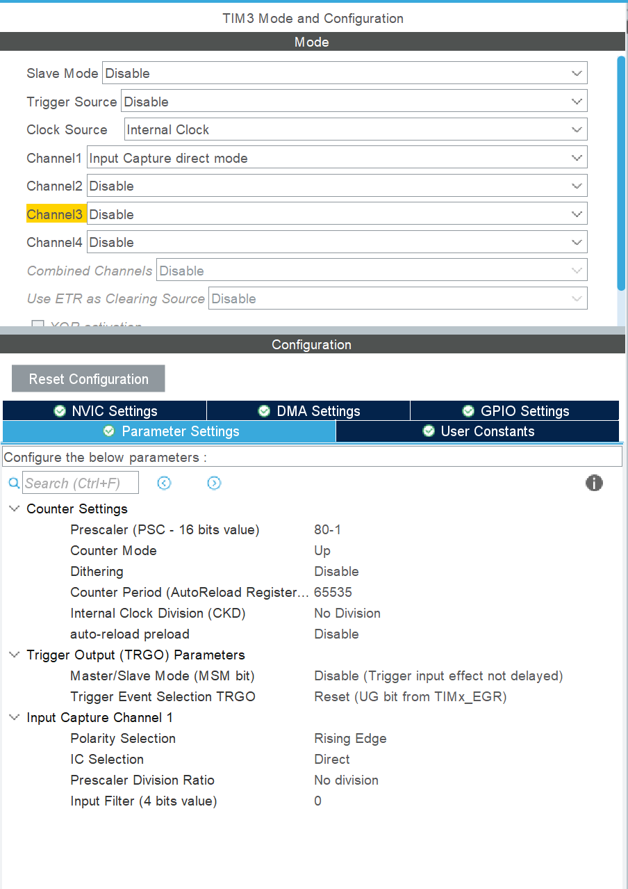
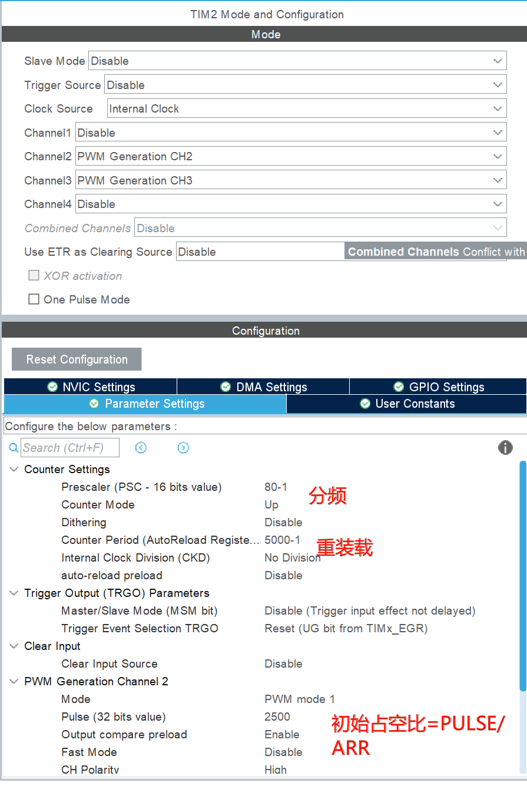
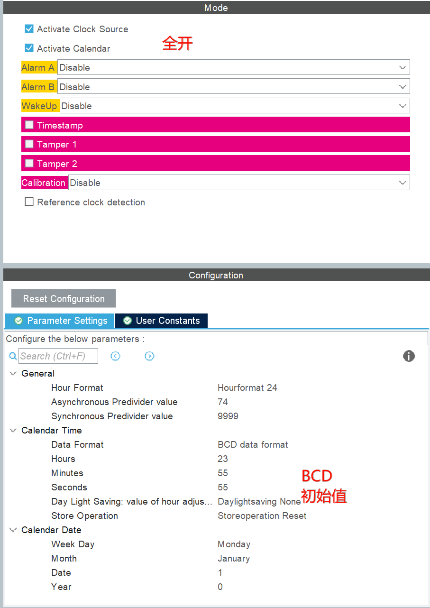
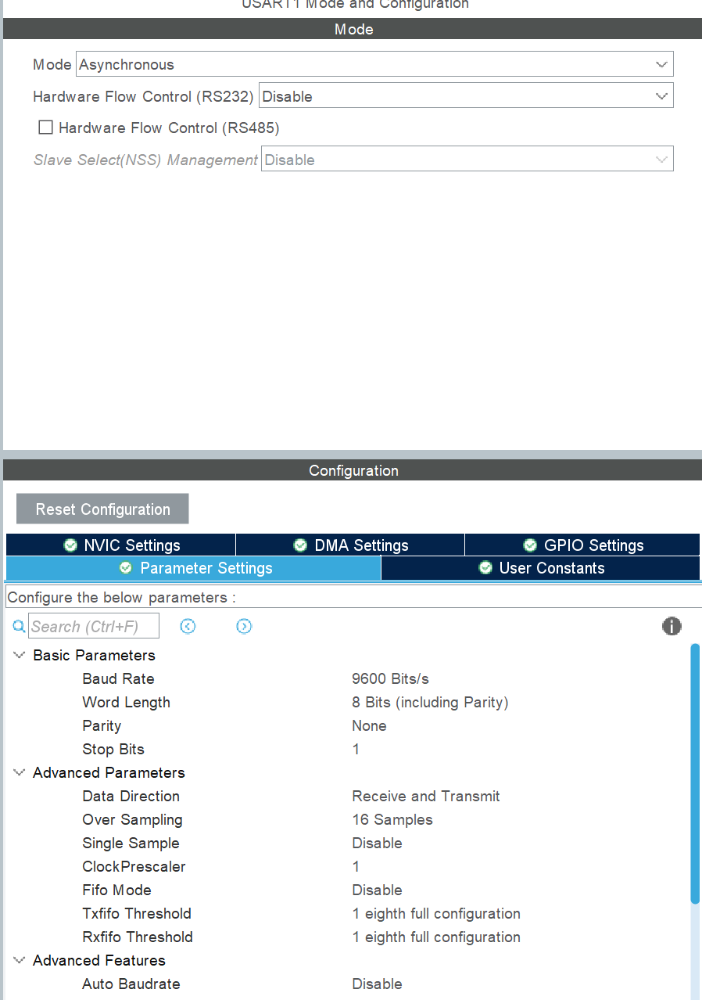

>[!NOTE] PWM测频
```c
HAL_TIM_IC_Start_IT(&htim2,TIM_CHANNEL_1);
HAL_TIM_IC_Start_IT(&htim3,TIM_CHANNEL_1);

void HAL_TIM_IC_CaptureCallback(TIM_HandleTypeDef *htim){
	if(htim==&htim3){
		if(htim->Channel==HAL_TIM_ACTIVE_CHANNEL_1){
			ccr1=HAL_TIMv_ReadCapturedValue(htim,TIM_CHANNEL_1);
			TIM3->CNT=0;
			fre1=1000000/ccr1;
		}
	}
	if(htim==&htim2){
		if(htim->Channel==HAL_TIM_ACTIVE_CHANNEL_1){
			ccr2=HAL_TIM_ReadCapturedValue(htim,TIM_CHANNEL_1);
			TIM2->CNT=0;
			fre2=1000000/ccr2;
		}
	}
}
```
>[!WARNING] 开中断！开中断！开中断！开中断！开中断！


> [!NOTE] PWM输出
>记！得！开！初！始！化！

```c
	HAL_TIM_PWM_Start(&htim2,TIM_CHANNEL_2);
	HAL_TIM_PWM_Start(&htim2,TIM_CHANNEL_3);
	//改变占空比
	__HAL_TIM_SetCompare(&htim2,TIM_CHANNEL_2,duty1/100*ARR);

	__HAL_TIM_SetCompare(&htim2,TIM_CHANNEL_3,duty2/100*ARR);
	//占空比的大小就是ARR的百分比
	//改变频率
	__HAL_TIM_SetAutoreload(&htim2,ARR);
	//双通道公用一个频率，频率大小为1000000/ARR
```

> [!NOTE] 按键长短按
```c
uint8_t key_scanf(void){
	uint8_t key_return=0;
	static uint8_t key_state=0;
	switch(key_state){
		case 0:
			if(B1&&B2&&B3&&B4)key_state=0;
			else key_state=1;
		break;
		case 1:
			if(B1&&B2&&B3&&B4)key_state=0;
			else {
				if(!B1)key_return=1;
				if(!B2)key_return=2;
				if(!B3)key_return=3;
				if(!B4){
					b4_flag=1;
					b4_time++;
				}
			key_state=2;
			}
		break;
		case 2:
			if(B1&&B2&&B3&&B4){
				key_state=0;
				if(b4_flag==1){
					if(b4_time<150){//时间为判断的数x10
						key_return=4;
						b4_time=0;
					}else{
						key_return=5;
						b4_time=0;
					}
					b4_flag=0;
				}
			}
			if(!B4)b4_time++;
		break;	
	}
	return key_return;
}
```
>[!NOTE] RTC时钟
```c
//初始化
RTC_TimeTypeDef H_M_S_time;
RTC_DateTypeDef Y_M_D_time;
//显示
LCD_DisplayStringLine(Line4,(u8*)str);
sprintf(str,"      TIME:%d:%d:%d  ",H_M_S_time.Hours,H_M_S_time.Minutes,H_M_S_time.Seconds);
```

>[!NOTE] 串口
```c
HAL_UARTEx_ReceiveToIdle_IT(&huart1,(u8*)recieveData,sizeof(recieveData));
//中断回调
void HAL_UARTEx_RxEventCallback(UART_HandleTypeDef *huart, uint16_t Size){
	if(huart==&huart1){
		recieveData[Size]='\0';
		rx_flg=1;
		HAL_UARTEx_ReceiveToIdle_IT(&huart1,(u8*)recieveData,sizeof(recieveData));
	}
}
//接受和发送
void rx_pro(){
	if(rx_flg==1){
		if(!strcmp(recieveData,"指定接受的信息")){
			
		}else if(!strcmp(recieveData,"指定接受的信息")){
			
		}else{
		HAL_UART_Transmit(&huart1,(u8*)"ERROR",strlen("ERROR"),0xffff);
		}
		rx_flg=0;
	}
}
```

记得是PA9和PA10
>[!WARNING] 开中断！开中断！开中断！开中断！开中断！

>[!NOTE] ADC
```c
HAL_ADCEx_Calibration_Start(&hadc1, ADC_SINGLE_ENDED);//ADC校准

void adc_pro(){
	if(uwTick-adc_time<100)return;
	adc_time=uwTick;
	HAL_ADC_Start(&hadc1);
	HAL_ADC_PollForConversion(&hadc1,1000);
	voltage=HAL_ADC_GetValue(&hadc1)*3.3/4096;
}
```

>[!NOTE] LED
```c
void led_disp(u8 led_num){
		HAL_GPIO_WritePin(GPIOC,GPIO_PIN_8|GPIO_PIN_9|GPIO_PIN_10|GPIO_PIN_11|GPIO_PIN_12|GPIO_PIN_13|GPIO_PIN_14|GPIO_PIN_15,GPIO_PIN_SET);
		HAL_GPIO_WritePin(GPIOD,GPIO_PIN_2,GPIO_PIN_SET);
		HAL_GPIO_WritePin(GPIOD,GPIO_PIN_2,GPIO_PIN_RESET);
		HAL_GPIO_WritePin(GPIOC,led_num<<8,GPIO_PIN_RESET);
		HAL_GPIO_WritePin(GPIOD,GPIO_PIN_2,GPIO_PIN_SET);
		HAL_GPIO_WritePin(GPIOD,GPIO_PIN_2,GPIO_PIN_RESET);
}
```
>[!NOTE] I2C
```c
u8 i2c_read(u8 add){
	
	unsigned char val;
	I2CStart();
	I2CSendByte(0xa0);
	I2CWaitAck();
	I2CSendByte(add);
	I2CWaitAck();
	I2CStart();
	I2CSendByte(0xa1);
	I2CWaitAck();
	val=I2CReceiveByte();
	I2CWaitAck();
	I2CStop();
	return val;
}
void i2c_write(u8 add,u8 val){
	I2CStart();
	I2CSendByte(0xa0);
	I2CWaitAck();
	I2CSendByte(add);
	I2CWaitAck();
	I2CSendByte(val);
	I2CWaitAck();
	I2CStop();
}


I2CInit();
val=i2c_read(0);
i2c_write(0,++val);
```
