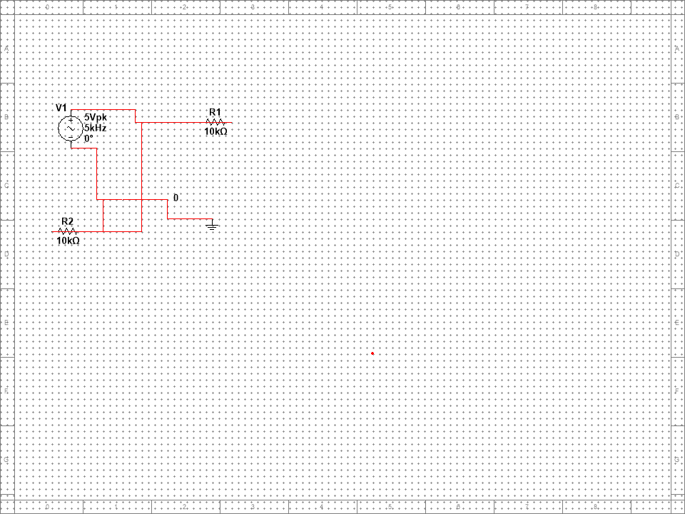
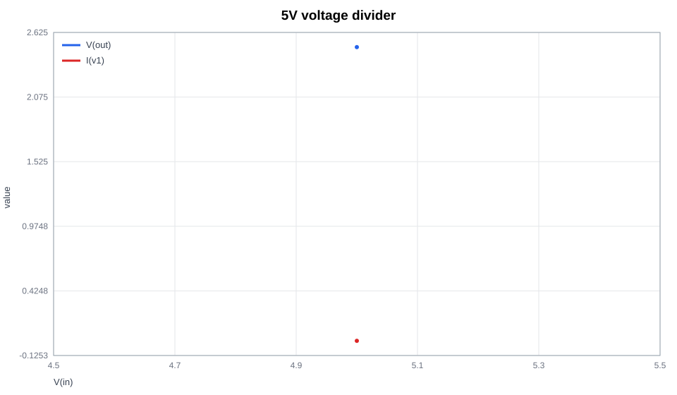

# 5V voltage divider

## Reproducibility

- Multisim design: circuit.ms14
- Analysis commands: op
- Simulation succeeded: `True`
- Points: `1`
- Columns: V(in), V(out), I(v1)

## Circuit netlist

```spice
V1 in 0 5
R1 in out 10k
R2 out 0 10k
.end
```

## Artifacts

- Editable circuit: circuit.ms14
- Schematic: 
- Data: `data.csv`
- Plot: 

## Data preview

| V(in) | V(out) | I(v1) |
| --- | --- | --- |
| 5 | 2.5 | -0.00025 |

## Automatic measurements

| signal | first | last | min | max | mean |
| --- | ---: | ---: | ---: | ---: | ---: |
| V(in) | 5 | 5 | 5 | 5 | 5 |
| V(out) | 2.5 | 2.5 | 2.5 | 2.5 | 2.5 |
| I(v1) | -0.00025 | -0.00025 | -0.00025 | -0.00025 | -0.00025 |

## Diagnostics

- Timed out: `False`
- Last error: 

> Generated by the unofficial Multisim MCP. Verify safety-critical results independently.